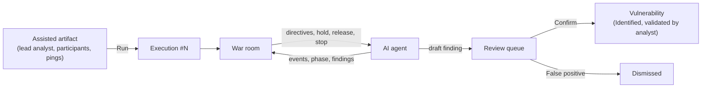
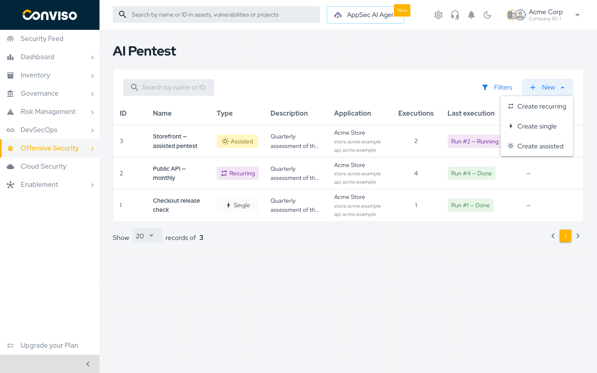
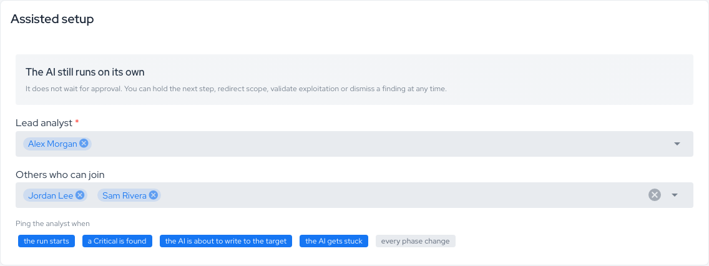
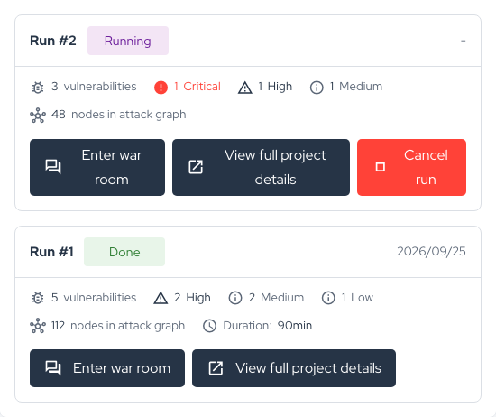
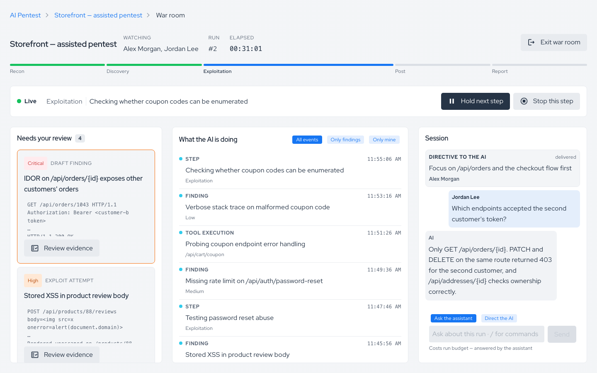
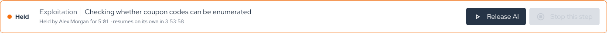
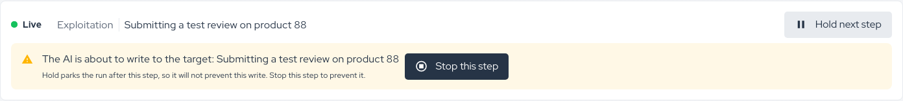
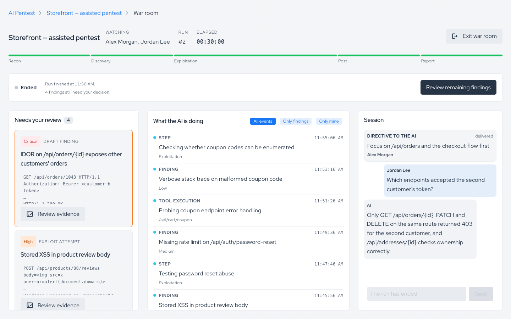
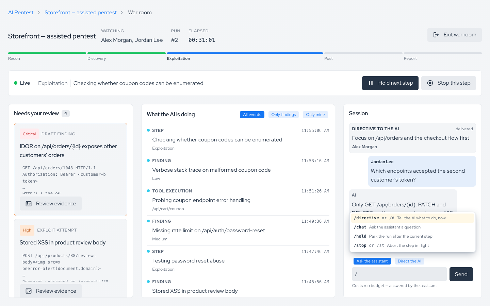
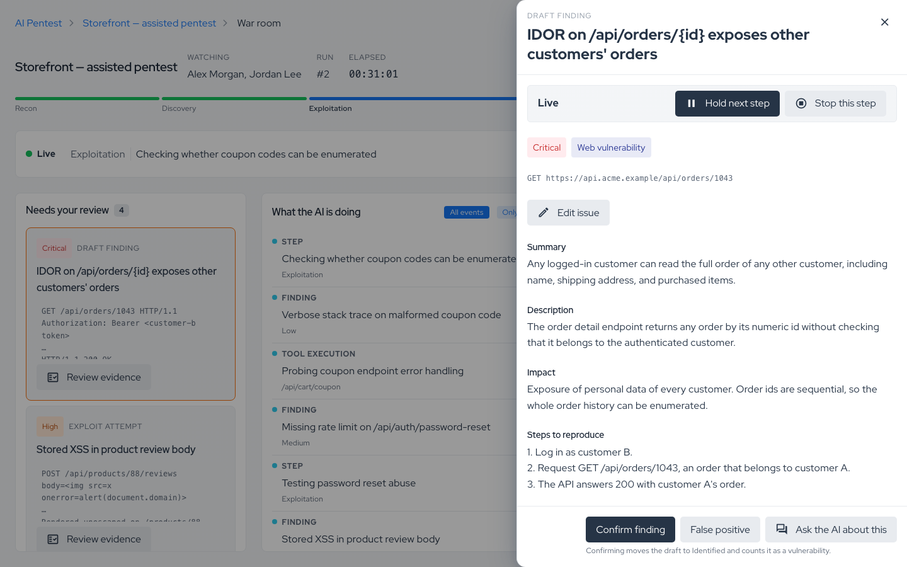

## Introduction

**AI Pentest Assisted** is a mode of [AI Pentest](./ai-pentest.md) where a human analyst supervises the run live. The AI agent still runs on its own — it **never waits for approval** — but the analyst watches what it does in a dedicated **war room**, steers it with directives, parks or aborts steps, asks it questions, and **confirms or dismisses every finding before it counts** as a vulnerability.

Use Assisted when you want the speed and coverage of the autonomous agent together with human judgment on what gets reported:

- **Proof before promotion.** Each finding arrives as a **draft**. It only becomes a vulnerability after an analyst reviews the evidence and confirms it. False positives are dismissed before they reach your vulnerability list.
- **The AI acts, the analyst governs.** Hold, release, stop a step, or redirect the agent at any time. Controls always stay reachable and take effect visibly.
- **Show the work.** The live activity feed, phase progress, and attack graph show what the agent tried, where it is, and why it is stuck — not only what it found.

The analyst can be someone from your own security team or a Conviso pentester, depending on your contract.

## How it works

Assisted is a third **artifact type**, next to Single and Recurring. Everything you already know about artifacts — Application, Scope, Safety, Authentication, Code & Documentation, Assessment Settings — works the same way. What changes is who is involved in each run and how findings are promoted.



| | Single | Recurring | Assisted |
|---|---|---|---|
| **Who starts a run** | A user (on demand) or a one-time schedule | The scheduler, on a cadence | A user, on demand |
| **Scheduling** | Optional, once | Weekly / monthly / quarterly | Not available — an assisted run is started by someone who intends to watch it |
| **Human during the run** | No | No | Yes — lead analyst and participants in the war room |
| **How findings are created** | Directly as vulnerabilities | Directly as vulnerabilities | As **drafts**, confirmed or dismissed by an analyst |
| **Credits** | [Cost model](./ai-pentest.md#cost-model) | [Cost model](./ai-pentest.md#cost-model) | Same cost model — an assisted run costs the same as an autonomous one |

## Prerequisites

Assisted runs share every prerequisite of [AI Pentest](./ai-pentest.md#prerequisites) (permissions, credits, an Application with FQDN assets, and optional Secrets, repositories, and documentation). In addition:

| Requirement | Needed for |
|-------------|------------|
| At least one **analyst** with access to the company | The **Lead analyst** and **participants** must be platform users with access to the company that owns the artifact. |
| **AI Pentest update** permission | Acting in the war room (controls, directives, finding decisions). Users with read access only can watch. |
| A browser session kept open during the run | The war room is a live screen. The run does not depend on it, but supervision does. |
| Traffic allowed from the pentest IP | Shown on the **Scope** card, same as any AI Pentest run. |

## Creating an assisted artifact

1. Open **AI Pentest** in the side menu.
2. Click **New** (top right of the artifact table) and choose **Create assisted**.
3. Fill in the cards as you would for any artifact — see [Configuring an artifact](./ai-pentest.md#configuring-an-artifact). The **Type** shows **Assisted** and is locked.
4. Fill in the **Assisted setup** card (it replaces the **Scheduling** card).
5. Save.

<div style={{textAlign: 'center', maxWidth: '100%'}}>



</div>

### Assisted setup card

The card opens with a reminder of how the mode behaves: **"The AI still runs on its own"** — it does not wait for approval, and you can hold the next step, redirect scope, validate exploitation, or dismiss a finding at any time.

| Field | Description |
|-------|-------------|
| **Lead analyst** (required) | The analyst who owns the run. They are the primary person supervising the war room. |
| **Others who can join** | Additional users allowed into the war room. Everyone listed here (plus the lead analyst) is a **participant**. |
| **Ping the analyst when** | Which moments send a notification. See [Notifications](#notifications). |

The ping options are:

- **the run starts**
- **a Critical is found**
- **the AI is about to write to the target**
- **the AI gets stuck**
- **every phase change**

<div style={{textAlign: 'center', maxWidth: '100%'}}>



</div>

:::note
The platform checks that the lead analyst and participants have access to the company before saving. If you later switch an artifact away from Assisted, its analyst assignments are cleared.
:::

## Starting a run and entering the war room

Open the artifact and click **Run AI Pentest**. The confirmation dialog shows how many credits the run consumes. Confirm to queue the execution, exactly like any other AI Pentest run (see [Running an AI Pentest](./ai-pentest.md#running-an-ai-pentest)).

Each execution card of an assisted artifact has an **Enter war room** button. Click it to open the war room for that run. The war room becomes available once the run starts (before that you see *"This execution has no war room available yet."*) and stays available after the run ends, with whatever still needs a decision.

<div style={{textAlign: 'center', maxWidth: '100%'}}>



</div>

:::tip
Only participants (the lead analyst and the users in **Others who can join**) can open the war room. Anyone else gets *"Could not open the war room. Check your connection and that you are a participant, then try again."*
:::

## The war room

The war room is a full-screen view: the side menu and global header are hidden so the run gets the whole viewport. Use **Exit war room** (top left) to go back to the artifact. The breadcrumb shows the artifact, the run, and the war room.

The screen has three areas, each scrolling on its own. On smaller screens they become tabs.

<div style={{textAlign: 'center', maxWidth: '100%'}}>



</div>

| Area | What it shows |
|------|---------------|
| **Header and control strip** | Run number, elapsed time, who is **Watching**, the run state (**Live**, **Pause requested**, **Held**, **Ended**, **Failed**, **Cancelled**), the current step, and the run controls. Alerts appear here. |
| **Run phase** | A progress bar with five phases: **Recon**, **Discovery**, **Exploitation**, **Post**, **Report**. |
| **What the AI is doing** | The live activity feed. Filter it by **All events**, **Only findings**, or **Only mine**. The feed opens on the most recent events; click **Load older events** to page back to the start of the run. |
| **Session** | One shared thread with assistant questions and answers, directives, and control actions in chronological order, plus the [session composer](#the-session-composer). |
| **Needs your review** | The review queue of draft findings and the detail panel. See [Reviewing findings](#reviewing-findings). |

Everything in the room is shared: every participant sees the same feed, thread, queue, and decisions in real time.

## Controlling the run

The control strip has three controls. They change what the agent does next; they never stop the whole run (to stop the run entirely, use **Cancel run** on the artifact's execution card).

| Control | What happens |
|---------|--------------|
| **Hold next step** | The AI parks **as soon as the current step finishes**. The state goes **Pause requested** → **Held**. A held run spends no AI budget. The strip shows who is holding it and for how long. |
| **Release AI** | The run continues from where it parked. |
| **Stop this step** | The AI **aborts what it is running against the target right now** and moves on to its next step. The run keeps going. A confirmation dialog asks before stopping. |

**Things to know:**

- **Hold expires.** A hold nobody releases is lifted automatically after a few hours (4 hours by default). The strip shows *"resumes on its own in …"* while the hold is armed.
- **Hold does not prevent the current step.** If the AI is about to write to the target, Hold will not stop that write — the strip warns *"Hold parks the run after this step, so it will not prevent this write."* Use **Stop this step** instead.
- **Stop needs a step in flight.** While the run is held, there is nothing to stop.
- **One control at a time.** Commands are sent to the agent and confirmed by it. While one is waiting for confirmation, the other controls are unavailable (*"Unavailable until Hold reaches the agent."*). A **Stop** may overtake a queued **Hold**.
- **Honest pending state.** The strip shows when a command was sent, by whom, and how long it has waited. Delivery keeps retrying. If a command does not reach the agent, the strip shows *"Hold did not reach the agent."* with **Send again** — nothing changed on the run.

<div style={{textAlign: 'center', maxWidth: '100%'}}>



</div>

### Alerts in the room

The control strip raises an alert when:

- **The AI is about to write to the target** — decide whether to let the step finish or **Stop this step**.
- **The AI is stuck** — send a `/directive` in the session to unblock it.
- **New Critical finding** — click **Review it** to open it in the review queue.

<div style={{textAlign: 'center', maxWidth: '100%'}}>



</div>

When the run ends, the strip summarizes the outcome (*"Run finished at …"*) and tells you how many findings still need a decision, with **Review remaining findings**.

<div style={{textAlign: 'center', maxWidth: '100%'}}>



</div>

## The session composer

One input at the bottom of the **Session** panel handles both questions and orders. A visible switch, **Send plain text as**, decides where plain text goes:

| Mode | Plain text goes to | Cost |
|------|--------------------|------|
| **Ask the assistant** | The run's assistant, which answers questions about the run in the thread. The AI keeps going. | Costs run budget — answered by the assistant |
| **Direct the AI** | The agent, as a directive. The agent reads it on its next tool call. | Free — reaches the AI on its next tool call |

If you type something that reads like an order while in **Ask the assistant** mode, the composer warns you that it will be sent as a question and suggests switching to **Direct the AI**.

### Slash commands

Slash commands work in either mode. Type `/` to open the command menu; it only lists the commands that apply to the run's current state (for example, `/release` appears only while the run is held).

| Command | Short form | What it does |
|---------|-----------|--------------|
| `/directive <text>` | `/d` | Tell the AI what to do, now. |
| `/chat <text>` | — | Ask the assistant a question, even in **Direct the AI** mode. |
| `/hold` | — | Park the run after the current step. |
| `/release` | — | Let the run continue. |
| `/stop` | `/st` | Abort the step in flight. |

Examples:

```text
/d focus on the /api/transfer endpoint, skip static assets
/chat which endpoints accepted the forged JWT?
/hold
```

**Slashes in text.** A leading slash is only a command when the first word *is* a command, so directives such as `focus on /admin` or `/api/transfer is the priority` are sent as text. To send text that starts with a literal slash, type `//`.

<div style={{textAlign: 'center', maxWidth: '100%'}}>



</div>

**Limits.** Directives and questions are limited to 2,000 characters. While a question is being answered, you can still send commands.

Directives and control actions appear in the thread with their delivery status: **queued**, **delivered**, or **failed**.

## Reviewing findings

In assisted mode, each finding the agent reports is opened as a **draft issue** holding the full structured report. Drafts appear in **Needs your review**. Nothing counts as a vulnerability until an analyst decides.

There are two kinds of card:

| Kind | Meaning | Confirm action |
|------|---------|----------------|
| **Draft finding** | A vulnerability the agent reported. | **Confirm finding** |
| **Exploit attempt** | The agent's validation of an exploitation. | **Confirm exploit** |

### Deciding

Open a card to see the full evidence in the detail panel: **Summary**, **Description**, **Impact**, **Steps to reproduce**, **Request**, **Response**, and **Target**.

- **Confirm** moves the draft to **Identified** and counts it as a vulnerability, marked as **validated by analyst**.
- **False positive** dismisses it. The dismissal is also sent to the agent so it does not keep pursuing the same lead.
- **Critical and High findings are decided from the full evidence** — their confirm action is only available in the detail panel, not directly on the card.
- **Ask the AI about this** sends the assistant a question asking how the finding was confirmed, what the evidence proves, and what the impact would be.

<div style={{textAlign: 'center', maxWidth: '100%'}}>



</div>

**Undo window.** A decision is recorded after **10 seconds** unless you click **Undo**. The countdown pauses while your pointer or keyboard focus is on the undo bar. Then click **Next finding** to move on.

**Concurrent decisions.** Several analysts can review at the same time. If someone else decided the finding first, you see *"Another analyst already decided this finding."*

### Editing before confirming

Click **Edit issue** in the detail panel to adjust the draft's **Title**, **Severity**, **Description**, and **Steps to reproduce**, then **Save edits** before confirming. Edited cards show an **Edited** tag.

- When severity is **calculated from the CVSS score**, it cannot be changed here.
- Titles are limited to 255 characters.
- If a confirmation is rejected, your edits are kept so you can fix the field and confirm again.

### Findings by origin

The **Findings by origin** breakdown tallies the session's findings as **Awaiting validation**, **Validated by analyst**, and **Dismissed**, so you can see at a glance how much still needs review.

### After the run ends

No new findings arrive after the run ends, but the queue stays open: the strip shows how many findings still need your decision. Confirmed findings follow the normal [vulnerability management](../vulnerability-management/process.md) workflow, like results from any other source.

## White-box findings: "Reachability unproven"

When the artifact uses a repository (**Use repository**), the agent also audits the source code and then tries to prove each lead live against the target.

- A source-code lead that the agent **proves live** is reported as a normal finding, with the white-box evidence (proof of concept and supporting documents) attached.
- A lead the agent **could not prove live** is still reported, labeled **Reachability unproven**: *"Found by whitebox (source-code) analysis; its live reachability was not proven. It may exist but was not confirmed exploitable."*

The label is shown on the vulnerability page. It tells reviewers the finding is real in code but not yet confirmed exploitable — it is not hidden, and it is not dressed up as confirmed.

## Notifications

The pings selected on the **Assisted setup** card are delivered through the platform's notification channels (email and, when configured for your company, Slack). Each notification links straight to the war room.

| Ping | Sent when |
|------|-----------|
| **the run starts** | The execution starts running. |
| **a Critical is found** | The agent reports a Critical finding. |
| **the AI is about to write to the target** | The agent signals it is about to perform a write action against the target. |
| **the AI gets stuck** | The agent signals it cannot make progress. |
| **every phase change** | The run moves to a new phase. |

:::note
"About to write" and "stuck" are signaled by the agent itself. They are a best-effort warning, not a guarantee that every write is announced. Use **Guardrails** and **Specific scope** to restrict what the agent is allowed to do.
:::

## Permissions and access

| Who | Can do |
|-----|--------|
| Users with AI Pentest **create/update** permissions | Create and edit assisted artifacts. |
| Users with AI Pentest **run** permission | Start and cancel runs. |
| **Participants** (lead analyst + others who can join) with **update** permission | Enter the war room, use controls, send directives, ask the assistant, and decide findings. |
| **Participants** with read permission only | Enter the war room and watch. Controls and decisions are read-only. |
| Users who are not participants | Cannot open the war room. |

If your access to the company or the artifact is revoked while you are in the room, updates stop and the strip shows *"Your access to this room was revoked."*

## Credits

An assisted run uses the same [cost model](./ai-pentest.md#cost-model) as an autonomous run: credits are debited at the start of the execution based on **Assessment size** and **Test depth**, and refunded if the run fails or is cancelled. See [Credits](./ai-pentest.md#credits) and [Debit history](./ai-pentest.md#debit-history-ai-pentest-transactions).

Questions to the assistant are answered from the run's existing budget; they do not debit extra credits. Directives and controls are free.

## Live updates

The war room updates in real time. If the live connection drops, the strip says so and the room keeps refreshing every 30 seconds until it reconnects:

- *"Live updates lost for … Reconnecting; the room refreshes every 30 seconds meanwhile."*
- *"Live updates are unavailable. The room refreshes every 30 seconds."*

Nothing is lost while disconnected: commands and decisions are stored by the platform, and the feed catches up when the connection returns.

## Troubleshooting / FAQ

**"This execution has no war room. Only assisted pentests have one."**
The execution belongs to a Single or Recurring artifact. Only assisted artifacts have a war room.

**"Could not open the war room…"**
You are not a participant of that artifact, or the connection failed. Ask the artifact owner to add you to **Others who can join**, then try again.

**The controls are greyed out.**
Either a command is still waiting for the agent to confirm it (*"A command is waiting for agent confirmation."*), the run has ended, or you have read-only permission.

**I clicked Hold but the AI keeps going.**
Hold parks the run **after the current step**. The state shows **Pause requested** until the step finishes, then **Held**. To interrupt the current step, use **Stop this step**.

**The run resumed by itself.**
A hold that nobody releases expires after a few hours (4 hours by default), and the run resumes.

**"The finding is still being synchronized. Try again shortly."**
The draft issue is still being created on the platform. Wait a few seconds and confirm again.

**"The finding was not confirmed because its severity is calculated from CVSS."**
Your edits are saved. Open the finding and save with the calculated severity.

**"The asset is archived, so its findings can no longer change status."**
Unarchive the asset to decide its findings.

**Can I schedule an assisted run?**
No. An assisted run is always started by someone who intends to watch it. Use a Recurring artifact for scheduled coverage.

**Can I change an existing Single or Recurring artifact to Assisted?**
No — the type is locked after creation. Create a new assisted artifact.

## Support

Should you have any questions or require assistance while configuring or running AI Pentest Assisted, feel free to contact our dedicated support team.
