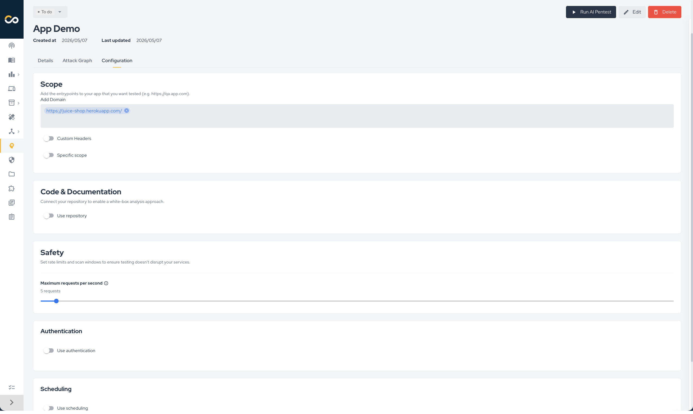
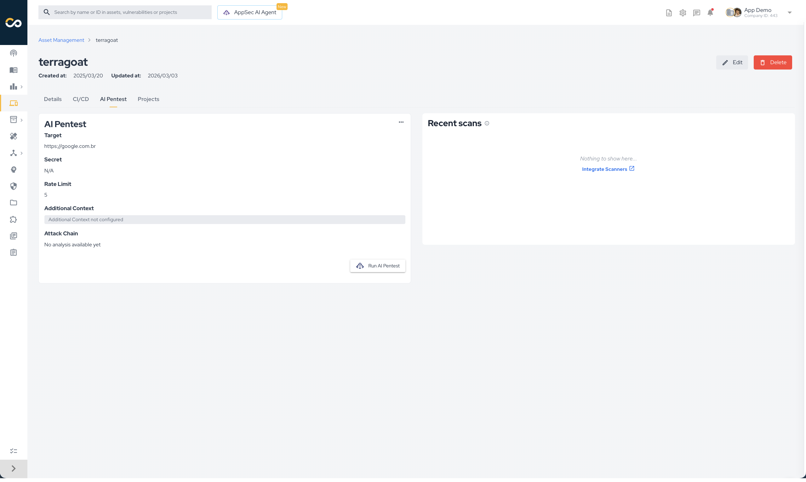
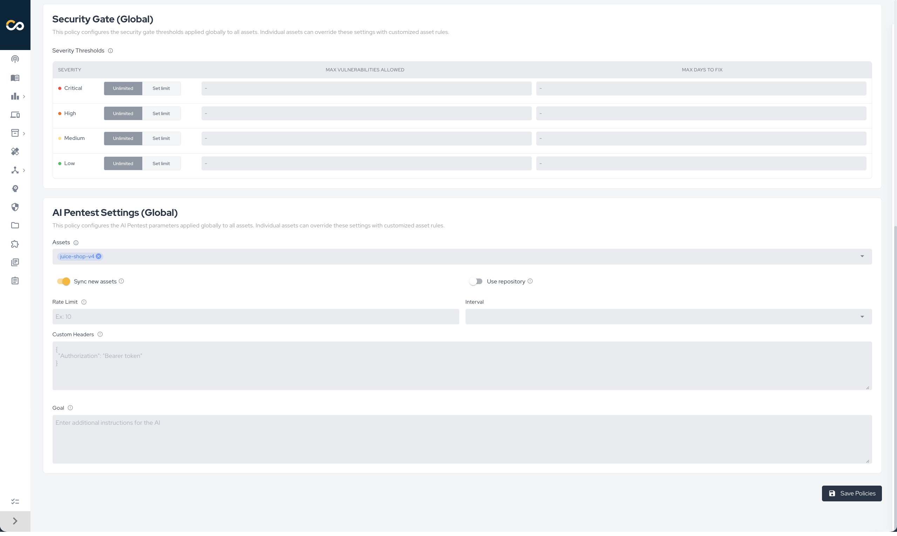
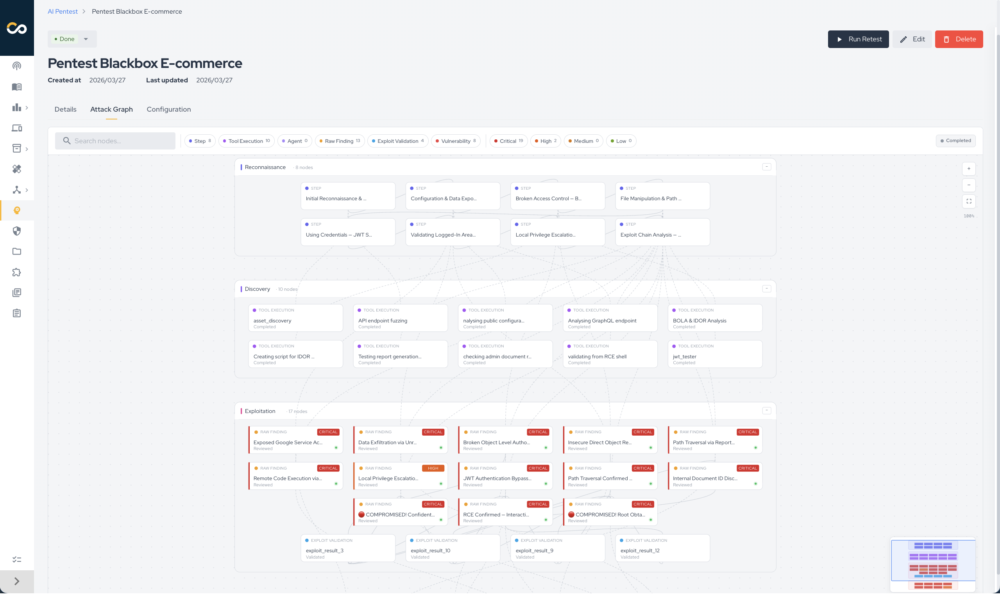

## Introduction

**AI Pentest** is an autonomous penetration testing capability of the Conviso Platform. It uses an LLM-driven engine that orchestrates 100+ offensive security tools (recon, fuzzing, exploitation, web/API attacks) to discover, validate, and report vulnerabilities — without manual triggering of each tool.

Findings produced by AI-Pentest flow back into the Conviso Platform as standard vulnerabilities, so they can be triaged, tracked, and remediated alongside results from DAST, SAST, SCA, Container, and SBOM scans.

:::note
AI Pentest requires the `AI_PENTEST_ACCESS` plan permission and per-execution credits. Confirm with your account manager that the capability is enabled for your company before configuring it.
:::

## Configuration Levels

AI Pentest configuration is **layered**. The platform stores configuration at three independent levels and resolves the effective values in cascade at execution time. The recommended primary entry point is the **Project** level — Asset and Global exist for specific flows.

| Level | Role | Where it lives | Typical owner |
|-------|------|----------------|---------------|
| **Project** *(primary)* | **Main configuration scope.** Defines a pentest execution targeting one or more assets and exposes the full set of fields. Overrides asset and global values. | **AI Pentest → Create new AI Pentest** | Pentest owner |
| **Asset** *(override)* | Overrides the global configuration for a single asset, used when a particular asset needs persistent settings across every execution. | **Asset Management → Asset → AI Pentest → Configuration** | Asset owner |
| **Global** *(default)* | Company-wide defaults applied to every asset that does not override them. Used for the company-wide automated schedule and as a fallback for unconfigured assets. | **Policies → AI Pentest Settings (Global)** | AppSec / Security Manager |

### How the cascade resolves

When a pentest starts, the platform looks up the configuration in this order and uses the **first non-empty value** it finds for each field:

```text
Project config  →  Asset config  →  Global config
```

Boolean toggles (`use_repository`, `use_documentation`, etc.) follow the same precedence and default to `false` when absent at every level. Free-form values (`domains`, `extra_prompt`, `repositories`, etc.) inherit from the upper level when not set.

This means:

- A field set at the **Project** level **overrides** Asset and Global for that single execution. *(primary scope)*
- A field set at the **Asset** level **overrides** the Global value for that asset only. *(override scope)*
- Fields left empty at the Project and Asset levels **inherit** the Global value. *(default scope)*

:::note
The Global level is the only one that controls **which assets are eligible** for the company-wide automated schedule (via the **Assets** selector and the **Sync new assets** toggle). Project and Asset levels only control execution parameters, not eligibility.
:::

## Integration Requirements

Some configuration sections depend on integrations being active in the Conviso Platform. Configure them before enabling the related toggles:

| Section | Required integration | Used for |
|---------|----------------------|----------|
| **Authentication** | A Secret stored in the Conviso Platform (Basic Auth, Bearer Token, Header, Cookie, Query Param, Generic). See [Credentials](../platform/credentials.md). | Lets AI-Pentest reach authenticated areas of the application during the pentest. |
| **Code & Documentation → Use repository** | **GitHub** or **Azure DevOps** integration enabled at the company level. | Enables a white-box approach: the platform clones the selected repositories and exposes them to AI-Pentest for static-analysis-aware exploitation. |
| **Code & Documentation → Use documentation** | None. The platform accepts a public URL or a direct file upload (OpenAPI, GraphQL, Postman, SOAP). | Lets AI-Pentest map endpoints from the spec instead of relying solely on brute-force recon. |
| **Scheduling** | None, but requires the `AI_PENTEST_ACCESS` plan permission and available execution credits. | Triggers the pentest automatically on the chosen cadence. |

## Configurations

The **Project** is the recommended entry point for configuring an AI Pentest. From a single project you can pick one or more target assets, tune every field AI-Pentest supports, and dispatch one execution per asset under the same project umbrella.

1. Open **AI Pentest** in the side menu.
2. Click **Create new AI Pentest**.
3. Fill in the project metadata (name, scope description, dates, assigned users).
4. Select one or more **Assets** in the **Assets** field. The project will run AI-Pentest against every selected asset.
5. Tune the configuration cards described below.

<div style={{textAlign: 'center', maxWidth: '100%'}}>



</div>

The form is split into the cards described below. Fields left empty fall back to the Asset configuration (when present) and then to the Global configuration at execution time.

### Scope

Defines **what AI-Pentest is allowed to test**.

- **Add Domain**: one or more entry-point URLs (e.g. `https://qa.app.com`). The first domain is treated as the **primary target**; the rest are listed as additional in-scope domains in AI-Pentest's context.
- **Custom Headers**: optional `Key: Value` pairs added to every HTTP request issued by AI-Pentest. Use them to inject API keys, tenant headers, tracing IDs, etc.
- **Specific scope**: when enabled, restricts testing to the path patterns declared below. When disabled, AI-Pentest tests the entire application under the primary target.
  - **In-Scope Paths**: regex/path patterns AI-Pentest must focus on. If at least one entry is provided, AI-Pentest prioritizes these paths.
  - **Out-of-Scope Paths**: regex/path patterns AI-Pentest must not test. These paths are explicitly excluded.

**Impact on the pentest:** the scope drives AI-Pentest's recon and attack surface enumeration. A narrower scope shortens the run and reduces noise; a broader scope increases coverage but also cost in credits and tokens.


### Code & Documentation

Provides white-box context to AI-Pentest.

- **Use repository**: when enabled, the platform clones the selected repositories before the run and exposes them to AI-Pentest on the local filesystem. Requires an active **GitHub** or **Azure DevOps** integration.
  - **Repositories**: multi-select picker of repositories visible through the integration. Each entry is tagged with its provider (`github` or `azure_devops`).
- **Use application documentation**: when enabled, AI-Pentest receives the API specification of the application.
  - **Documentation format**: `OpenAPI / Swagger`, `GraphQL`, `Postman`, or `SOAP / WSDL`.
  - **Documentation URL or file**: either a public URL pointing to the spec or a direct upload (max 5 MB; allowed content types include JSON, YAML, XML, and plain text).

**Impact on the pentest:** a connected repository enables AI-Pentest to reason about the source (auth flows, parameter sinks, framework-specific patterns) and to chain code-level insight with runtime exploitation. An attached documentation lets AI-Pentest enumerate endpoints deterministically instead of brute-forcing them, which usually produces faster, more accurate API testing.

### Safety

- **Maximum requests per second**: rate limit enforced by AI-Pentest against the target. Lower values are safer for fragile or shared environments; higher values shorten the run.

**Impact on the pentest:** this is the main throttle protecting your application. AI-Pentest (and its sub-tools) honor this value when issuing HTTP requests.

### Authentication

- **Use authentication**: when enabled, attaches an existing **Secret** to the run. The secret payload (basic auth, bearer token, header, cookie, query param, or generic key/value) is forwarded to AI-Pentest and used for authenticated browsing and request signing.
- **Manage your credentials**: shortcut to the company's [Credentials](../platform/credentials.md) page where secrets are created, rotated, and revoked.

**Impact on the pentest:** without a valid secret, AI-Pentest only reaches publicly accessible surface. With a secret, it can authenticate, reach private endpoints, and exercise authorization flows (privilege escalation, IDOR, broken access control).

### Scheduling

- **Use scheduling**: when enabled, the asset is included in the recurring dispatch.
- **Interval**: `Weekly`, `Monthly`, or `Quarterly`.
- **Weekday / Day / Hour / Minute**: when the run is dispatched within the cycle.

**Impact on the pentest:** scheduling determines whether the asset is picked up by the scheduled dispatcher. The dispatcher checks every asset's effective configuration once per day and queues a run when:

1. the asset's effective `use_scheduling` is `true`,
2. the asset's effective `interval` is not `NONE`,
3. and the asset is due according to its last successful execution.

The dispatcher creates a single AI Pentest **Project** per company per cycle and groups all eligible assets under it.

Click **Save Configuration** to persist the configuration.

### Projects with multiple assets

A single AI Pentest **Project** can group several assets. The platform dispatches one execution **for each asset in the project scope** under the same project umbrella. This happens in two flows:

- **Manual creation via Project (recommended)**: from **AI Pentest → Create new AI Pentest**, select one or more assets in the **Assets** field; the project is created with all of them in scope and one execution is queued per asset.
- **Scheduled dispatch**: the scheduled dispatcher creates a single AI Pentest project per company per cycle and links every eligible asset to it; AI-Pentest then runs once per linked asset.

When a project bundles multiple assets, each asset resolves its own configuration via the Project → Asset → Global cascade. Project-level overrides apply uniformly to every asset in the project; Asset-level overrides (when present) provide per-asset specifics (domains, secrets, repositories, scope rules).

:::note
Projects of type **AI Pentest** show up under the company's project list and host the findings, the attack graph, and the execution status produced by every run linked to them — one entry per asset.
:::

### Asset-level configuration (override for specific assets)

Use the **Asset-level configuration** when a particular asset needs settings that should persist across every execution — for example, a fixed authentication secret, a curated repository selection, or stricter scope rules — without having to redefine them on every project you create.

It exposes the **same set of fields** described above and writes them to the asset record. Project executions targeting that asset will inherit these values whenever the corresponding Project-level field is empty.

To open it:

1. Open **Asset Management** in the side menu.
2. Click the asset name to open its detail page.
3. Open the **AI Pentest** tab.
4. Click **Set Up AI Pentest** (or **Edit Configuration** if it already exists).

<div style={{textAlign: 'center', maxWidth: '100%'}}>



</div>

:::note
You do not need an Asset-level configuration to run an AI Pentest. The Project flow can supply every field. Use this level only when you want a stable per-asset baseline that survives across projects.
:::

### Global-level configuration (company-wide defaults)

The Global configuration is **not the primary way to configure an AI Pentest**. It exists for two specific flows:

1. The **company-wide automated schedule**, where the platform recurrently dispatches AI Pentest against assets that opted in.
2. As a **fallback default** for fields a user did not set on the Project or Asset level.

It is exposed in **Policies → AI Pentest Settings (Global)**, uses a **smaller set of fields** focused on company-wide behavior, and is typically owned by AppSec / Security Manager roles:

1. Log in to the Conviso Platform.
2. Open **Policies** in the side menu.
3. Locate the **AI Pentest Settings (Global)** section.

<div style={{textAlign: 'center', maxWidth: '100%'}}>



</div>

Fields available **only at the Global level**:

- **Assets**: list of assets included in the company-wide schedule. Assets not selected here are explicitly opted out of the global rule (an internal configuration is created with `interval: NONE`).
- **Sync new assets**: when enabled, every new asset created in the company automatically follows this Global policy. When disabled, new assets are created opted out by default.

Fields **shared with Project / Asset levels** (act as defaults when the upper levels do not set them):

- **Use repository**: enables the white-box mode globally. The repository selection itself still needs to come from Project or Asset level.
- **Rate limit**: maximum number of HTTP requests AI-Pentest is allowed to send per second.
- **Interval**: cadence of the company-wide schedule — `Weekly`, `Monthly`, `Quarterly`, or `None` (disabled).
- **Custom headers**: JSON object with HTTP headers added to every request AI-Pentest sends.
- **Goal (extra prompt)**: free-text guidance appended to AI-Pentest's system prompt to steer the pentest (e.g. "focus on IDOR and authorization issues").

Click **Save Policies** to persist the Global configuration.

:::note
The Global level is the only one that controls **which assets are eligible** for the company-wide schedule. Asset and Project levels only control execution parameters, not eligibility. If you change the **Assets** selection, opted-out assets receive an internal config row pinned to `interval: NONE` to block their execution; re-selected assets have their override deleted so they fall back to the Global rule.
:::

## Black-Box Mode and Application Data Privacy

By default — and whenever **Use repository** is disabled — AI-Pentest runs in **black-box mode**, interacting with the target only through the network surface exposed by the application. This section describes which data flows through the platform and the LLM during a black-box run.

### What we do not do

- **We do not give the LLM raw HTTP traffic.** Full request/response payloads, response bodies, and large tool outputs are never streamed verbatim to the main language model. They are intercepted, summarized, and reduced to structured signals before the LLM sees them.
- **We do not retain authentication secrets.** Secrets are pulled from the Conviso **Credentials** vault at the start of the execution, scoped to the run, and used only by AI-Pentest and its tools. They are not embedded into LLM prompts or persisted outside the secure secret store.
- **We do not exfiltrate the target's data.** AI-Pentest runs against the targets you list under **Domains** and **In-Scope Paths**; out-of-scope paths and any host outside the configured scope are excluded.

### What actually happens during a black-box run

1. **Surface mapping.** AI-Pentest issues recon requests to the configured domains: subdomain enumeration, technology fingerprinting, port and endpoint discovery. Custom headers and authentication secrets — when configured — are attached to every request so AI-Pentest reaches authenticated areas.
2. **Tool execution.** Scanners, fuzzers, and exploit tools run inside Conviso's isolated tool-execution sandbox. Their raw output (HTTP responses, tool stdout, screenshots) stays inside that sandbox.
3. **Summarization layer.** A dedicated background process — running on a small, cheap model — intercepts every tool output and **converts it into structured signals** (endpoints found, parameters discovered, behaviors observed, candidate vulnerabilities, evidence snippets). Raw outputs above ~4 KB are summarized inline before they can reach the main LLM.
4. **Project-scoped memory.** The structured signals are persisted in a **per-project memory store** isolated to that execution. Each project has its own dedicated store; data does not bleed across projects, assets, or companies.
5. **LLM input.** The main LLM receives only these **summarized, structured signals** plus AI-Pentest's working context (target metadata, scope rules, prior decisions). It uses them to decide the next attack, craft payloads, and chain steps — without ever seeing full traffic dumps.

### What this means for you

- Sensitive payloads observed in responses (PII, tokens, internal IDs) are processed inside Conviso's sandbox and summarized before they can be embedded into LLM prompts. The LLM is fed signals about behavior, not raw response bodies.
- Authentication secrets stay inside the secret pipeline; they are forwarded to AI-Pentest's HTTP client at runtime and are not visible to the language model.
- Per-execution isolation: the memory store is scoped to the project ID. Two pentests against the same asset never share state, and one company's data never reaches another company's run.
- You can constrain blast radius further by tightening the **Scope** card (specific scope, in/out patterns) and the **Safety** card (rate limit). Both are honored by every tool AI-Pentest runs.

:::note
Both black-box and whitebox modes use the same summarization boundary in front of the main LLM. Enabling **Use repository** adds the static-analysis pipeline described above; it does not change how runtime traffic is handled.
:::

## Whitebox Mode and Source Code Privacy

When **Use repository** is enabled, AI-Pentest runs in **whitebox mode**, combining black-box exploitation with code-level insight. This section describes how source code is handled — and, just as importantly, what is **not** sent to the LLM.

### What we do not do

- **We do not store your source code on the Conviso Platform.** Repositories are cloned on demand at the start of a run, used as a working copy by AI-Pentest, and discarded when the execution ends. There is no permanent copy of your source code in the platform's databases or object storage.
- **We do not send your source code directly to the LLM.** The raw files are never embedded in prompts or attached as context to the language model. The LLM never receives your code as-is.

### What actually happens during a whitebox run

1. **Clone on demand.** The platform mints a short-lived, scoped access token through your **GitHub** or **Azure DevOps** integration and clones the selected repositories into AI-Pentest's isolated workspace for the duration of the execution.
2. **Static analysis pipeline.** Local SAST tools and source analyzers run against the working copy and produce structured outputs (rules triggered, sinks/sources, taints, suspicious patterns, dependency context).
3. **Application call graph.** AI-Pentest builds a **call graph of the entire application** — entry points, route handlers, controllers, services, and the chain of calls between them — so it can reason about reachability, parameter propagation, and which black-box endpoints map to which code paths.
4. **Consolidation.** The SAST findings and the call graph are **consolidated into structured, summarized signals** (e.g. "endpoint `/api/users/:id` reaches `db.query` via parameter `id` without sanitization", "controller X exposes IDOR-prone direct object access").
5. **LLM input.** Only these **consolidated signals** are passed to the LLM as context for decision-making. The LLM uses them to choose attacks, craft payloads, and prioritize exploitation — without ever seeing the raw source.

### What this means for you

- Your source code stays inside AI-Pentest's ephemeral execution sandbox; it is not persisted by the platform and not exposed to any third-party LLM provider.
- The whitebox advantage (faster discovery of authorization flaws, taint-driven injection, framework-specific bugs) comes from the **derived analysis**, not from feeding the model your code.
- You can audit the boundary: the inputs the LLM actually receives are the consolidated SAST/call-graph signals — the same data that drives AI-Pentest's tool choices and that you can review in the attack graph node details after the run.

:::note
Repository access is mediated by the same GitHub / Azure DevOps integration used by other Conviso scanners (SAST, SCA). Revoking the integration immediately cuts AI-Pentest's ability to clone new repositories.
:::

## Running an AI Pentest

There are three ways to start an AI Pentest:

1. **Project flow (recommended)**: from **AI Pentest → Create new AI Pentest**, fill in the project metadata, select **one or more assets** in the **Assets** field, and tune the configuration cards. The platform creates a single AI Pentest Project linked to every selected asset and dispatches **one execution per asset** under that project. This is the primary way to start a pentest.
2. **Single-asset shortcut**: from the asset's **AI Pentest** view, click **Run AI Pentest**. The platform reuses the Asset/Global configuration, creates a Project bound to that single asset, and dispatches AI-Pentest. Useful for one-off runs against a single asset that already has Asset-level configuration.
3. **Scheduled trigger**: the platform's scheduled dispatcher runs daily, evaluates the cascaded configuration of every asset, filters by active plan permission (`AI_PENTEST_ACCESS`), groups all due assets of a company under a **single Project**, and queues AI-Pentest once per asset. Driven by the Global policy.

In all cases the platform:

1. Resolves the effective configuration via the Project → Asset → Global cascade.
2. Resolves the authentication secret (if `Use authentication` is enabled).
3. Resolves repository clone access (if `Use repository` is enabled).
4. Dispatches AI-Pentest with the resolved configuration.
5. Tracks the execution status, visible on the AI Pentest view alongside execution logs and the live attack graph.

## Viewing Results

When AI-Pentest finishes, the platform stores the produced **Vulnerabilities** and **Findings** under the AI Pentest Project and links them to the asset. Results are visible at:

- **Asset Management → Asset → AI Pentest** — execution history and the attack graph for the asset.
- **Projects → [AI Pentest Project]** — vulnerabilities and findings grouped per execution.
- **Vulnerability Management** — same as any other scanner source; AI Pentest results follow the regular workflow status, severity, and triage rules.

### Attack Graph

The **Attack Graph** is a live visualization of AI-Pentest's reasoning during the pentest. It streams in real time on the AI Pentest project view, so you can watch the run progress without waiting for the final report.

<div style={{textAlign: 'center', maxWidth: '100%'}}>



</div>

Each node represents a discrete step AI-Pentest took (a tool execution, an observation, or a confirmed vulnerability), and edges connect steps that AI-Pentest chained together. Nodes are grouped into four phases that mirror the offensive security kill chain:

| Phase | What it represents |
|-------|--------------------|
| **Reconnaissance** | Information gathering and surface mapping (subdomain enumeration, technology fingerprinting, port and endpoint discovery). |
| **Discovery** | Vulnerability identification — candidate weaknesses surfaced by scanners, fuzzers, or manual probes AI-Pentest ran. |
| **Exploitation** | Active exploitation attempts against the candidates from the previous phase. |
| **Impact** | Confirmed vulnerabilities and demonstrated business impact (data exposure, privilege escalation, takeover). |

Selecting a node opens its details panel with the underlying tool output, AI-Pentest's interpretation, and links to any vulnerability the node generated. Use it to:

- audit how a given vulnerability was discovered (full attack chain from recon to exploit);
- monitor an in-progress pentest and stop it early if the scope or behavior is not what you expected;
- hand the chain over to a human pentester or developer as evidence during triage.

The graph remains available after the run completes, so it doubles as the post-mortem view of the execution.

## Support

Should you have any questions or require assistance while configuring the AI Pentest capability, feel free to contact our dedicated support team.
