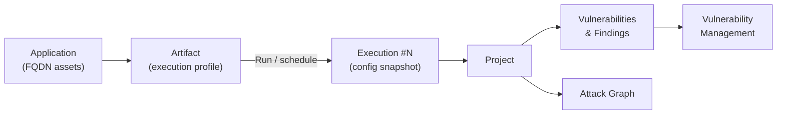
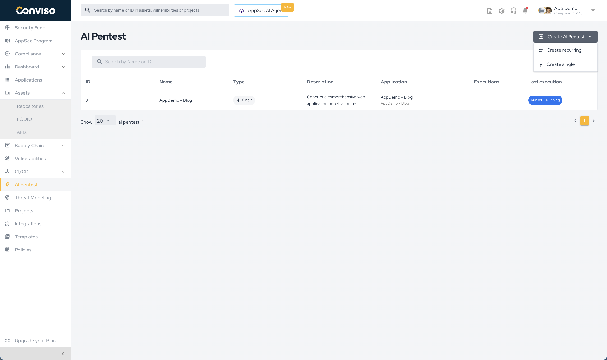
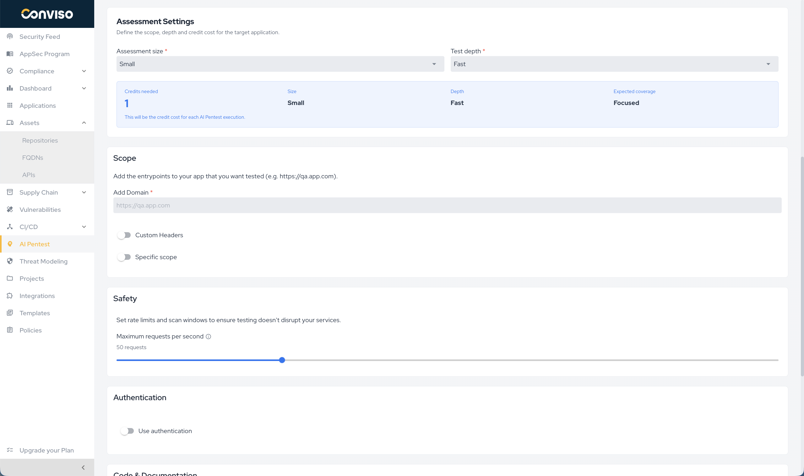
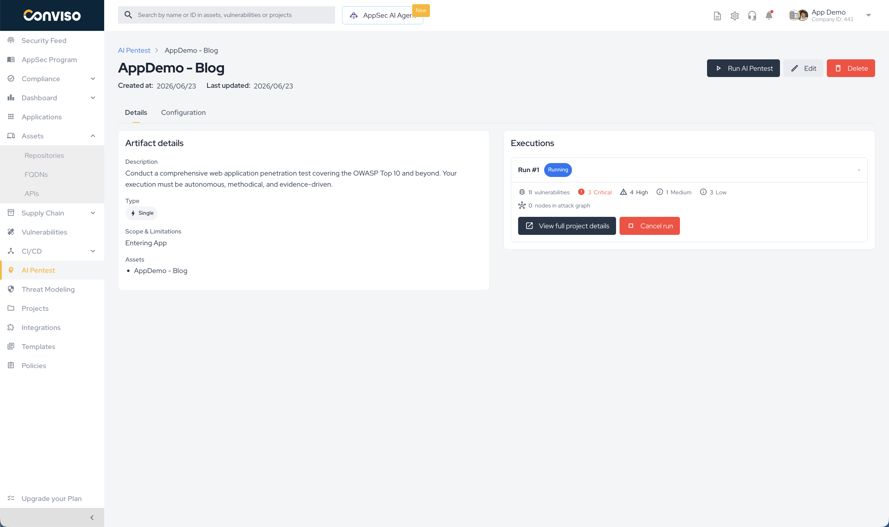
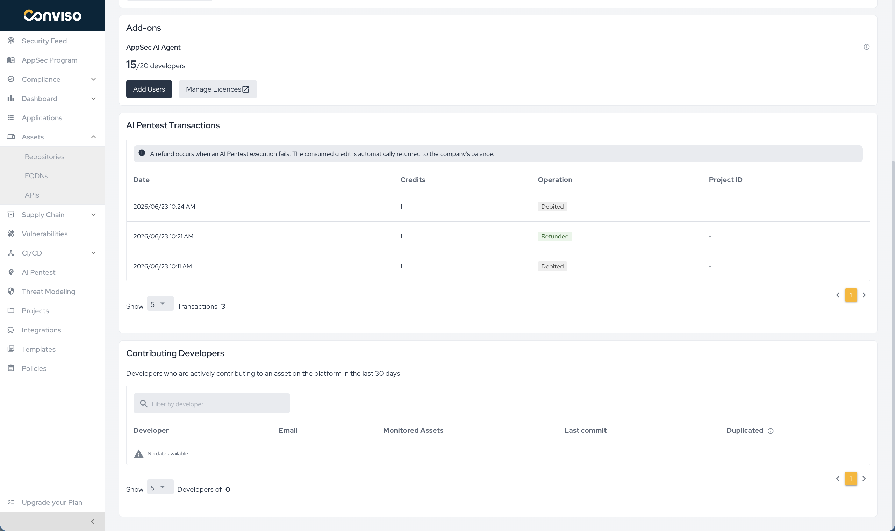

## Introduction

**AI Pentest** is an autonomous penetration testing capability of the Conviso Platform. It uses an LLM-driven engine that orchestrates 100+ offensive security tools (recon, fuzzing, exploitation, web/API attacks) to discover, validate, and report vulnerabilities — without manual triggering of each tool.

Findings produced by AI Pentest flow back into the Conviso Platform as standard vulnerabilities, so they can be triaged, tracked, and remediated alongside results from DAST, SAST, SCA, Container, and SBOM scans.


## Core concepts

The **AI Pentest screen is the single source of configuration** — every domain, credential, scope rule, and schedule for a pentest lives on its artifact there.

| Object | What it is | Lives under |
|--------|------------|-------------|
| **Artifact** | One **logical pentest** — effectively an **execution profile**. It belongs to a single **Application** and holds the entire configuration (type, domains, scope, safety, authentication, code & docs, scheduling, assessment size/depth). You create and edit it from the AI Pentest screen, then run it as many times as you want — every run reuses this profile. | **AI Pentest** (side menu) |
| **Execution (Run)** | One **run** of an artifact. Each execution is numbered (`Run #1`, `Run #2`, …), is backed by a **Project**, carries its own status, vulnerabilities, attack graph, and an immutable copy of the config used. | **AI Pentest → [Artifact] → Details** |

Think of the artifact as a **reusable execution profile**: you configure it once, and each run spins up a new, independent execution from that same config. Editing the artifact changes the profile for **future** runs only — past executions keep an immutable snapshot of the config they ran with. Recurring artifacts also generate executions automatically on a schedule.



### Artifact types

The type is chosen **when you create the artifact** and is **immutable afterwards** :

- **Single** — a one-off pentest. You can run it on demand, or schedule it to start once at a specific date/time.
- **Recurring** — runs automatically on a cadence (weekly, monthly, or quarterly).


## Prerequisites

| Requirement | Needed for |
|-------------|------------|
| AI Pentest plan permissions + available **credits** | Creating, running, and viewing artifacts. A run with no available credits **fails** (see [Credits](#credits)). |
| An **Application** with **FQDN assets** | The artifact targets an Application; its FQDN (domain) assets pre-populate the scope **Domains**. See [FQDN assets](#fqdn-assets). |
| A **Secret** (Basic Auth, Bearer, Header, Cookie, Query Param, Generic) | Authenticated testing. See [Credentials](../platform/credentials.md). |
| **GitHub** or **Azure DevOps** integration | White-box mode (`Use repository`). |
| API specification (OpenAPI, GraphQL, Postman, SOAP) — URL or file | Documentation-aware endpoint mapping (`Use documentation`). |


## Getting started

Run your first AI Pentest in five steps:

1. **Confirm access.** Make sure your company has `AI_PENTEST_ACCESS` and available **credits** (**Plan → Plan Usage → AI Pentest Credits**). No credits = the run fails.
2. **Pick a target.** Open **AI Pentest** in the side menu, click **Create AI Pentest**, and choose **Create single** (one-off) or **Create recurring**. Select the **Application** to test — its FQDN assets auto-fill the scope **Domains**.
3. **Set the effort.** On the **Assessment Settings** card pick an **Assessment size** and **Test depth**. The card shows the **Credits needed** for that combination before you commit. Start with `Small` / `Fast` for a cheap first pass.
4. **(Optional) Tune the run.** Add a **Secret** for authenticated testing, restrict **Specific scope** paths, lower **Maximum requests per second** for fragile environments, or enable **Use repository** / **Use documentation** for deeper coverage.
5. **Run and watch.** Save, then click **Run**. Credits are debited and an **Execution (Run #1)** is queued. Open it to follow the live **Attack Graph**; when it reaches `done`, review the **Vulnerabilities** and **Generate report**.

:::tip
Configure the artifact once and re-run it whenever you ship changes it's a reusable profile. For continuous coverage, create a **recurring** artifact instead and let the schedule run it for you.
:::


## The AI Pentest screen (artifact list)

Open **AI Pentest** in the side menu to see every artifact for the company. The table shows: **ID**, **Name**, **Type**, **Description**, **Application** (and its assets), **Executions** count, and **Last execution** (`Run #N` with a status badge).

Use **Create AI Pentest** (top right) to start a new one. The dropdown lets you pick the type up front:

- **Create recurring**
- **Create single**

<div style={{textAlign: 'center', maxWidth: '100%'}}>



</div>


## Configuring an artifact

The create/edit form is split into cards. Selecting the **Type** (Create recurring / single) and an **Application** are the entry points; everything else tunes the run.


### Artifact info

- **Name** (required): identifies the artifact.
- **Goals**: free-text objectives for the run. Forwarded to AI Pentest as the pentest goal.
- **Type** (required): Recurring or Single. **Locked**: it is defined by the Create action and cannot be changed here.
- **Application** (required): the deployable unit under test. **Selecting an Application auto-fills the Domains**.
- **Scope and limitations**: free-text notes about constraints.

### Assessment Settings

Two selectors define how much work the run does and therefore **how many credits it costs**.

**Assessment size** the breadth of the application (sets the base credit cost):

| Size | Best for | Coverage | Highlights |
|------|----------|----------|------------|
| **Small** (1 base credit) | Simple applications, small APIs, or admin panels with reduced scope. | Focused | Focused coverage · low complexity · ideal for quick validations. |
| **Medium** (3 base credits) — **recommended** | B2B SaaS, relevant APIs, authentication, and multiple business flows. | Broad | Broad coverage · moderate complexity · recommended for most projects. |
| **Large** (5 base credits) | Large platforms, multi-tenant, SSO, integrations, and complex workflows. | Extensive | Extensive coverage · high complexity · ideal for critical environments. |

**Test depth** — how exhaustively AI Pentest explores (multiplies the base cost):

| Depth | What it does | Highlights |
|-------|--------------|------------|
| **Fast** (×1) | Quick run to find the most evident vulnerabilities and validate initial exposure. | Reduced crawling · fewer exploratory attempts · shorter run time. |
| **Standard** (×1.5) — **best default** | Balance between coverage, depth, and predictability. | Balanced exploration · more business context · good overall coverage. |
| **Deep** (×2) | Extensive autonomous exploration to find harder-to-reach vulnerabilities. | More branching · more fuzzing · more attempts and validations. |

:::tip Recommendation
Drop to **Small / Fast** for a cheap first pass or a tiny surface; move to **Large / Deep** for critical, complex, or high-assurance targets.
:::

The card shows a live preview with **Credits needed**, the chosen Size/Depth, and the **Expected coverage**. The cost is computed per execution, see [Credits](#credits) for the full matrix.

<div style={{textAlign: 'center', maxWidth: '100%'}}>



</div>

### Scope

Defines **what AI Pentest is allowed to test**.

- **Add Domain** (**required**): one or more entry-point URLs (e.g. `https://qa.app.com`). Auto-populated from the Application's FQDN assets; you can add or remove entries. At least one domain is required to save.
- **Custom Headers**: optional `Key: Value` pairs attached to **every** request (API keys, tenant headers, tracing IDs).
- **Specific scope**: when enabled, restricts testing to the path patterns below:
  - **In-Scope Paths**: regex/path patterns to focus on.
  - **Out-of-Scope Paths**: regex/path patterns to exclude.

**Impact:** a narrower scope shortens the run and reduces noise; a broader scope increases coverage and token usage.

:::tip Identify or allowlist the pentest traffic
Because **Custom Headers** are sent on every request, you can add a unique marker header (e.g. `X-Conviso-Pentest: <token>`) so your **WAF, CDN, or SOC** can recognize AI Pentest traffic. Use it to:

- **Allowlist / bypass** WAF blocking and rate limiting, so testing reaches the application instead of being filtered (recommended when scanning a protected environment, otherwise the WAF may mask real vulnerabilities).
- **Tag and filter** the traffic in logs/SIEM to avoid false alerts during the run.

Coordinate the exact header name/value with whoever manages the WAF/edge, then add it here. Keep any sensitive token in a **[Secret](#authentication)** rather than a plain header when possible.
:::

### Safety

- **Maximum requests per second** — rate limit AI Pentest honors against the target. Lower is safer for fragile/shared environments; higher shortens the run.

### Authentication

- **Use authentication**: attaches an existing **Secret** to the run; the payload (basic auth, bearer, header, cookie, query param, generic) is forwarded to AI Pentest for authenticated browsing and request signing.
- **Manage your credentials**: shortcut to the [Credentials](../platform/credentials.md) page.

**Impact:** without a secret, AI Pentest only reaches public surface. With one, it can exercise authenticated and authorization flows (privilege escalation, IDOR, broken access control).

### Code & Documentation

- **Use repository**: clones the selected repositories before the run and exposes them to AI Pentest (white-box). Requires a **GitHub** or **Azure DevOps** integration; each repo is tagged with its provider.
- **Use application documentation**: feeds an API spec so endpoints are mapped deterministically instead of brute-forced.
  - **Documentation format**: `OpenAPI / Swagger`, `GraphQL`, `Postman`, or `SOAP / WSDL`.
  - **Documentation URL or file**: a public URL or a direct upload.

See [Whitebox Mode and Source Code Privacy](#whitebox-mode-and-source-code-privacy) for how source code is handled.

### Scheduling

The scheduling card adapts to the artifact **type**:

- **Single**: the run is on demand by default. Enable **Use scheduling** to start it once at a chosen **Date** + **Hour/Minute**.
- **Recurring**: scheduling is always on. Pick an **Interval** (`Weekly`, `Monthly`, `Quarterly`) and the dispatch moment (**Weekday** for weekly; **Day** for monthly/quarterly; plus **Hour/Minute**).

Save the form to persist the artifact. On a recurring artifact, the scheduled dispatcher queues an execution automatically each cycle.

## Artifact details and executions

Opening an artifact shows its header (with **Run**, **Edit**, **Delete** actions, subject to permissions) and two tabs:

- **Details**: description, type (with interval), scope, assignee, and the Application's assets, plus the **Executions** list.
- **Configuration**: a read-only snapshot of the artifact's current configuration.

### Executions (run cards)

Each run is a card showing:

- **Run #N** and a **status badge**.
- **Vulnerabilities** count and the **severity breakdown** (critical / high / medium / low / info).
- **Nodes in attack graph** and the run **duration**.
- **View full project details**: opens the backing Project (vulnerabilities, attack graph, report).
- **Cancel run**: available while the run is `pending` or `running`.





#### Execution statuses

| Status | Meaning |
|--------|---------|
| `pending` | Queued; credits debited; waiting for the agent to start. |
| `running` | The pentest is executing; the attack graph streams live. |
| `done` | Finished successfully. |
| `failed` | The run could not complete (e.g. insufficient credits, agent/connection error). Debited credits are **refunded**. |
| `cancelled` | Stopped by a user via **Cancel run**. |

### Generating the report

The **Generate report** action lives on the run's **project details** page. For AI Pentest it is **enabled only when the execution status is `done`** — while a run is still in progress the button is greyed out, to prevent generating an incomplete report.

### Re-testing

From a finished AI Pentest project you can trigger a **retest** of the previously found vulnerabilities. Requirements:

- The project must be **`done`** and must still have pending (unfixed) vulnerabilities.
- You need the **`AI_PENTEST_UPDATE`** permission (or be a super-user).

A retest creates a **new execution** (kind `retest`) that reuses the same project and re-validates only the known vulnerabilities — it does **not** re-run the full pentest. Retests are **free**: no credits are debited. The agent reports a per-vulnerability verdict back to the platform, and fixed vulnerabilities are counted against the snapshot taken when the retest started. A retest failure leaves the project in `done` (it never reverts the original result).

## Running an AI Pentest

There are two ways a run starts:

1. **Manual**: create an artifact (or open an existing one and click **Run**). One execution is queued immediately.
2. **Scheduled**: a recurring artifact is picked up by the platform's dispatcher on its cadence, which queues one execution per cycle.

In both cases the platform:

1. Builds the resolved configuration snapshot for the execution.
2. **Debits the required credits** (see below) — if none are available, the run **fails** before contacting the agent.
3. Resolves the authentication secret (if `Use authentication`).
4. Resolves repository clone access (if `Use repository`).
5. Dispatches AI Pentest and tracks status, vulnerabilities, and the live attack graph.

## Credits

Every AI Pentest **execution** consumes execution credits of type **AI_PENTEST**.

### Cost model

The cost per execution is derived from the **Assessment Settings**:

```text
credits = ceil( size_base × depth_multiplier )
```

| | Fast (×1) | Standard (×1.5) | Deep (×2) |
|--------------|:--:|:--:|:--:|
| **Small** (1 base) | 1 | 2 | 2 |
| **Medium** (3 base) | 3 | 5 | 6 |
| **Large** (5 base) | 5 | 8 | 10 |

The **Credits needed** preview on the Assessment Settings card always reflects this value for the selected Size/Depth.

### How credits are charged

- **When**: at the start of every execution (manual or scheduled).
- **Where from**: the platform debits with a fallback order:
  1. **Recurrent balance**: your plan's periodic AI Pentest credits (reset each billing period).
  2. **ADDON pool**: additional purchased credits, used for any remainder.
- **Insufficient credits**: if the recurrent balance is exhausted and there is no ADDON pool, the debit raises `Insufficient credits: no available recurrent balance and no ADDON pool found for AI_PENTEST` and the execution is marked **failed**.
- **Refunds**: when a run ends as **failed** or **cancelled**, the credits debited for it are **refunded** automatically.

## Debit history (AI Pentest Transactions)

The full credit ledger is visible under **Plan → Plan Usage**. The page shows:

- **AI Pentest Credits**: the current available balance.
- **AI Pentest Transactions**: the debit/refund history table.

The transactions table has the columns:

| Column | Description |
|--------|-------------|
| **Date** | When the transaction happened. |
| **Credits** | Amount moved. |
| **Operation** | **Debited** (a run was charged) or **Refunded** (a failed/cancelled run was reimbursed). |
| **Project** | The AI Pentest project/execution the transaction is tied to (links to the associated run). |





## Viewing results

When AI Pentest finishes, the produced **Vulnerabilities** and **Findings** are stored under the run's Project and linked to the Application's asset. They are visible at:

- **AI Pentest → [Artifact] → Details**: execution history and per-run summary.
- **Projects → [AI Pentest Project]**: vulnerabilities, findings, and the attack graph for the run.
- **Vulnerability Management**: AI Pentest results follow the same workflow status, severity, and triage rules as any other scanner source.

### Attack Graph

The **Attack Graph** is a live visualization of AI Pentest's reasoning during the run. It streams in real time on the project view, so you can watch progress without waiting for the final report.

<div style={{textAlign: 'center', maxWidth: '100%'}}>


</div>

Each node is a discrete step (a tool execution, an observation, or a confirmed vulnerability); edges connect steps AI Pentest chained together. Nodes are grouped into four phases that mirror the offensive kill chain:

| Phase | What it represents |
|-------|--------------------|
| **Reconnaissance** | Information gathering and surface mapping (subdomain enumeration, fingerprinting, port/endpoint discovery). |
| **Discovery** | Vulnerability identification — candidate weaknesses surfaced by scanners, fuzzers, or probes. |
| **Exploitation** | Active exploitation attempts against the candidates. |
| **Impact** | Confirmed/reported vulnerabilities and demonstrated business impact (data exposure, privilege escalation, takeover). Labelled **Reported Vulnerabilities** in the viewer. |

Selecting a node opens its details with the underlying tool output, AI Pentest's interpretation, and links to any vulnerability it generated. The graph remains available after the run as the post-mortem view.

## Black-Box Mode and Application Data Privacy

By default and whenever **Use repository** is disabled — AI Pentest runs in **black-box mode**, interacting with the target only through its network surface.

### What we do not do

- **We do not give the LLM raw HTTP traffic.** Full request/response payloads and large tool outputs are intercepted, summarized, and reduced to structured signals before the LLM sees them.
- **We do not retain authentication secrets.** Secrets are pulled from the Credentials vault at the start of the execution, scoped to the run, and used only by AI Pentest and its tools — never embedded in LLM prompts or persisted elsewhere.
- **We do not exfiltrate the target's data.** AI Pentest runs against the listed **Domains** and **In-Scope Paths**; out-of-scope paths and hosts outside the configured scope are excluded.

### What actually happens during a black-box run

1. **Surface mapping.** Recon requests to the configured domains (subdomain enumeration, fingerprinting, port/endpoint discovery), with custom headers and secrets attached when configured.
2. **Tool execution.** Scanners, fuzzers, and exploit tools run inside an isolated sandbox; their raw output stays inside it.
3. **Summarization layer.** A dedicated background process on a small, cheap model converts every tool output into **structured signals** (endpoints, parameters, behaviors, candidate vulnerabilities, evidence snippets). Large outputs are summarized inline before reaching the main LLM.
4. **Project-scoped memory.** Signals are persisted in a **per-execution memory store**; data never bleeds across projects, assets, or companies.
5. **LLM input.** The main LLM receives only those summarized signals plus working context, and uses them to decide the next attack — without ever seeing full traffic dumps.

## Whitebox Mode and Source Code Privacy

When **Use repository** is enabled, AI Pentest runs in **whitebox mode**, combining black-box exploitation with code-level insight.

### What we do not do

- **We do not store your source code on the Conviso Platform.** Repositories are cloned on demand, used as a working copy for the run, and discarded when it ends.
- **We do not send your source code directly to the LLM.** Raw files are never embedded in prompts.

### What actually happens during a whitebox run

1. **Clone on demand.** A short-lived, scoped token is minted through your GitHub / Azure DevOps integration to clone the selected repositories into the isolated workspace for the run's duration.
2. **Static analysis pipeline.** Local SAST tools and analyzers produce structured outputs (rules triggered, sinks/sources, taints, dependency context).
3. **Application call graph.** AI Pentest builds a call graph of the application to reason about reachability and parameter propagation.
4. **Consolidation.** SAST findings and the call graph are consolidated into **structured, summarized signals**.
5. **LLM input.** Only those consolidated signals are passed to the LLM — never the raw source.

:::note
Repository access is mediated by the same GitHub / Azure DevOps integration used by other Conviso scanners. Revoking the integration immediately cuts AI Pentest's ability to clone new repositories.
:::

## Troubleshooting / FAQ

**My run failed immediately with an insufficient-credits error.**
The recurrent balance is exhausted and there is no ADDON pool. Top up credits or wait for the next billing period, then run again. The failed run's debit (if any) is auto-refunded — check **Plan → Plan Usage → AI Pentest Transactions**.
.

**I clicked Run but nothing started / it says a pentest is already running.**
Only one execution per artifact/asset runs at a time. Wait for the in-progress run to finish or **Cancel** it, then start a new one.

**The run is stuck in `pending`.**
`pending` means it's queued and waiting for agent capacity (a bounded number of pentests run concurrently). It moves to `running` once a slot frees. If it never starts, cancel it (credits are refunded) and retry.

**Generate report is greyed out.**
The report is only available when the execution status is `done`. Wait for the run to finish.

**The run finished with zero vulnerabilities.**
That can be legitimate (clean surface), or coverage was too shallow. Try a larger **Assessment size** / deeper **Test depth**, add a **Secret** for authenticated flows, widen the **Scope**, or attach **documentation** / a **repository** for white-box depth.

**Can I change Single to Recurring (or vice-versa)?**
No — the type is locked after creation. Create a new artifact with the type you want.


**Where do the results show up?**
Under the run's **Project** (vulnerabilities, findings, attack graph) and in **Vulnerability Management**, where they follow the same triage workflow as any other scanner source. See [Viewing results](#viewing-results).

## Support

Should you have any questions or require assistance while configuring the AI Pentest capability, feel free to contact our dedicated support team.
