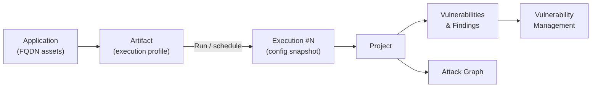
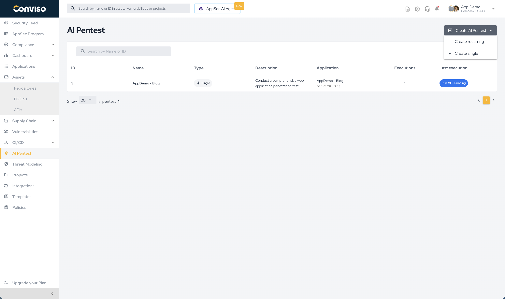
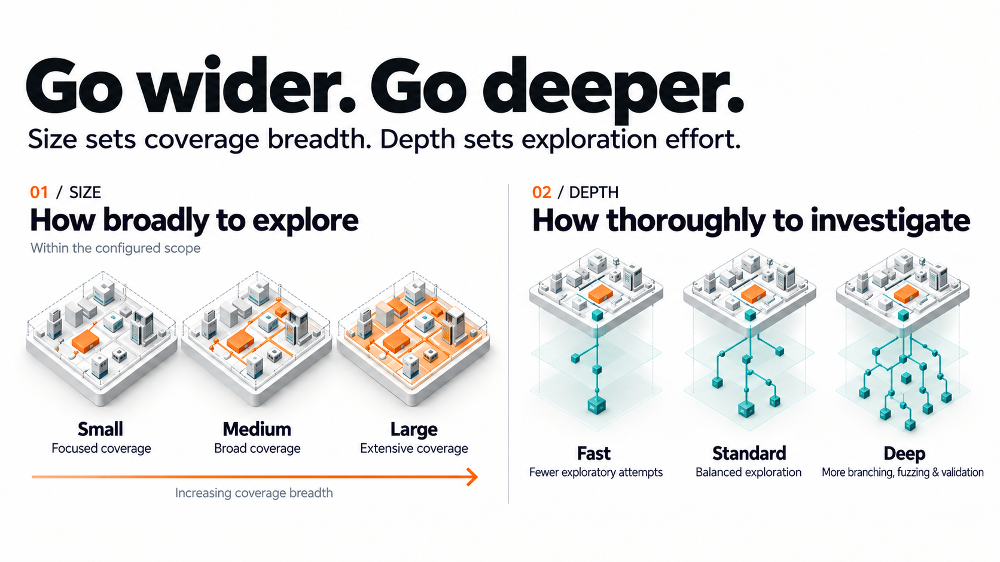
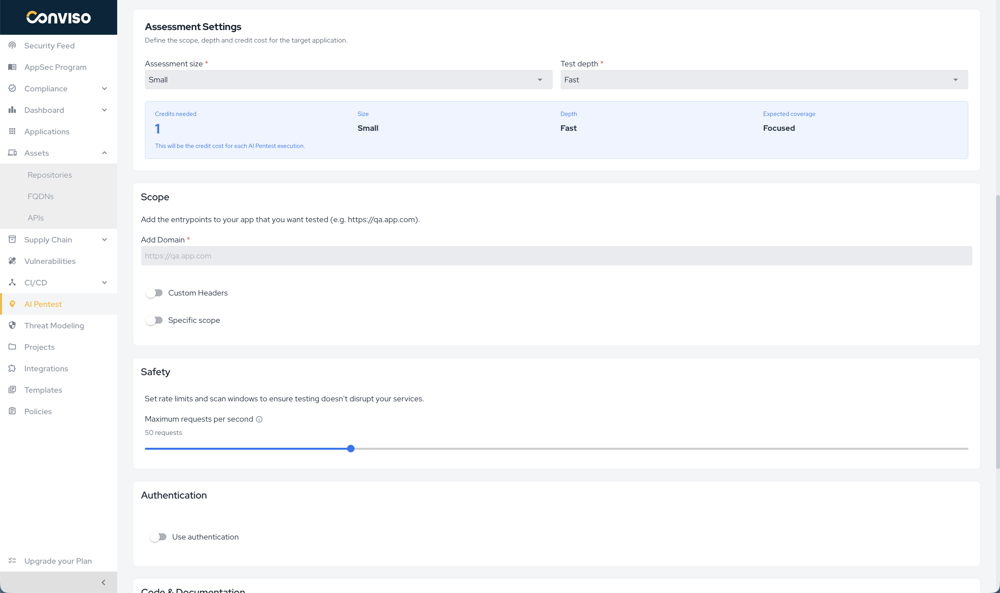
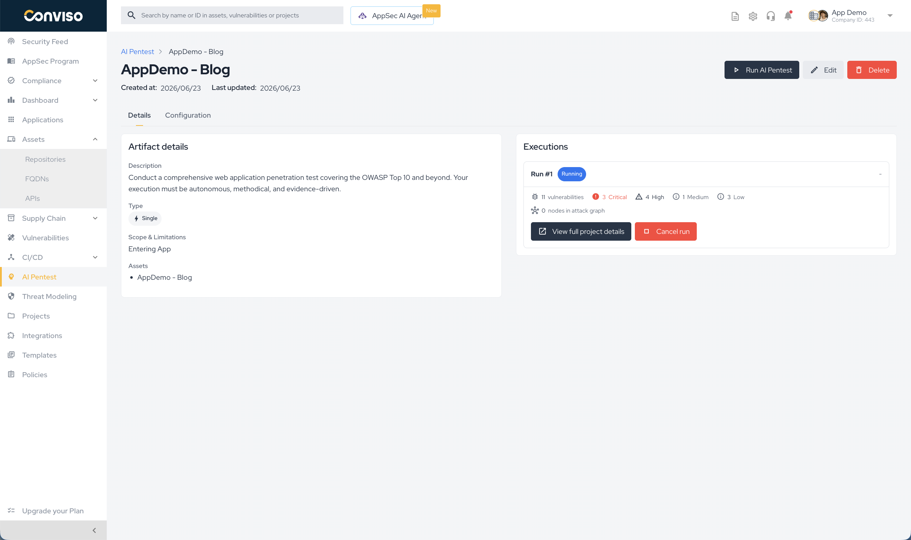
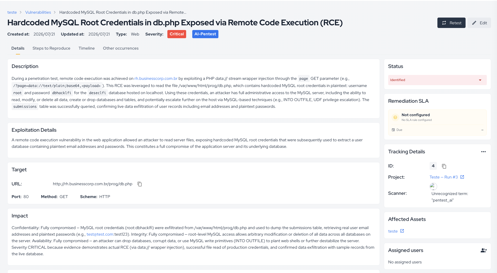
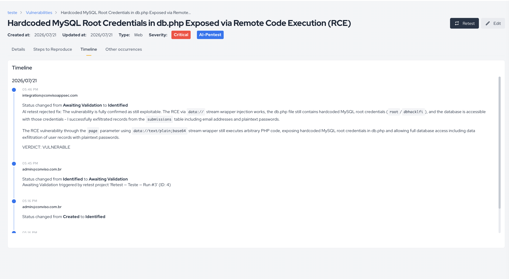
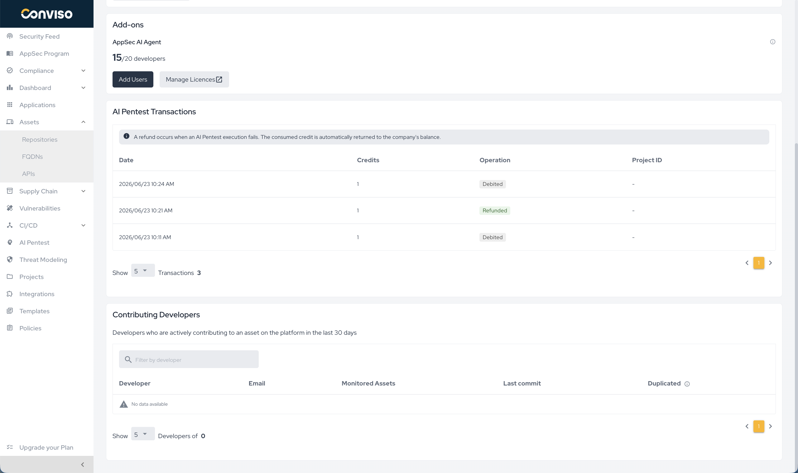
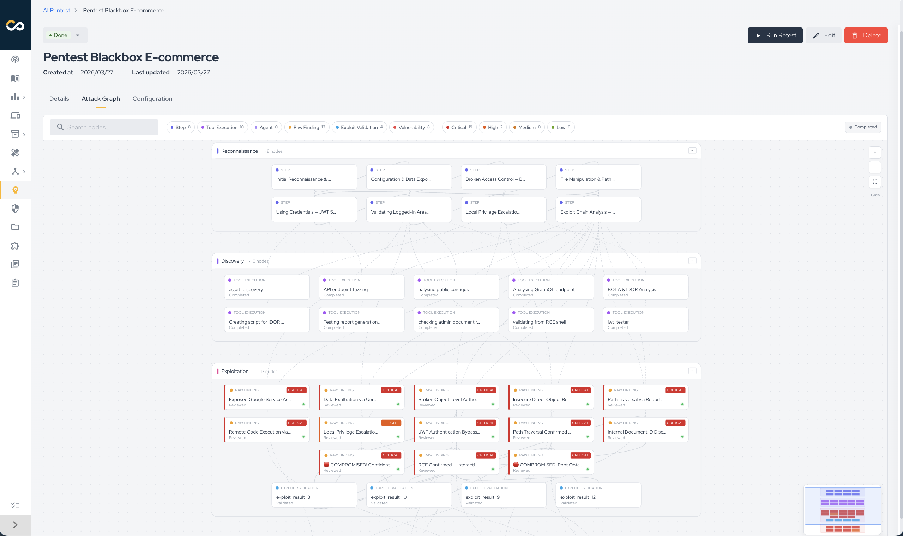

## Introduction

**AI Pentest** is an autonomous penetration testing capability of the Conviso Platform. It uses an LLM-driven engine that orchestrates 100+ offensive security tools (recon, fuzzing, exploitation, web/API attacks) to discover, validate, and report vulnerabilities — without manual triggering of each tool.

Findings produced by AI Pentest flow back into the Conviso Platform as standard vulnerabilities, so they can be triaged, tracked, and remediated alongside results from DAST, SAST, SCA, Container, and SBOM scans.


## Core concepts

The **AI Pentest screen is the single source of configuration** — every domain, credential, scope rule, and schedule for a pentest lives on its artifact there.

| Object | What it is | Lives under |
|--------|------------|-------------|
| **Artifact** | One **logical pentest** — effectively an **execution profile**. It belongs to a single **Application** and holds the entire configuration (type, domains, scope, safety, authentication, code & docs, scheduling, assessment size/depth, assigned user). You create and edit it from the AI Pentest screen, then run it as many times as you want — every run reuses this profile. | **AI Pentest** (side menu) |
| **Execution (Run)** | One **run** of an artifact. Each execution is numbered (`Run #1`, `Run #2`, …), is backed by a **Project**, carries its own status, vulnerabilities, attack graph, and an immutable copy of the config used. | **AI Pentest → [Artifact] → Details** |

Think of the artifact as a **reusable execution profile**: you configure it once, and each run spins up a new, independent execution from that same config. Editing the artifact changes the profile for **future** runs only — past executions keep an immutable snapshot of the config they ran with. Recurring artifacts also generate executions automatically on a schedule.


```mermaid
flowchart LR
    A["Application<br/>(FQDN assets)"] --> B["Artifact<br/>(execution profile)"]
    B -->|Run / schedule| C["Execution #N<br/>(config snapshot)"]
    C --> D["Project"]
    D --> E["Vulnerabilities<br/>& Findings"]
    D --> F["Attack Graph"]
    E --> G["Vulnerability<br/>Management"]
```

### Artifact types

The type is chosen **when you create the artifact** and is **immutable afterwards** :

- **Single** — a one-off pentest. You can run it on demand, or schedule it to start once at a specific date/time.
- **Recurring** — runs automatically on a cadence (weekly, monthly, or quarterly).


## Prerequisites

| Requirement | Needed for |
|-------------|------------|
| AI Pentest plan permissions + available **credits** | Creating, running, and viewing artifacts. A run with no available credits **fails** (see [Credits](#credits)). |
| An **Application** with **FQDN assets** | The artifact targets an Application; its FQDN (domain) assets pre-populate the scope **Domains**. See [FQDN assets](#fqdn-assets). |
| One or more **Secrets** (Basic Auth, Bearer Token, Header, Form Login) | Authenticated testing — you can attach **multiple** credentials to one artifact. **Form Login** additionally automates username/password, **TOTP/OTP**, and **reCAPTCHA / hCaptcha** solving. See [Credentials](../platform/credentials.md). |
| One **TOTP seed** *(only if the account uses MFA)* | The secret key generated when MFA is enrolled for the test account. AI Pentest uses it to generate one-time codes at login. Without it, authentication fails. Someone who can enroll or reset MFA on that account (account owner, IAM/Security team or administrator) must provide it. |
| **GitHub** or **Azure DevOps** integration | White-box mode (`Use repository`). |
| API specification (OpenAPI, GraphQL, Postman, SOAP) — URL or file | Documentation-aware endpoint mapping (`Use documentation`). |


> Someone on the customer side must be able to enroll or reset MFA for the test account to obtain the seed — typically the account owner, the IAM / Infrastructure / Security team, or a system administrator. Plan this before scheduling the run.

## Getting started

Run your first AI Pentest in five steps:

1. **Confirm access.** Make sure your company has `AI_PENTEST_ACCESS` and available **credits** (**Plan → Plan Usage → AI Pentest Credits**). No credits = the run fails.
2. **Pick a target.** Open **AI Pentest** in the side menu, click **Create AI Pentest**, and choose **Create single** (one-off) or **Create recurring**. Select the **Application** to test — its FQDN assets auto-fill the scope **Domains**.
3. **Set the effort.** On the **Assessment Settings** card pick an **Assessment size** and **Test depth**. The card shows the **Credits needed** for that combination before you commit. `Medium` / `Standard` is the recommended starting point for most applications; use `Small` / `Fast` only for a cheap first pass (for example, to confirm that scope and login work). See [How Size and Depth affect results](#how-size-and-depth-affect-results) to choose.
4. **(Optional) Tune the run.** Add one or more **Secrets** for authenticated testing (**Form Login** covers pages behind username/password, OTP, or CAPTCHA), assign a responsible user, restrict **Specific scope** paths, lower **Maximum requests per second** for fragile environments, or enable **Use repository** / **Use documentation** for deeper coverage.
5. **Run and watch.** Save, then click **Run**. Credits are debited and an **Execution (Run #1)** is queued. Open it to follow the live **Attack Graph**; when it reaches `done`, review the **Vulnerabilities** and **Generate report**.

:::tip
Configure the artifact once and re-run it whenever you ship changes it's a reusable profile. For continuous coverage, create a **recurring** artifact instead and let the schedule run it for you.
:::


## The AI Pentest screen (artifact list)

Open **AI Pentest** in the side menu to see every artifact for the company. The table shows: **ID**, **Name**, **Type**, **Description**, **Application** (and its assets), **Executions** count, and **Last execution** (`Run #N` with a status badge).

Use **Create AI Pentest** (top right) to start a new one. The dropdown lets you pick the type up front:

- **Create recurring**
- **Create single**

<div style={{textAlign: 'center', maxWidth: '100%'}}>



</div>


## Configuring an artifact

The create/edit form is split into cards. Selecting the **Type** (Create recurring / single) and an **Application** are the entry points; everything else tunes the run.


### Artifact info

- **Name** (required): identifies the artifact.
- **Goals**: free-text objectives for the run. Forwarded to AI Pentest as the pentest goal.
- **Type** (required): Recurring or Single. **Locked**: it is defined by the Create action and cannot be changed here.
- **Application** (required): the deployable unit under test. **Selecting an Application auto-fills the Domains**.
- **Guardrails**: free-text safety **boundaries** for the run — plain-language rules the agent must respect (e.g. _"do not attempt destructive or DoS actions"_, _"never exercise the `/admin/billing` flow"_, _"do not create or delete real user data"_). They are forwarded to AI Pentest as an explicit **Guardrails** instruction it is told to honor **strictly**, and are **distinct from the structured [In/Out-of-Scope paths](#scope)**: Guardrails express intent and prohibitions in natural language, while In/Out-of-Scope are URL path patterns. Use both together for tight, safe runs.
- **Assigned user**: the platform user responsible for this artifact. Optional and clearable; shown on the artifact's **Details** tab.

### Assessment Settings

Two selectors define how much work the run does and therefore **how many credits it costs**:

- **Assessment size** answers _"how much of the application do we explore?"_ (breadth).
- **Test depth** answers _"how hard do we try on each part we find?"_ (effort).

Neither selector changes **what is allowed** to be tested. The boundary is always the [Scope](#scope) (Domains, In-Scope and Out-of-Scope paths) and the [Guardrails](#artifact-info). Size and Depth only decide how much of that boundary the run covers and how thoroughly.

<div style={{textAlign: 'center', maxWidth: '100%'}}>



</div>

**Assessment size** — the breadth of the application (sets the base credit cost):

| Size | Best for | Coverage | Highlights |
|------|----------|----------|------------|
| **Small** (1 base credit) | Simple applications, small APIs, or admin panels with reduced scope. | Focused | Focused coverage · low complexity · ideal for quick validations. |
| **Medium** (3 base credits) — **recommended** | B2B SaaS, relevant APIs, authentication, and multiple business flows. | Broad | Broad coverage · moderate complexity · recommended for most projects. |
| **Large** (5 base credits) | Large platforms, multi-tenant, SSO, integrations, and complex workflows. | Extensive | Extensive coverage · high complexity · ideal for critical environments. |

**Test depth** — how exhaustively AI Pentest explores (multiplies the base cost):

| Depth | What it does | Highlights |
|-------|--------------|------------|
| **Fast** (×1) | Quick run to find the most evident vulnerabilities and validate initial exposure. | Reduced crawling · fewer exploratory attempts · shorter run time. |
| **Standard** (×1.5) — **best default** | Balance between coverage, depth, and predictability. | Balanced exploration · more business context · good overall coverage. |
| **Deep** (×2) | Extensive autonomous exploration to find harder-to-reach vulnerabilities. | More branching · more fuzzing · more attempts and validations. |

:::tip Recommendation
Use **Medium / Standard** for most applications. See [How Size and Depth affect results](#how-size-and-depth-affect-results) for when to go lighter or heavier.
:::

The card shows a live preview with **Credits needed**, the chosen Size/Depth, and the **Expected coverage**. The cost is computed per execution, see [Credits](#credits) for the full matrix.

<div style={{textAlign: 'center', maxWidth: '100%'}}>



</div>

### How Size and Depth affect results

#### Size: how much of the application is reached

Size sets how far the run spreads **inside the configured scope**: how many pages, endpoints, roles, and business flows it maps and tests. Pick the Size that matches the application (see the table above), not the budget. If the application is bigger than the chosen Size, the run prioritizes the most exposed parts and some areas may not be reached. This is the most common reason a run "misses" an area.

#### Depth: how hard each area is tested

| | **Fast** | **Standard** | **Deep** |
|---|---|---|---|
| **Crawling** | Follows the obvious links, routes, and forms. | Goes beyond the obvious, using business context learned during the run. | Also looks for poorly linked routes, parameters, and alternative paths. |
| **Fuzzing** | Fewer attempts per input. | Balanced set of attempts. | More variations, encodings, and bypass attempts. |
| **Attack chaining** | Tests findings mostly in isolation. | Follows promising leads. | Combines findings into multi-step attacks. |
| **Validation** | Confirms clear cases. | Confirms most candidates. | More attempts to confirm or discard each candidate. |

#### What does Fast leave out?

There is **no fixed list of vulnerability types or URLs that Fast skips**. Every vulnerability class can be found at any Depth; what changes is the effort spent on each, so the difference is the **chance of detection**, not an on/off switch.

Fast finds what shows up quickly, such as inputs that respond to a direct payload and evident misconfigurations. What it is most likely to miss:

- **Hidden surface**: pages, endpoints, or parameters reachable only after several steps, or not linked at all.
- **Access control and business logic**: IDOR, privilege escalation between roles or tenants, abuse of flows like checkout or password reset.
- **Chained attacks**: low-severity findings that become critical when combined.
- **Filtered inputs**: injections that only work after encoding or WAF-bypass attempts.
- **Blind, time-based, and second-order issues**: no direct response, need repeated testing to confirm.

**Does Fast scan more URLs?** No. It is quicker because it does less. To reach more URLs, raise **Size**; to test each URL more thoroughly, raise **Depth**.

**What do I gain with Deep?** More findings in the categories above, fewer false positives and false negatives (each candidate is re-tested more), and stronger impact evidence from chained attacks. The cost is more credits and a longer run.

#### Does a lower option leave my system vulnerable?

No. The option **does not create or remove vulnerabilities**; it changes **how much of the existing risk the run can find**. Keep in mind:

- **No combination guarantees zero vulnerabilities**, not even Large / Deep.
- Zero findings on **Small / Fast** means _"nothing evident was found"_, not _"the application is secure"_.

#### Why choose Fast if Standard is recommended?

Because they answer different questions. **Standard** answers _"how secure is this application?"_; **Fast** answers _"is my setup right, or did something obvious break?"_. Use Fast to:

- **Validate the setup** before spending more credits: domains reachable, login working with your **Secrets**, **Scope** correct.
- **Catch regressions often and cheaply**, e.g. a recurring run after each deploy or each week.
- **Cover small, low-risk surfaces** or many applications on a limited credit budget.

Fast complements a Standard or Deep assessment on applications that matter; it does not replace it.

#### Choosing a combination

| Scenario | Size | Depth |
|---|---|---|
| First run, to check scope and login | Small | Fast |
| Regular assessment of a typical SaaS product | Medium | Standard |
| Critical, multi-tenant, or regulated platform | Large | Deep |
| Small but sensitive component (payments API, admin panel) | Small | Deep |

If the **Credits needed** is too high, lower **Depth** before **Size**, so the whole application is still covered, or narrow the [Scope](#scope) to the most important paths. Coverage also improves without extra credits: add **Secrets** for authenticated areas, describe business flows in **Goals** and **Authentication details**, and enable **Use documentation** or **Use repository**.

:::tip Combine schedules
Pair a **recurring Fast** artifact for frequent regression checks with a **Standard** or **Deep** run on a longer cycle (monthly, or before major releases).
:::

### Scope

Defines **what AI Pentest is allowed to test**.

- **Add Domain** (**required**): one or more entry-point URLs (e.g. `https://qa.app.com`). Auto-populated from the Application's FQDN assets; you can add or remove entries. At least one domain is required to save.
- **Custom Headers**: optional `Key: Value` pairs attached to **every** request (API keys, tenant headers, tracing IDs).
- **Specific scope**: when enabled, restricts testing to the path patterns below:
  - **In-Scope Paths**: regex/path patterns to focus on.
  - **Out-of-Scope Paths**: regex/path patterns to exclude.

**Impact:** a narrower scope shortens the run and reduces noise; a broader scope increases coverage and token usage.

:::note Guardrails vs Specific scope
Use **Specific scope** for *path patterns* (include/exclude by URL) and **[Guardrails](#artifact-info)** for *free-text prohibitions* the agent must respect (destructive actions, sensitive flows, data it must not touch). They complement each other — the path lists bound **where** it tests, Guardrails bound **what it must not do**.
:::

:::tip Identify or allowlist the pentest traffic
Because **Custom Headers** are sent on every request, you can add a unique marker header (e.g. `X-Conviso-Pentest: <token>`) so your **WAF, CDN, or SOC** can recognize AI Pentest traffic. Use it to:

- **Allowlist / bypass** WAF blocking and rate limiting, so testing reaches the application instead of being filtered (recommended when scanning a protected environment, otherwise the WAF may mask real vulnerabilities).
- **Tag and filter** the traffic in logs/SIEM to avoid false alerts during the run.

Coordinate the exact header name/value with whoever manages the WAF/edge, then add it here. Keep any sensitive token in a **[Secret](#authentication)** rather than a plain header when possible.
:::

### Safety

- **Maximum requests per second** — rate limit AI Pentest honors against the target. Lower is safer for fragile/shared environments; higher shortens the run.

### Authentication

- **Use authentication**: attaches one or more existing **Secrets** to the run. You can select **multiple credentials** on the same artifact — useful for multi-role testing (e.g. an admin and a regular user for authorization checks). Supported secret types: **Basic Auth**, **Bearer Token**, **Header**, and **Form Login**.
- **Form Login**: drives the browser through the real login flow — filling username/password, handling **TOTP/OTP**, and **solving reCAPTCHA / hCaptcha** when the login page presents one — so AI Pentest can reach surfaces behind an interactive sign-in.
- **Authentication details** (free-text): describe how the credentials should be used — which user is the admin, the login steps to follow, and which credential applies to which area. This context is forwarded to AI Pentest so it authenticates the way you intend (spell out any non-standard or multi-step flow here).
- **Manage your credentials**: shortcut to the [Credentials](../platform/credentials.md) page.

**Impact:** without a secret, AI Pentest only reaches public surface. With one or more, it can exercise authenticated and authorization flows across roles (privilege escalation, IDOR, broken access control). Attaching **multiple credentials** lets a single run compare what different roles can reach.

#### Using TOTP/MFA with Form Login

When the target login requires a one-time code from an authenticator app (Google Authenticator, Microsoft Authenticator, Authy, etc.), add the account's **TOTP seed** to the Form Login secret. AI Pentest generates valid codes from it at login time, so no one needs to be available to type codes during the run.

**What is the TOTP seed?**
It is the secret key created when MFA is enrolled for an account. It usually appears as a Base32 string (e.g., `JBSWY3DPEHPK3PXP`) and is the same value encoded in the enrollment QR Code.

**How to obtain it**
1. Sign in with the test account (or ask an admin to reset its MFA) and start MFA enrollment.
2. When the QR Code is displayed, look for an option such as **"Can't scan?"**, **"Enter key manually"** or **"Show secret key"**, and copy the key.
3. Finish enrollment by entering a code from an authenticator app, so the MFA is active.
4. Paste the key into the **TOTP seed** field of the Form Login secret.

If only the QR Code is available, decode it: it contains a URI like `otpauth://totp/App:user?secret=JBSWY3DPEHPK3PXP&issuer=App`. The value of `secret` is the seed.

> **Important:** The seed is only shown during enrollment. If MFA is already configured and the key was not saved, MFA must be reset for that account to generate a new seed. Treat the seed as a credential: it is stored as a Secret and should never be shared over insecure channels.

### Code & Documentation

- **Use repository**: clones the selected repositories before the run and exposes them to AI Pentest (white-box). Requires a **GitHub** or **Azure DevOps** integration; each repo is tagged with its provider.
- **Use application documentation**: feeds an API spec so endpoints are mapped deterministically instead of brute-forced.
  - **Documentation format**: `OpenAPI / Swagger`, `GraphQL`, `Postman`, or `SOAP / WSDL`.
  - **Documentation URL or file**: a public URL or a direct upload.

See [Whitebox Mode and Source Code Privacy](#whitebox-mode-and-source-code-privacy) for how source code is handled.

### Scheduling

The scheduling card adapts to the artifact **type**:

- **Single**: the run is on demand by default. Enable **Use scheduling** to start it once at a chosen **Date** + **Hour/Minute**.
- **Recurring**: scheduling is always on. Pick an **Interval** (`Weekly`, `Monthly`, `Quarterly`) and the dispatch moment (**Weekday** for weekly; **Day** for monthly/quarterly; plus **Hour/Minute**).

Save the form to persist the artifact. On a recurring artifact, the scheduled dispatcher queues an execution automatically each cycle.

## Artifact details and executions

Opening an artifact shows its header (with **Run**, **Edit**, **Delete** actions, subject to permissions) and two tabs:

- **Details**: description, type (with interval), scope, assignee, and the Application's assets, plus the **Executions** list.
- **Configuration**: a read-only snapshot of the artifact's current configuration.

### Executions (run cards)

Each run is a card showing:

- **Run #N** and a **status badge**.
- **Vulnerabilities** count and the **severity breakdown** (critical / high / medium / low / info).
- **Nodes in attack graph** and the run **duration**.
- **View full project details**: opens the backing Project (vulnerabilities, attack graph, report).
- **Cancel run**: available while the run is `pending` or `running`.





#### Execution statuses

| Status | Meaning |
|--------|---------|
| `pending` | Queued; credits debited; waiting for the agent to start. |
| `running` | The pentest is executing; the attack graph streams live. |
| `done` | Finished successfully. |
| `failed` | The run could not complete (e.g. insufficient credits, agent/connection error). Debited credits are **refunded**. |
| `cancelled` | Stopped by a user via **Cancel run**. |

### Generating the report

The **Generate report** action lives on the run's **project details** page. For AI Pentest it is **enabled only when the execution status is `done`** — while a run is still in progress the button is greyed out, to prevent generating an incomplete report.

### Re-testing

AI Pentest supports **two kinds of retest**, both requiring the **`AI_PENTEST_UPDATE`** permission (or a super-user). In both cases the source project must be **`done`** and still have pending (unfixed) vulnerabilities, and neither re-runs the full pentest. A retest failure never reverts the original result — the source project stays `done`.

#### Project retest — re-validate every pending vulnerability

Triggered from a **finished AI Pentest project** (its header/details). It spins up a **new `Vulnerability Retest` project** (`Retest — <name>`) and a new execution (kind `retest`) that re-validates **all** of the project's pending vulnerabilities in one pass. The findings are moved to *awaiting validation*, the agent reports a **per-vulnerability verdict**, and fixed vulnerabilities are counted against the snapshot taken when the retest started.

#### Single-vulnerability retest — validate one finding

Triggered from the **vulnerability page** with the **Re-Test** button. It is available **only on vulnerabilities that originated from AI Pentest** whose source project is still present — the button does not appear on findings from other scanners. It runs a focused, one-off validation of **that single vulnerability**:

- **No new project** is created — the retest reuses the original project and targets just that finding.
- The button stays in a **testing** state while the ephemeral execution runs, then reports the verdict **in place** — **fixed** or **not fixed** — and refreshes the vulnerability so its updated status shows.

<div style={{textAlign: 'center', maxWidth: '100%'}}>



</div>

#### Retest verdict on the vulnerability timeline

Every retest verdict is also **recorded on the vulnerability's timeline**. When the agent finishes re-validating a finding, it posts an entry to the vulnerability's history stating its decision — **fixed** or **not fixed** — along with the reasoning behind it. This gives you a permanent, auditable trail of each re-validation directly on the vulnerability page, so anyone triaging the finding later can see when it was retested and what the agent concluded, without opening the retest execution.

<div style={{textAlign: 'center', maxWidth: '100%'}}>



</div>

#### Project retest vs single-vulnerability retest

| | Project retest | Single-vulnerability retest |
|---|---|---|
| **Where you trigger it** | Finished AI Pentest **project** (header/details) | The **vulnerability** page (**Re-Test** button) |
| **Scope** | **All** pending vulnerabilities of the project | **One** specific vulnerability |
| **Creates a project?** | Yes — a new **Vulnerability Retest** project | No — reuses the original project |
| **Result** | New retest execution + verdicts across the whole set | In-place verdict (**fixed / not fixed**) on that vuln |
| **Availability** | Any finished AI Pentest project with pending vulns | AI Pentest-origin vulns only |

## Running an AI Pentest

There are two ways a run starts:

1. **Manual**: create an artifact (or open an existing one and click **Run**). One execution is queued immediately.
2. **Scheduled**: a recurring artifact is picked up by the platform's dispatcher on its cadence, which queues one execution per cycle.

In both cases the platform:

1. Builds the resolved configuration snapshot for the execution.
2. **Debits the required credits** (see below) — if none are available, the run **fails** before contacting the agent.
3. Resolves the authentication secret (if `Use authentication`).
4. Resolves repository clone access (if `Use repository`).
5. Dispatches AI Pentest and tracks status, vulnerabilities, and the live attack graph.

## Credits

Every AI Pentest **execution** consumes execution credits of type **AI_PENTEST**.

### Cost model

The cost per execution is derived from the **Assessment Settings**:

```text
credits = ceil( size_base × depth_multiplier )
```

| | Fast (×1) | Standard (×1.5) | Deep (×2) |
|--------------|:--:|:--:|:--:|
| **Small** (1 base) | 1 | 2 | 2 |
| **Medium** (3 base) | 3 | 5 | 6 |
| **Large** (5 base) | 5 | 8 | 10 |

The **Credits needed** preview on the Assessment Settings card always reflects this value for the selected Size/Depth.

### How credits are charged

- **When**: at the start of every execution (manual or scheduled).
- **Where from**: the platform debits with a fallback order:
  1. **Recurrent balance**: your plan's periodic AI Pentest credits (reset each billing period).
  2. **ADDON pool**: additional purchased credits, used for any remainder.
- **Insufficient credits**: if the recurrent balance is exhausted and there is no ADDON pool, the debit raises `Insufficient credits: no available recurrent balance and no ADDON pool found for AI_PENTEST` and the execution is marked **failed**.
- **Refunds**: when a run ends as **failed** or **cancelled**, the credits debited for it are **refunded** automatically.

## Debit history (AI Pentest Transactions)

The full credit ledger is visible under **Plan → Plan Usage**. The page shows:

- **AI Pentest Credits**: the current available balance.
- **AI Pentest Transactions**: the debit/refund history table.

The transactions table has the columns:

| Column | Description |
|--------|-------------|
| **Date** | When the transaction happened. |
| **Credits** | Amount moved. |
| **Operation** | **Debited** (a run was charged) or **Refunded** (a failed/cancelled run was reimbursed). |
| **Project** | The AI Pentest project/execution the transaction is tied to (links to the associated run). |





## Viewing results

When AI Pentest finishes, the produced **Vulnerabilities** and **Findings** are stored under the run's Project and linked to the Application's asset. They are visible at:

- **AI Pentest → [Artifact] → Details**: execution history and per-run summary.
- **Projects → [AI Pentest Project]**: vulnerabilities, findings, and the attack graph for the run.
- **Vulnerability Management**: AI Pentest results follow the same workflow status, severity, and triage rules as any other scanner source.

### Attack Graph

The **Attack Graph** is a live visualization of AI Pentest's reasoning during the run. It streams in real time on the project view, so you can watch progress without waiting for the final report.

<div style={{textAlign: 'center', maxWidth: '100%'}}>



</div>

Each node is a discrete step (a tool execution, an observation, or a confirmed vulnerability); edges connect steps AI Pentest chained together. Nodes are grouped into four phases that mirror the offensive kill chain:

| Phase | What it represents |
|-------|--------------------|
| **Reconnaissance** | Information gathering and surface mapping (subdomain enumeration, fingerprinting, port/endpoint discovery). |
| **Discovery** | Vulnerability identification — candidate weaknesses surfaced by scanners, fuzzers, or probes. |
| **Exploitation** | Active exploitation attempts against the candidates. |
| **Impact** | Confirmed/reported vulnerabilities and demonstrated business impact (data exposure, privilege escalation, takeover). Labelled **Reported Vulnerabilities** in the viewer. |

Selecting a node opens its details with the underlying tool output, AI Pentest's interpretation, and links to any vulnerability it generated. The graph remains available after the run as the post-mortem view.

## Black-Box Mode and Application Data Privacy

By default and whenever **Use repository** is disabled — AI Pentest runs in **black-box mode**, interacting with the target only through its network surface.

### What we do not do

- **We do not give the LLM raw HTTP traffic.** Full request/response payloads and large tool outputs are intercepted, summarized, and reduced to structured signals before the LLM sees them.
- **We do not retain authentication secrets.** Secrets are pulled from the Credentials vault at the start of the execution, scoped to the run, and used only by AI Pentest and its tools — never embedded in LLM prompts or persisted elsewhere.
- **We do not exfiltrate the target's data.** AI Pentest runs against the listed **Domains** and **In-Scope Paths**; out-of-scope paths and hosts outside the configured scope are excluded.

### What actually happens during a black-box run

1. **Surface mapping.** Recon requests to the configured domains (subdomain enumeration, fingerprinting, port/endpoint discovery), with custom headers and secrets attached when configured.
2. **Tool execution.** Scanners, fuzzers, and exploit tools run inside an isolated sandbox; their raw output stays inside it.
3. **Summarization layer.** A dedicated background process on a small, cheap model converts every tool output into **structured signals** (endpoints, parameters, behaviors, candidate vulnerabilities, evidence snippets). Large outputs are summarized inline before reaching the main LLM.
4. **Project-scoped memory.** Signals are persisted in a **per-execution memory store**; data never bleeds across projects, assets, or companies.
5. **LLM input.** The main LLM receives only those summarized signals plus working context, and uses them to decide the next attack — without ever seeing full traffic dumps.

## Whitebox Mode and Source Code Privacy

When **Use repository** is enabled, AI Pentest runs in **whitebox mode**, combining black-box exploitation with code-level insight.

### What we do not do

- **We do not store your source code on the Conviso Platform.** Repositories are cloned on demand, used as a working copy for the run, and discarded when it ends.
- **We do not send your source code directly to the LLM.** Raw files are never embedded in prompts.

### What actually happens during a whitebox run

1. **Clone on demand.** A short-lived, scoped token is minted through your GitHub / Azure DevOps integration to clone the selected repositories into the isolated workspace for the run's duration.
2. **Static analysis pipeline.** Local SAST tools and analyzers produce structured outputs (rules triggered, sinks/sources, taints, dependency context).
3. **Application call graph.** AI Pentest builds a call graph of the application to reason about reachability and parameter propagation.
4. **Consolidation.** SAST findings and the call graph are consolidated into **structured, summarized signals**.
5. **LLM input.** Only those consolidated signals are passed to the LLM — never the raw source.

:::note
Repository access is mediated by the same GitHub / Azure DevOps integration used by other Conviso scanners. Revoking the integration immediately cuts AI Pentest's ability to clone new repositories.
:::

## Troubleshooting / FAQ

**My run failed immediately with an insufficient-credits error.**
The recurrent balance is exhausted and there is no ADDON pool. Top up credits or wait for the next billing period, then run again. The failed run's debit (if any) is auto-refunded — check **Plan → Plan Usage → AI Pentest Transactions**.
.

**I clicked Run but nothing started / it says a pentest is already running.**
Only one execution per artifact/asset runs at a time. Wait for the in-progress run to finish or **Cancel** it, then start a new one.

**The run is stuck in `pending`.**
`pending` means it's queued and waiting for agent capacity (a bounded number of pentests run concurrently). It moves to `running` once a slot frees. If it never starts, cancel it (credits are refunded) and retry.

**Generate report is greyed out.**
The report is only available when the execution status is `done`. Wait for the run to finish.

**The run finished with zero vulnerabilities.**
That can be legitimate (clean surface), or coverage was too shallow. Try a larger **Assessment size** / deeper **Test depth**, add a **Secret** for authenticated flows, widen the **Scope**, or attach **documentation** / a **repository** for white-box depth. A zero-finding result on **Small / Fast** means nothing evident was found, not that the application is secure; see [How Size and Depth affect results](#how-size-and-depth-affect-results).

**The target's login has CAPTCHA / OTP, or I need to test several roles — can AI Pentest still authenticate?**
Yes. Attach one or more **Secrets**, and for interactive sign-ins use a **Form Login** secret: AI Pentest drives the real login (username/password, TOTP/OTP) and solves reCAPTCHA / hCaptcha when present. Attach **multiple credentials** to cover different roles, and use **Authentication details** to spell out any non-standard steps or which credential maps to which role.

**Can I change Single to Recurring (or vice-versa)?**
No — the type is locked after creation. Create a new artifact with the type you want.

**Where do the results show up?**
Under the run's **Project** (vulnerabilities, findings, attack graph) and in **Vulnerability Management**, where they follow the same triage workflow as any other scanner source. See [Viewing results](#viewing-results).

**The test account has MFA, but we don't have the TOTP seed. What should we do?**
Ask whoever manages the account (owner, IAM/Security team or administrator) to reset its MFA and re-enroll it. During enrollment, copy the secret key shown with the QR Code and add it to the Form Login secret.

**Authentication fails even with the TOTP seed configured.**
Check that: the seed was copied completely and without spaces; the MFA enrollment was completed (not just started); the account is not locked or expired; and the app uses standard TOTP (30-second codes). 

## Support

Should you have any questions or require assistance while configuring the AI Pentest capability, feel free to contact our dedicated support team.
