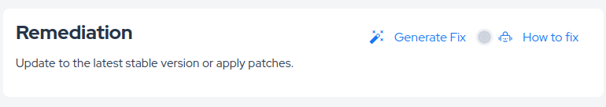
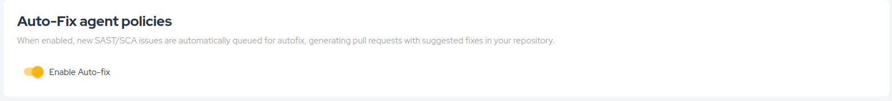

## Overview

**Autofix** extends AI-assisted remediation by generating code changes for eligible vulnerabilities and opening them as pull requests in your repository.

This helps reduce manual effort and speeds up the remediation workflow while preserving the normal code review process.

## How Autofix Works

There are two ways to use **Autofix**:

1. **Manual trigger**: Click **Generate Fix** inside the vulnerability details view. The agent analyzes the vulnerability context, proposes a fix, and creates a pull request with the suggested changes.

2. **Automatic mode**: When the Autofix policy is enabled in **Policies**, the platform can automatically generate pull requests for eligible vulnerabilities without manual intervention.

## Review Flow

All generated fixes are delivered as pull requests so your team can review, test, and approve the changes before merging them into the codebase.
