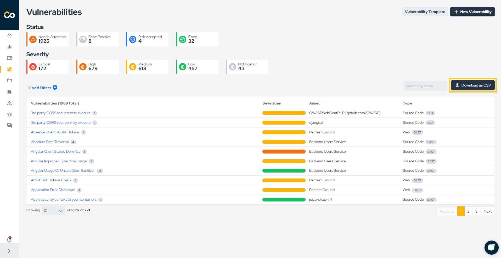
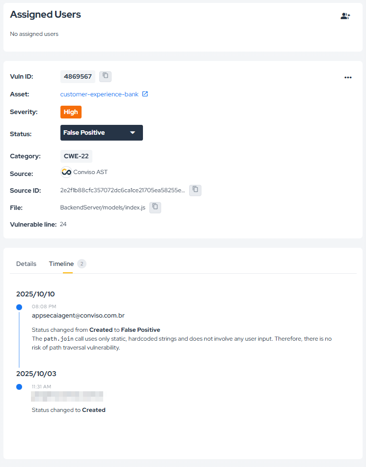
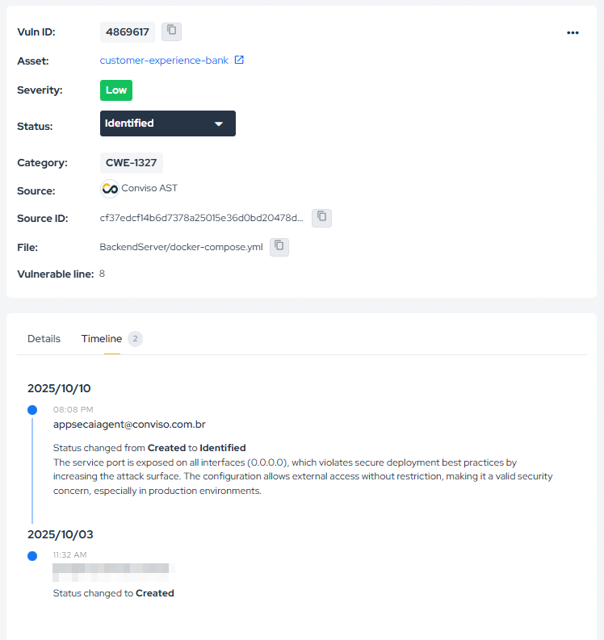

## Overview

**False Positive Analysis** uses the **AppSec AI Agent** to help validate whether a reported vulnerability should remain actionable or be treated as a false positive.

When enabled through **Policies**, the capability can:

* analyze vulnerabilities using AI;
* update the status to **False Positive** or **Identified**;
* record the decision and justification in the **Timeline**.

All AI-driven decisions remain visible and auditable.

## Where to Find It

When the capability is enabled, the AI indicator appears above the filtered vulnerability list in the **Vulnerabilities** area.

## Reviewing the Analysis

When the agent classifies a vulnerability as a false positive, the result is recorded in the vulnerability timeline together with the justification used in the analysis.

The same applies when the outcome is **Identified** instead of **False Positive**.

## Requirement

To use **False Positive Analysis**, enable it first in **Policies**.
