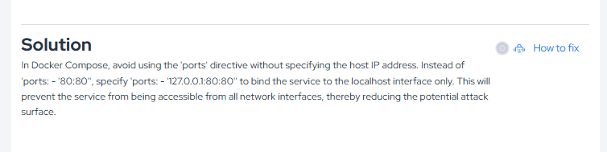
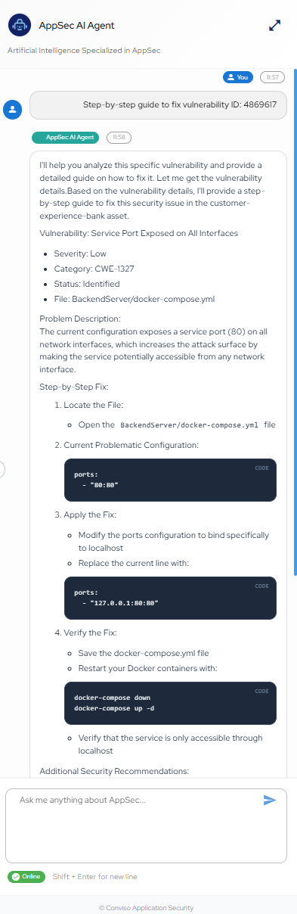

## Overview

The **How to Fix** capability helps developers understand how to remediate identified vulnerabilities with step-by-step AI guidance.

Inside the vulnerability details view, the platform displays a dedicated area with mitigation guidance and the **How to fix** action.

## How It Works

When you click **How to fix**, the **AppSec AI Agent** opens and presents guidance tailored to the vulnerability context.

This helps teams:

* understand the remediation path faster;
* reduce time spent investigating the issue;
* prioritize secure code correction more effectively.

