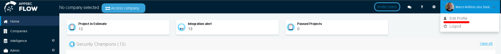
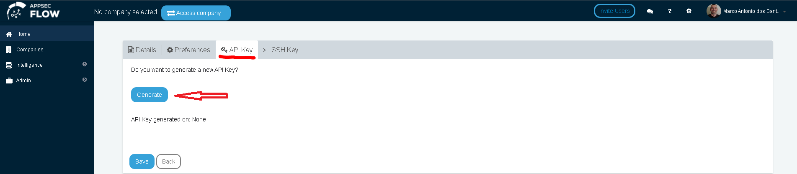
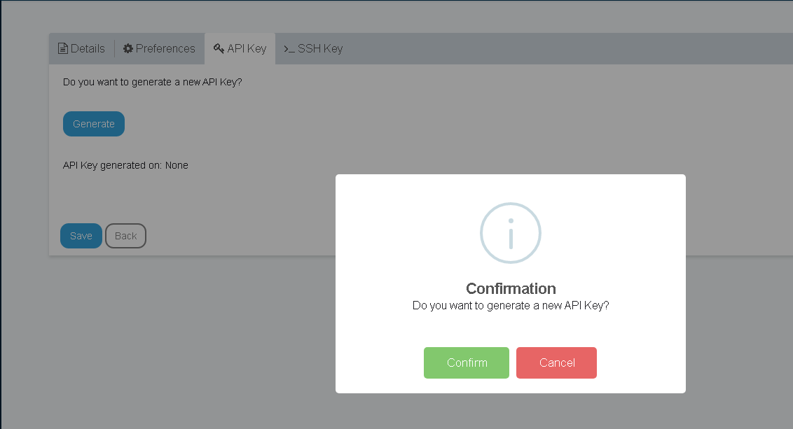
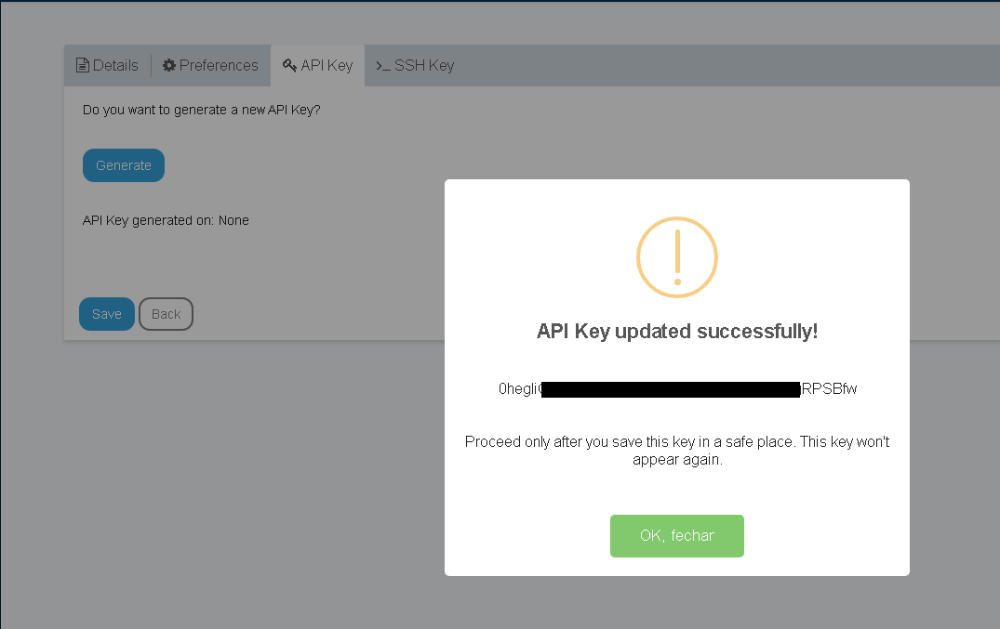

To generate your user's API_KEY key, Logon to Conviso Platform and go to the "Edit Profile" in the upper right corner, as shown in the image below:

:::note
This key can be generated as many times as you wish. However, the previously generated key will lose its usefulness.
:::

After clicking on **Edit Profile**, then click on the **API Key** tab, and then on the **Generate** button to generate your key, as in the following image:

After clicking on **Generate**, click on **Confirm** for your key to be generated successfully.

After clicking on **Confirm**, the confirmation of your new API Key will appear with its respective value. We recommend storing this API Key somewhere safe as a password vault.

Once you have your API Key properly stored, click **OK, close** and the **Save** button.