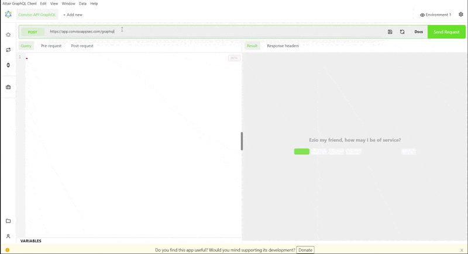

## Introduction 
Using the Conviso API GraphQL, you can seamlessly integrate the Conviso Platform with your development infrastructure to perform Application Security activities.

The GraphQL API offers advantages over other API options such as flexibility, reduced overfetching and underfetching, integrated documentation, and a growing ecosystem of developers and tools.

## Configuring API access
To start using our GraphQL API, you need to configure access to the API, following the steps below.

### Conviso API GraphQL URL 
Conviso's GraphQL API endpoint is located at ```/graphql```.

The base URL for all Conviso API GraphQL endpoints is ```https://app.convisoappsec.com/graphql```

You need to have an API Key and authenticate in order to interact with the Conviso API.

### Authentication
The authentication process is done through the ```x-api-key header```, as exemplified below:

```console 
x-api-key: {{API_KEY}}
```

**Note:** You can generate your API key by following [this tutorial](../generate-apikey.md).


Authentication example of our API using the [Altair GraphQL Client](https://altairgraphql.dev/):


<div style={{textAlign: 'center'}}>



</div>

**Note:** There are different ways to play and explore with our GraphQL API. You can use a desktop application like [Insomnia](https://insomnia.rest/) or our web GraphQL explorer [here](https://docs.convisoappsec.com/playground-graphql.html), based on [GraphQL Playground](https://github.com/graphql/graphql-playground).


After performing authentication, you are authorized to execute queries and mutations.

## Making requests with the API

One of the key features of the Conviso GraphQL API is the ability to perform actions through queries and mutations.

### Queries
[Queries](../graphql/documentation/queries/allocated-analyses.mdx) allow you to retrieve data from the API, such as information about projects, vulnerabilities, and scans. You can also use queries to filter data based on specific criteria, making it easy to retrieve exactly the information you need.

### Mutations
[Mutations](../graphql/documentation/mutations/configure-integration-schedule.mdx), on the other hand, enable you to modify data. With mutations, you can create new entities, such as projects, scans, and vulnerabilities. You can also update and delete existing entities.

The Conviso API offers diverse queries and mutations that enable you to manage projects and vulnerabilities.

## Understanding the GraphQL Schema Language  
Directives, Objects, Enums, Inputs, and Scalars are all components of the GraphQL schema language used in the Conviso API GraphQL.

### Directives
[Directives](../graphql/documentation/directives/deprecated.mdx) are used to control the behavior of GraphQL operations. The ```deprecated``` directive can be used to mark a field or enum value as deprecated, while ```include``` and ```skip``` directives can be used to conditionally include or skip parts of a query based on a Boolean argument. The ```specifiedBy``` directive can be used to specify a URL that provides information about the field or enum value.

### Objects
[Objects](../graphql/documentation/objects/activity.mdx) are complex data types that can have fields and methods. They are used to represent various entities and concepts in the system, such as ```Asset```, ```Project```, and ```Vulnerability```. These objects can be queried and mutated using GraphQL operations.


### Enums
[Enums](../graphql/documentation/enums/asset-arch.mdx) are used to represent a fixed set of possible values for a field. The system includes various enums such as ```AssetArch```, ```AssetAudience```, and ```AssetSeverity``` which represent different characteristics of assets.

### Inputs
[Inputs](../graphql/documentation/inputs/company-search.mdx) are used to pass arguments to mutation operations. These are used to create or update entities in the system, such as ```CreateProjectInput```, ```CreateAssetInput```, and ```UpdateSamlIntegrationInput```.

### Scalars
[Scalars](../graphql/documentation/scalars/boolean.mdx) are basic data types that represent a single value. The system includes various scalars such as ```Boolean```, ```Int```, ```String```, and ```ISO8601Date```. These are used as field types in objects and as argument types in operations.

By using these components in combination, you can define a powerful and flexible schema for your application security workflows, enabling you to retrieve, modify, and delete data as needed.

These features help to automate and streamline your application security workflows, saving time and enhancing the overall security of your applications.

## Getting support for the Conviso GraphQL API
If you have any questions or need help using our API, please don't hesitate to contact our [support team](mailto:support@convisoappsec.com).

## Resources​
By exploring our content you'll find resources to help you:

[Automation of security requirements with the Conviso API:](https://bit.ly/3Mjmlpm) The process of security requirements analysis can be an arduous task. In this article we will see how automation through Python scripting can be a great ally in this process.

[](https://cta-service-cms2.hubspot.com/web-interactives/public/v1/track/redirect?encryptedPayload=AVxigLKtcWzoFbzpyImNNQsXC9S54LjJuklwM39zNd7hvSoR%2FVTX%2FXjNdqdcIIDaZwGiNwYii5hXwRR06puch8xINMyL3EXxTMuSG8Le9if9juV3u%2F%2BX%2FCKsCZN1tLpW39gGnNpiLedq%2BrrfmYxgh8G%2BTcRBEWaKasQ%3D&webInteractiveContentId=125788977029&portalId=5613826)