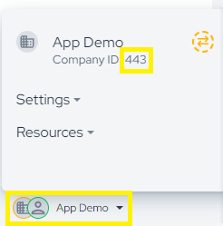
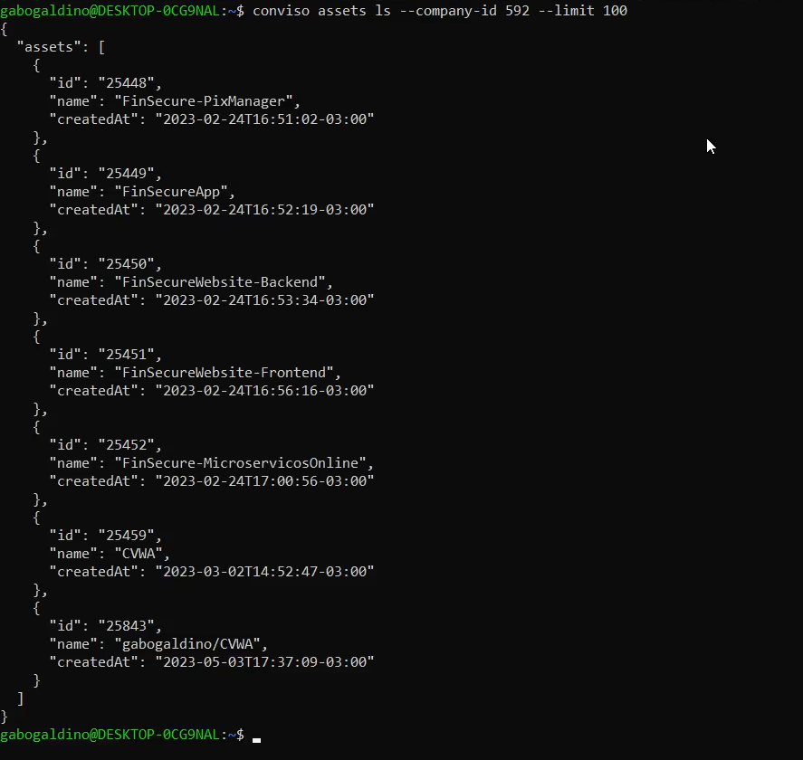

## Introduction

The Conviso CLI allows you to create and list assets of your company registered on the Conviso Platform.

### Prerequisites
To successfully run  `conviso assets` command you need to [authenticate with the API Key](../cli/installation.md/#authentication).

## Usage
See how to use the `conviso assets` command.

## Listing all Assets
Use `conviso assets ls [OPTIONS]` to list all the Assets you have access on the Conviso Platform, execute in your terminal:

```
conviso assets ls --company-id $YOUR_COMPANY_ID --page "INTEGER" --limit "INTEGER" 
``` 

### Options

`-c, --company-id`
The ID of the company whose resources will be used. This option is required for all commands.

To access your company ID you need to go to settings, then "Companies", in the upper right corner next to your profile picture:

<div style={{textAlign: 'center'}}>



</div>

And go to your company and copy the ID number.

`-p, --page` 
The page number to be consulted. The default value is 1.

`-l, --limit` 
The maximum number of items per page. The default value is 32.

### Example

List the first 100 assets of your company:

```
conviso assets ls --company-id $YOUR_COMPANY_ID --limit 100
```

In our case this is the result that appears in the terminal:

<div style={{textAlign: 'center'}}>



</div>


## Creating Assets
Use `conviso assets create [OPTIONS]` to create an asset in your company registered on the Conviso Platform.

#### Options
`-c, --company-id` 
The ID of the company whose resources will be used.

`-r, --repository-dir`
The directory path for the asset [required]. The default value is ".".

`--name`
Customize the asset name.

`--scan-type` 
Customize the asset scan type. The default value is "None".


#### Example
Create an asset named "asset-x" from the git repository "~/path/example":

```
conviso assets create --company-id $YOUR_COMPANY_ID --repository-dir "." --name "TEXT" --scan-type "TEXT"
```


From the moment it is created, you can access [Assets Management](../general/assets_management.md) to have asset visibility on the platform.

## Support
If you have any questions or need help using our product, please don't hesitate to contact our [support team](mailto:support@convisoappsec.com).

## Resources
By exploring our content you'll find resources to help you understand assets management:

[Continuous monitoring and management of the application:](https://bit.ly/45TbWK0) The monitoring and validation of findings from analyzes performed – whether through dynamic tests (DAST), interactive tests (IAST), or Network Scans need to be monitored and maintained in a centralized and organized way by the teams involved in the process.

[Security Risk Management - Best Practices and Processes:](https://bit.ly/45RKSL7) In this article, we will discuss the importance of security risk management and share best practices for effectively executing this process.

[](https://cta-service-cms2.hubspot.com/web-interactives/public/v1/track/redirect?encryptedPayload=AVxigLKtcWzoFbzpyImNNQsXC9S54LjJuklwM39zNd7hvSoR%2FVTX%2FXjNdqdcIIDaZwGiNwYii5hXwRR06puch8xINMyL3EXxTMuSG8Le9if9juV3u%2F%2BX%2FCKsCZN1tLpW39gGnNpiLedq%2BrrfmYxgh8G%2BTcRBEWaKasQ%3D&webInteractiveContentId=125788977029&portalId=5613826)