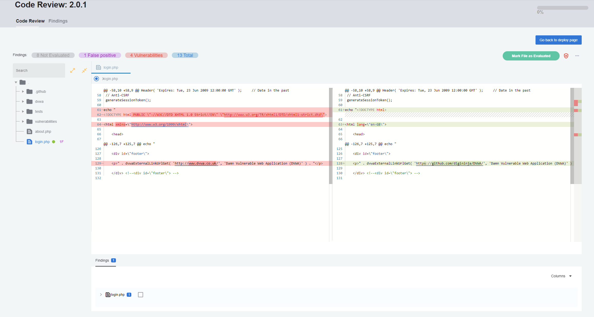

## Scan projects using the CLI

### Introduction

Protect your code from security threats with our **AST (Application Security Testing)** using Conviso CLI. 

The tool offers both **Static Application Security Testing (SAST)** and **Software Composition Analysis (SCA)** tools, which can be accessed through the Conviso Platform.


### Usage

To trigger this function is very simple, one of the methods is to export the settings to be used by the CLI to environment variables. Below an example:

```bash
export FLOW_API_KEY='your-api-key'
export FLOW_PROJECT_CODE='your-project-code'
cd your_source_code_repository
conviso ast run
```

Or if you prefer to do it in a single command, the instructions below have the same effect:

```bash
conviso --api-key 'your-api-key' ast run \
  --project-code 'your-project-code' \
  --repository-dir 'your_source_code_repository_path'
```

**Note:** To scan your repository with AST, you need to have a project registered on Conviso Platform, the "Project Code" is found on the specific project page.

The identified vulnerabilities will be automatically sent to your Project on Conviso Platform. Now you can use the [Vulnerabilities Management](../general/vulnerabilities_management.md) resource to work on the correction flow.

### Deploy

When running the AST scan with the CLI, a [Deploy](../guides/code-review-strategies.md) creation is automatically performed to send diff code to Conviso Platform security Code Review. 

<div style={{textAlign: 'center'}}>



</div>

Thus, it is possible to verify if the code added or changed in the commit has known security vulnerabilities and compare it with the original repository. 

**Note:** This feature is essential for performing Security Code Review by the security team. Conviso offers the continuous code review service, [see more](https://bit.ly/457M2Cb).


## Run scan only with Conviso SAST

As an additional custom configuration of the Conviso CLI, it’s possible to perform SAST-only in your code using the following command:

```bash
export FLOW_API_KEY='your-api-key'
export FLOW_PROJECT_CODE='your-project-code'
cd your_source_code_repository
conviso sast run
```

The following instructions have the same effect:

```bash
cd my_source_code_repository
conviso --api-key 'your-api-key' sast run --project-code 'your-project-code'
```

In case of any results, they will be automatically sent to Conviso Platform for assessment.

## Support
If you have any questions or need help using Conviso CLI, please don't hesitate to contact our [support team](mailto:support@convisoappsec.com).

## Resources
By exploring our content you'll find resources to help you understand the benefits of the Conviso CLI:

[Securing customers CI/CD pipelines using Conviso CLI:](https://bit.ly/3LS1oD7) This article brings a presentation of the possibilities of using the Conviso CLI for your CI/CD pipeline.