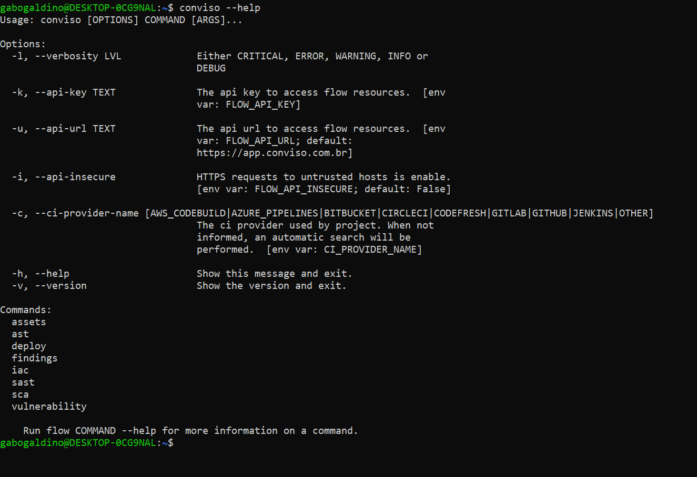

## Introduction
The CLI is a command-line interface tool to interact with Conviso Platform. The primary goal of the CLI is to be a developer friendly tool which brings the functionality of Conviso Platform into your development workflow. 

You can use the CLI locally and also inside your CI/CD to be able to use the following features:

- Perform security scans project (SAST, SCA, IaC, Container);
- Set policies to block the pipeline depending on different criteria;
- Send diff versions of your source code application to later be reviewed by your own security team or Conviso's (when subscribed to our professional services license).

## Install the Conviso CLI
To use the CLI, install it and [authenticate](#authentication) your machine.

### Prerequisites
To install the CLI some dependencies are required:
* python3 >= 3.4. See [python3 download](https://www.python.org/downloads/).
* pip. See [pip guide](https://packaging.python.org/tutorials/installing-packages/#installing-from-pypi).
* git. See [git download](https://git-scm.com/downloads).
* Docker. See [docker download](https://docs.docker.com/engine/install/).

Follow the download instructions for each dependency.

### Installation
Run the following installation command for the Conviso CLI:

```bash
pip install conviso-flowcli
```

or

```bash
python3 -m pip install conviso-flowcli
```

## Other installation commands

In case the main method didn't work, there are several other ways:

- If you haven't system admin privileges:

```bash
pip install --user conviso-flowcli
```

or

```bash
python3 -m pip install --user conviso-flowcli
```

- If you want to install a specific version. Versions can be found on [PypI](https://pypi.org/project/conviso-flowcli/#history).

```bash
python3 -m pip install conviso-flowcli==1.12.0rc2
```

**Note:** If you are unsuccessful in running the command, check that the Python path is validated by following this [guide](https://realpython.com/add-python-to-path/). 

- If you want to use Container Image with a specific version. Versions can be found on Github.

```bash
docker run convisoappsec/flowcli:1.12.0-rc.2 conviso --help
```

**Note:** Observe that PyPI and Github versions have a slightly difference,

**You can use the CLI in your CI/CD environment**. For details, please check the [menu](../integrations/integrations_intro.md) with all the different tools that we are integrated with. If your tool is not there, please contact us to assess it.

### Test your installation

After installation, test your installation. For a quick test, run:

```bash
conviso --help
```

The following shows an example:

<div style={{textAlign: 'center'}}>



</div>

The command will print CLI commands and options summary. Now we are ready to proceed!

**Note:** Conviso recommends always keeping your CLI installation updated to the latest version. You can check by running ```conviso --version```.

## Authentication

In order to start using the CLI you will need to provide your [API Key for your Conviso Platform account](../api/generate-apikey.md). Just go to "Edit Profile", and then click on "API Key" as follows the gif below:

<div style={{textAlign: 'center'}}>


</div>

**Note:** Every time you do this process, you will need to change the API Key from the CLI settings.

When retrieving it, you can export the key as system environment variable:

```bash
export FLOW_API_KEY='you-api-key'
```

**Note:** The command for setting environment variables can vary slightly between operating systems, but generally follows the same idea. On Windows, you can use the ```set``` command.

Also, the API Key can be set as option argument:

```bash
conviso --api-key 'you-api-key' [SOME COMMAND]
```

**Note:** For security reasons, this is not recommended for production environments!

## Updating Conviso CLI

We release new Conviso CLI versions often! See [Releases Notes](../releases/intro.md) for more details.

## Next steps

Once the CLI is installed and your machine is authenticated, perform the following actions to run your AppSec Program with the Conviso Platform:

- Perform **Application Security Testing (AST)** type scans, following this [tutorial](../cli/ast.md).
- Validate your opened vulnerabilities for a specific project and **block your CI/CD pipeline depending on pre-defined vulnerability policies**, [see more](../cli/security-gate.md).
- Perform the **Management of your Assets**, see this [guide](../cli/assets.md).
- **Import findings and vulnerabilities from other security tools** that support .SARIF files to Conviso Platform, see [more](../cli/findings.md).


## Tips: Shell Completion

Shell Completion is a feature that helps complete commands and command line arguments automatically in a terminal or shell. This is not required to use the tool, so you can skip it if you want.

#### Bash

Open your ```.bashrc``` file at ```~/.bashrc``` and place the following snippet in the end of file.

```bash
CONVISO_COMPLETER="$(which flow_bash_completer.sh)"

[ -f "$CONVISO_COMPLETER" ] && {
  source "$CONVISO_COMPLETER"
}
```

Start a new bash shell session and the shell completion will be available.

#### ZSH
Open your ```.zshrc``` file at ```~/.zshrc``` and place the following snippet in the end of file.

```bash
CONVISO_COMPLETER="$(which flow_zsh_completer.sh)"

[ -f "$CONVISO_COMPLETER" ] && {
  source "$CONVISO_COMPLETER"
}
```

Start a new ZSH shell session and the shell completion will be available.

#### Fish
Start a fish shell session and execute the following command.

```bash
mkdir -p ~/.config/fish/completions
cp (which flow_fish_completer.fish) ~/.config/fish/completions/flow.fish
```

Start a new fish shell session and the shell completion will be available.

## Getting support for the Conviso CLI
If you have any questions or need help using Conviso CLI, please don't hesitate to contact our [support team](mailto:support@convisoappsec.com).

## Resources
By exploring our content you'll find resources to help you understand the benefits of the Conviso CLI:

[What is SARIF and how it could revolutionize software security:](https://bit.ly/3nqqcbK) The article explains how SARIF can improve transparency and collaboration in the security software industry and highlights how the Conviso Platform already supports the SARIF format with Conviso CLI.

[Securing customers CI/CD pipelines using Conviso CLI:](https://bit.ly/3LS1oD7) This article brings a presentation of the possibilities of using the Conviso CLI for your CI/CD pipeline.
