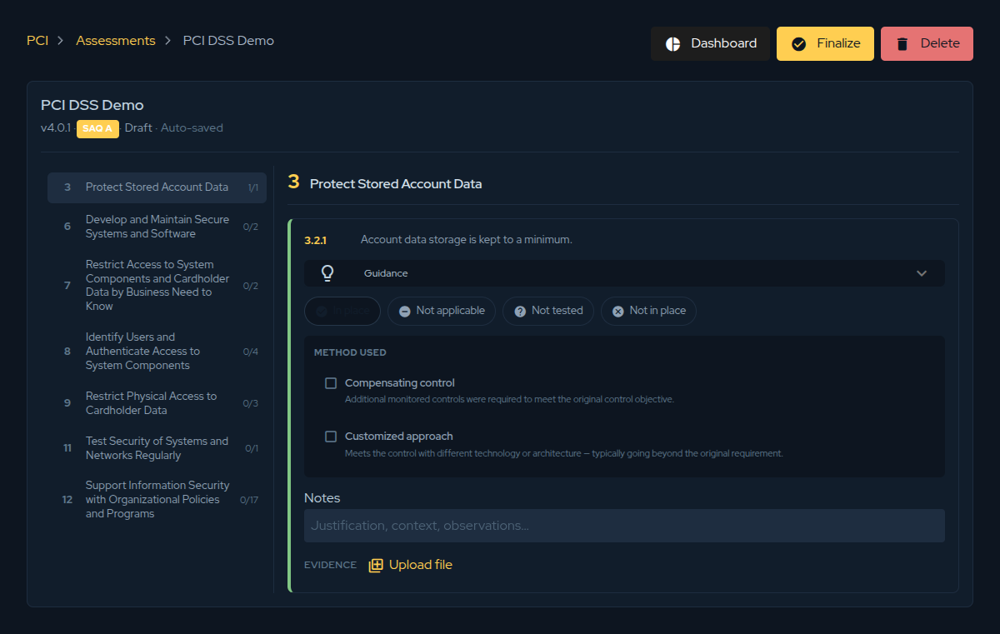
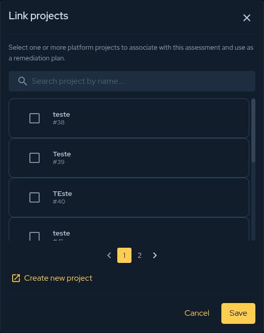
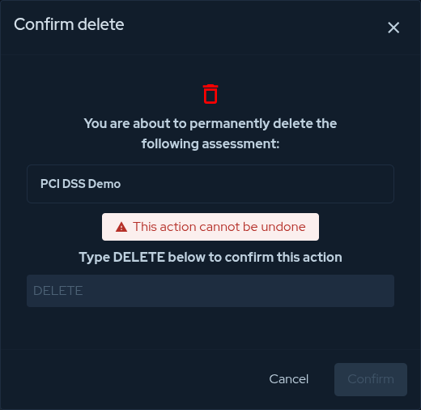

## Overview

Opening an assessment shows the **editor**, which is where most of the work happens. The
left column lists the framework's requirements with a progress counter on each (for example
`1/1`), so you always know how much is left. The right column shows the controls of the
requirement you have selected. Every answer **auto-saves** as you make it — there is no
separate save step — so you can stop and resume at any time.

## Setting a control's status

Each control is answered with exactly one compliance status. This is the answer that feeds
every chart in the [Gap Analysis](./pci-gap-analysis.md), so it is worth being deliberate:

| Status | Use it when… |
|--------|--------------|
| **In place** | The control is implemented and operating effectively. |
| **Not applicable** | The control genuinely does not apply to your scope. |
| **Not tested** | The control was not assessed in this round. |
| **Not in place** | The control is **not** met — this is counted as a gap. |

If a requirement is hard to interpret, expand **Guidance** on the control for help and for
examples of acceptable evidence.

:::note
A **justification is required** whenever you answer **Not applicable** or **Not tested** —
record *why* in the Notes field. This keeps the assessment defensible and is enforced before
you can finalize.
:::

## Recording the method used

Sometimes a control is met through an alternative path rather than the literal requirement.
When that happens, flag the method so an assessor understands your approach:

- **Compensating control** — additional monitored controls were put in place to meet the
  original control objective.
- **Customized approach** — the objective is met with different technology or architecture,
  typically going beyond the original requirement.

## Notes and evidence

Two fields back up every answer:

- **Notes** — the justification, context, and observations for the control. Required for
  *Not applicable* and *Not tested*, and good practice everywhere else.
- **Evidence** — use **Upload file** to attach the supporting artefact (a screenshot, a
  policy, a configuration export) directly to the control, so it travels with the assessment.

## Linking remediation projects

An assessment is only useful if the gaps get fixed. From the assessments list, use
**Link projects** to associate one or more platform projects with the assessment and use them
as the remediation plan. You can search existing projects, select several at once, or create
a new one without leaving the dialog.

This ties your compliance gaps to tracked, ownable work in the rest of the platform.

## Deleting an assessment

To remove an assessment entirely, open it and click **Delete**. Because this is irreversible,
the platform asks you to type `DELETE` to confirm before the action is enabled.

:::caution
Deleting an assessment permanently removes its answers and evidence. If you only want to
keep a finished assessment out of the way, **finalize and archive** it instead of deleting.
:::
