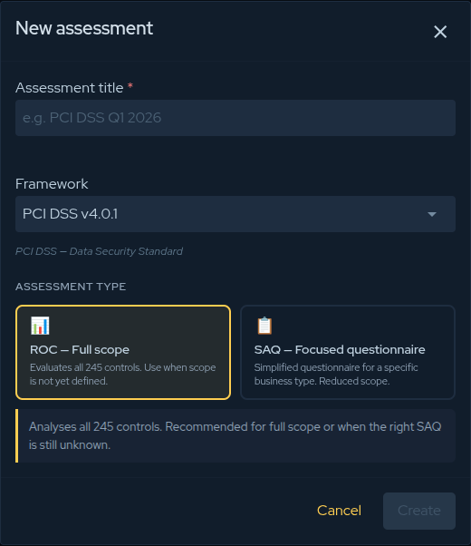
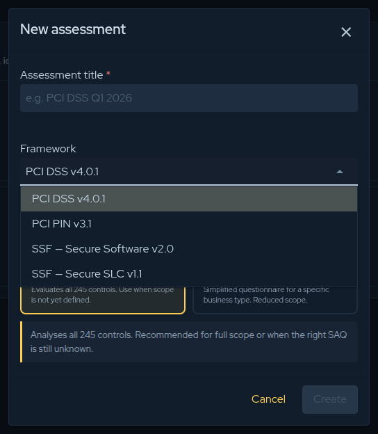
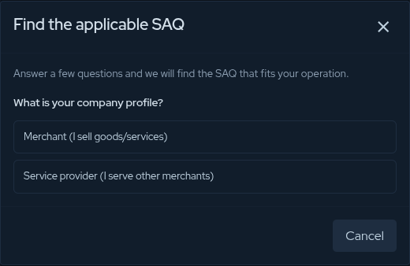

## Overview

An assessment is the unit of work you evaluate against a PCI standard. Creating one is a
two-step decision: **which framework** you are assessing against, and **how much of it**
(the scope). Both choices shape the control catalogue you will answer.

From **Compliance → PCI → Assessments**, click **New assessment**, then give the assessment
a title (for example `PCI DSS Q1 2026`).

## Step 1 — Choose the framework

The **Framework** selector lists every supported PCI standard. Pick the one that matches what
you are being assessed for; the dialog then shows the scope options that apply to it.

| Framework | Choose it when… |
|-----------|------------------|
| **PCI DSS v4.0.1** | You store, process, or transmit cardholder data and need a DSS validation. |
| **PCI PIN v3.1** | You are an acquirer, processor, or HSM/ATM operator handling PIN data. |
| **SSF — Secure Software v2.0** | You are validating a payment **software product**. |
| **SSF — Secure SLC v1.1** | You are validating your software **development lifecycle**. |

## Step 2 — Choose the scope

### PCI DSS

PCI DSS offers two paths:

- **ROC — Full scope** — evaluates **all 245 controls**. Use it for a complete Report on
  Compliance, when scope is not yet defined, or when you are unsure which SAQ applies.
- **SAQ — Focused questionnaire** — a reduced control set tailored to a specific business
  type. When you pick SAQ, select **which SAQ applies**:

  | SAQ | Applies to |
  |-----|------------|
  | **A** | Card-not-present e-commerce, fully outsourced to a validated TPSP. |
  | **A-EP** | E-commerce whose site can affect payment-data security (JS posting to a TPSP). |
  | **B** | Imprint machines or standalone dial-out terminals, no electronic CHD storage. |
  | **B-IP** | Standalone IP-connected POI devices approved as PTS POI. |
  | **C** | Internet-connected payment-application systems, no e-commerce. |
  | **C-VT** | Web-based virtual terminal on a single isolated computer. |
  | **D (Merchant)** | Merchants who do not qualify for any other SAQ — full DSS scope. |
  | **D (Service Provider)** | Service providers eligible for SAQ (no ROC required). |
  | **P2PE** | Hardware terminals in a PCI-listed P2PE solution. |
  | **SPoC** | PCI-listed SPoC — software-based PIN entry on COTS devices. |

### PCI PIN

Choose how the assessment is performed:

- **Self-Assessment** — internal self-attestation AOC.
- **QPA-assessed** — a formal assessment by a Qualified PIN Assessor.

### PCI SSF (Secure Software / Secure SLC)

Each SSF standard is assessed against its full control set — there are no reduced scopes to
choose. Select the framework and continue.

## Not sure which SAQ? Use the wizard

For PCI DSS, if you are unsure which SAQ fits your operation, choose SAQ and click
**“Not sure which SAQ — help me choose.”** The wizard asks about your company profile, how
customers pay, who processes card data at checkout, and your equipment, then recommends the
applicable SAQ and fills it in for you.

When the form is complete, click **Create** to open the assessment and start answering
controls.

:::tip
Not certain about your scope yet? Start with **PCI DSS → ROC — Full scope**. You see the
complete control set and can narrow down on a later assessment.
:::
