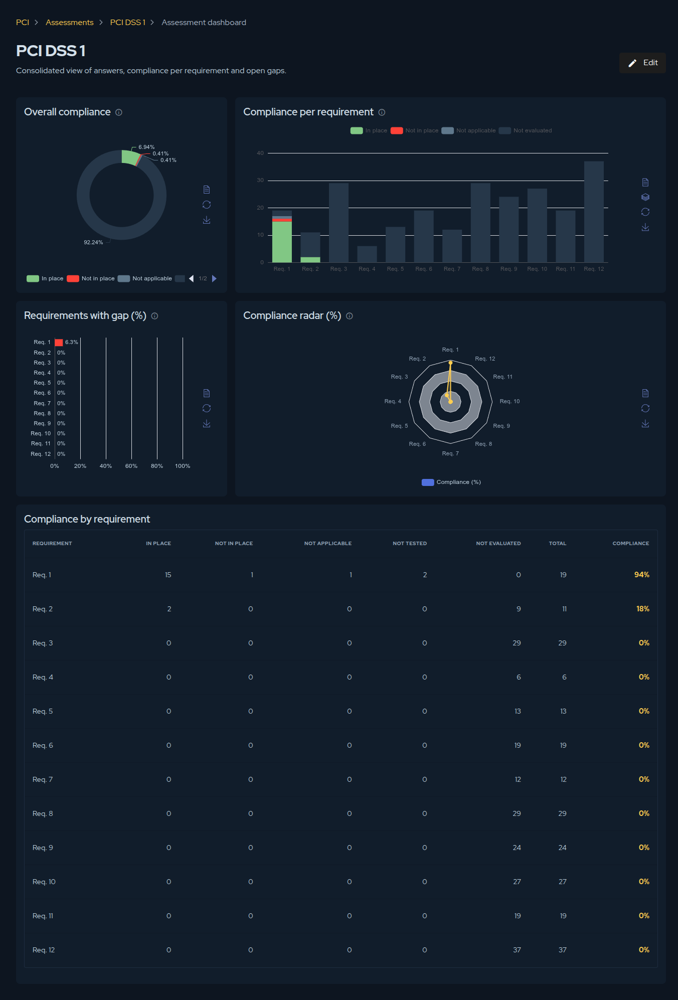

## Overview

Answering controls produces data; the **Assessment dashboard** turns it into a picture you
can act on. Open it from the **Dashboard** action inside any assessment to get a consolidated
view of answers, compliance per requirement, and open gaps. It is the fastest way to see
where you stand and what to remediate first, and it works the same way for every framework —
PCI DSS, PCI PIN, or SSF.

## Reading the dashboards

The page is built from five complementary views, each answering a different question:

- **Overall compliance** — a donut showing how all controls are distributed across the
  findings: *In place*, *Not in place*, *Not applicable*, and *Not evaluated*. Your headline
  number at a glance.
- **Compliance per requirement** — a stacked bar showing the share of each finding within
  every requirement, so you can see which requirements are healthy and which are mostly
  unanswered.
- **Requirements with gap (%)** — the percentage of *Not in place* controls per requirement.
  This is your prioritisation view: the tallest bars are where the real gaps are.
- **Compliance radar (%)** — the per-requirement compliance percentage in a radar shape,
  useful for spotting an unbalanced profile across requirements.
- **Compliance by requirement** — the underlying table with the count of each finding, the
  total, and the compliance percentage per requirement.

Each panel can be exported from its own actions, so the charts can go straight into a report
or a steering-committee deck.

## Finalizing an assessment

When the work is complete, click **Finalize** to lock the assessment as a point-in-time
record. Finalizing changes its nature:

- The assessment becomes **read-only** — answers and evidence are frozen.
- The action is **irreversible**. Afterwards the only lifecycle action available is
  **archive**, which keeps the record but moves it out of your active list.

:::caution
You cannot finalize while controls are still unanswered, or while a justification is missing
for any **Not applicable** or **Not tested** answer. The platform lists exactly what is
blocking so you can resolve those items first.
:::

A finalized assessment is what feeds the **History** and **Trend** KPIs on the
[PCI dashboard](./pci-overview.md): each one is a snapshot, and comparing snapshots is how
you demonstrate that compliance is improving over time.
