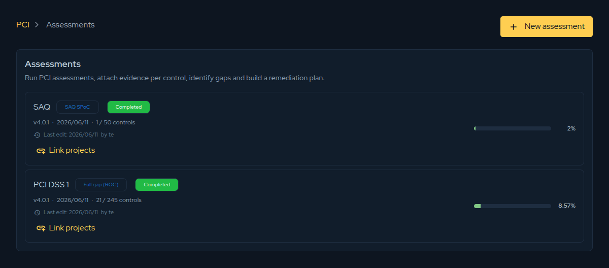

## Overview

The **Compliance** area lets you assess your environment against the **PCI family of
standards** without leaving the Conviso Platform. You create an assessment, answer each
control, attach the supporting evidence, and the platform consolidates the results into
dashboards that show exactly where your gaps are — so the same record becomes the basis for
your remediation plan.

It is built for the people accountable for payment-security compliance: PCI managers,
AppSec teams preparing for an assessment, and service providers who need a defensible,
point-in-time record of their posture.

You will find it under **Compliance → PCI Assessments** in the left navigation.

## Supported frameworks

Compliance is **not limited to PCI DSS**. When you create an assessment you choose which PCI
standard to evaluate against, and the platform loads the matching control catalogue:

| Framework | Version | Who it is for |
|-----------|---------|----------------|
| **PCI DSS** — Data Security Standard | v4.0.1 | Merchants, service providers, and any entity that stores, processes or transmits cardholder data (CHD/SAD). |
| **PCI PIN** — PIN Security Requirements | v3.1 | Acquirers, processors, KIFs, and HSM/ATM operators — covers PIN processing, transmission, and key management. |
| **PCI SSF — Secure Software Standard** | v2.0 | Payment **software products** — how a product protects sensitive data, authenticates, and responds to attacks. |
| **PCI SSF — Secure SLC Standard** | v1.1 | The software **development lifecycle** — how an organisation builds payment software securely. |

Each framework drives its own scope options and control set, but the workflow — answer,
evidence, analyse, finalize — is identical across all of them.

## Key concepts

| Term | Meaning |
|------|---------|
| **Assessment** | One run against a chosen framework and scope. |
| **Control** | An individual requirement item you answer (e.g. PCI DSS `3.2.1`). |
| **Requirement** | A top-level grouping of controls (PCI DSS requirements 1–12). |
| **Gap** | A control marked **Not in place** — the work remediation must close. |
| **Scope** | How much of the framework you assess (e.g. full ROC vs a focused SAQ). |

## The assessments list

The assessments list shows every PCI assessment you have created. Each card shows its scope,
framework version, control progress, last edit, and current compliance percentage.

## The workflow at a glance

1. **[Create an assessment](./pci-create-assessment.md)** and choose its framework and scope.
2. **[Answer the controls](./pci-answer-controls.md)** and attach evidence as you go.
3. **[Review the Gap Analysis](./pci-gap-analysis.md)** dashboards to see and prioritise open gaps.
4. **Link projects** to drive remediation.
5. **Finalize** to lock the assessment as a point-in-time record.

:::tip
If you own PCI in your organisation, the
[PCI Manager role-based guide](../general/role-based-guide-pci-manager.md) walks through the
same workflow from a manager's perspective.
:::
