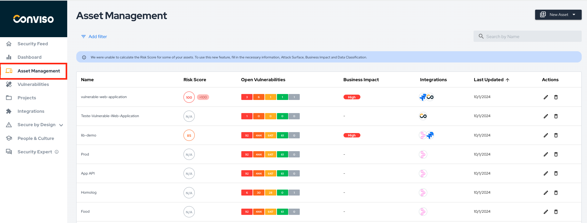
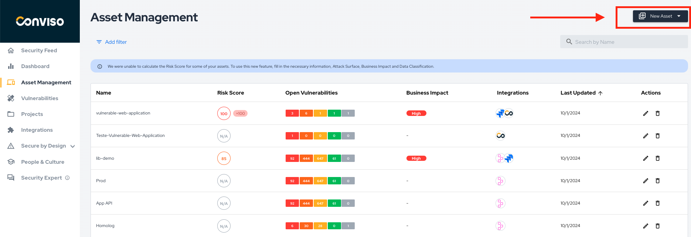

## Introduction

Asset management is a feature that allows managers to manage their assets registered in Conviso Platform, showing a view of the life cycle of each asset, helping the follow-up and monitoring of weaknesses, so that actions are carried out at the right time.

Asset management by Conviso Platform is extremely flexible as there is a friendly interface for consultants and clients to view the information of each registered asset.

## Benefits

The Assets Management allows you to search for and classify:

-  Severity classification by Asset;

- Vulnerability status by Asset;

- Assets integration;

- Asset-reviewed deployments;

- Environment type per Asset;

- Architecture type;

- Technology Type.

To get access to Assets Management, log in to the [Conviso Platform](https://app.convisoappsec.com);

On the main menu to the left, click on **Assets Management**:

## Registering New Assets

To create a new asset or import multiple assets, click on the **New Asset** button, then select what option you want to use from the drop-down list:

The Conviso Platform has basically three options for creating assets. If you have any Integration set, you may be able to see more options for creating new Assets:

**New Asset**: allows the user with the company access type to create a single asset;

**Import from Repositories**: allows you to directly import your Assets already configured at some system integrated to the Conviso Platform.

**Asset Import**: for those who have a large number of assets that want to register in Conviso Platform. To help on using this feature, refer to the [following guide](./assets_import).

