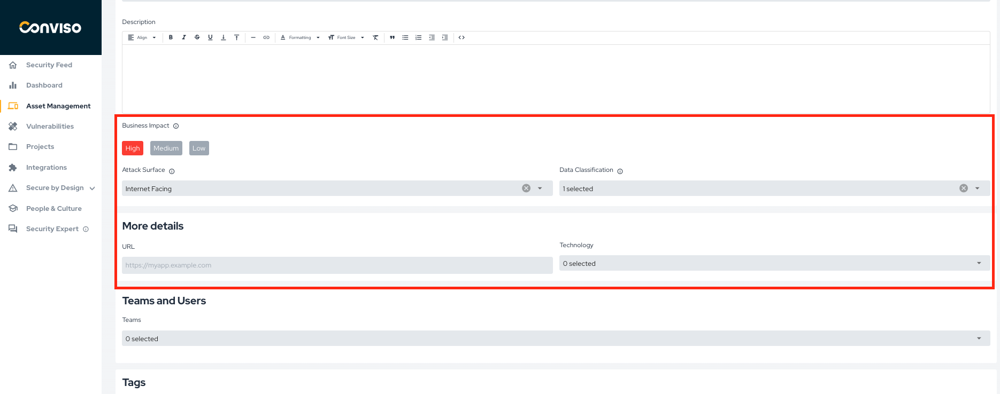

## Introduction

By utilizing **Assets Management**, you gain control and visibility of all assets through a centralized repository. This enables you to correlate vulnerabilities, define priorities, and gain agility in the process.

## Usage

On the left menu, click on "Assets Management" to access the centralized dashboard of all your assets.

This page displays an overview of registered assets, with the following information:

**Asset's Tags:** Referring to the category they belong to.

**Integrations:** Integrations performed with the asset.

**Severity:** Level of criticality.

**Vulnerabilities:** Referring to the vulnerabilities identified in projects related to the asset.

**Deploys:** Referring to asset deploys.

Easily manage your assets with just a few clicks. On the "Actions" column, you'll find quick access buttons to edit or delete items. 

Need to find something specific? No problem. Use our intuitive filters to search by Technology, Architecture Type, Data Classification, Life Cycle, or Asset Tags.

### Adding assets

You can see three options for creating assets. If you have any integration set up, you may see additional possibilities for creating new assets:

**Asset Import:** This option allows you to efficiently bring in multiple assets from a .csv file, with specific rules to follow as indicated in the [documentation](../general/assets_import).

**Import from repositories:** Another option that enables you to add assets from a platform like Github by connecting with your platform account.

**Add Manually:** You can also choose to add assets manually by accessing a dedicated page where you can input all the relevant information.

You can fill in the name of your asset in the **"Asset Name"** field, a short description about it in **"Description"** and define its severity level in **"Severity"**.

Using **"Advanced Options"**, you can further enrich information about the asset:

**Type:** Defines what type of asset it is, such as API, client-server, database, mobile, etc.

**Architecture Type:** For the kind of architecture, whether monolithic, microservices, etc.

**Development Team:** To define whether the responsible development team is internal, external, or both.

**Development Model:** For the type of development model.

**Audience:** For the intended audience of the asset, whether it is an external or internal domain.

**Teams:** The platform allows you to add already registered teams from Conviso and teams created within the company.

**Integrations:** Highlights the tools integrated with the asset if there is integration with other scanning tools, such as Fortify, Checkmarx, etc.

**Data Classification:** Whether it is public, confidential or non-confidential.

**Environment:** Defines whether it is within a specific environment.

**Life Cycle:** Indicates which stage of the life cycle the asset belongs to.

**Asset's Tags:** To help organize the asset using tags.

**Does the asset perform or intend to perform any of the following types of scans?** To verify which types of scans plan to be used on this asset.

**Contacts:** It is also possible to add the contact of the responsible people for the asset to be notified about its situation.

## Support
If you have any questions or need help using our product, please don't hesitate to contact our [support team](support@convisoappsec.com).