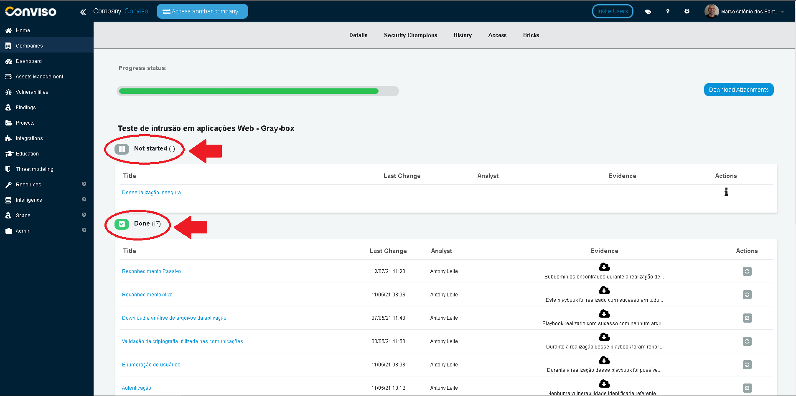

## Introduction

Bicks help keep large teams working towards the same goals, and following a pattern within a process is not the easiest of tasks. Bricks allow you to create an action plan based on tasks that must be accomplished. These tasks, in some cases, can be placed as mandatory for the closing of a project, which guarantees the manager total control over the execution.

## Using Bricks

Log in to the [Conviso Platform](https://app.convisoappsec.com);

On the main menu to the left, click on **Projects**. At the panel to the right, click on the Project you want to manage:

On the top bar menu, click on **Bricks**:

At this window, you may follow up the Bricks activities, sorted by their statuses:

