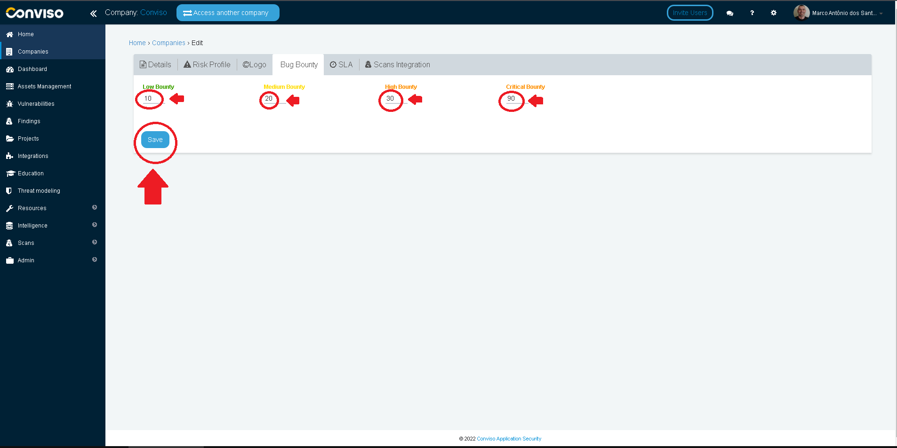
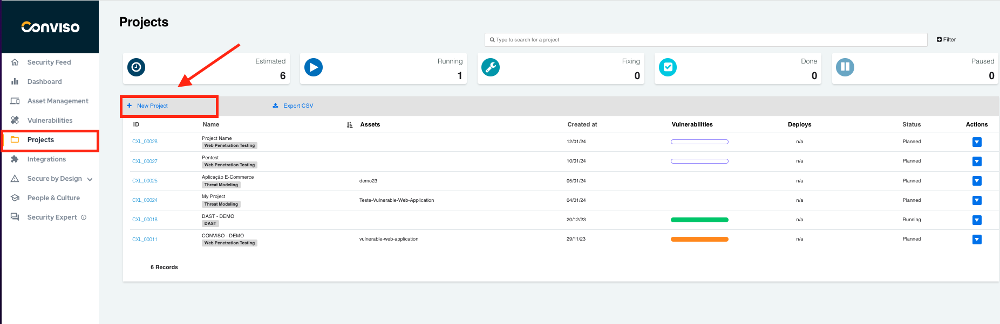
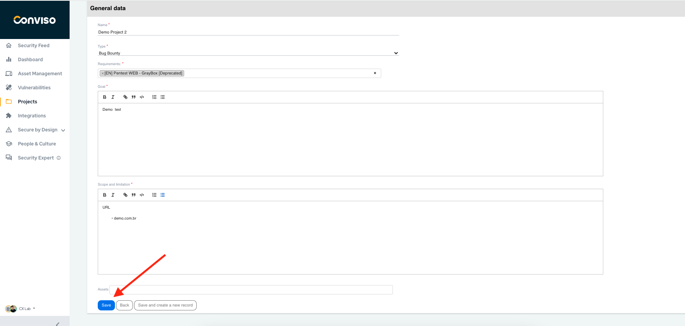
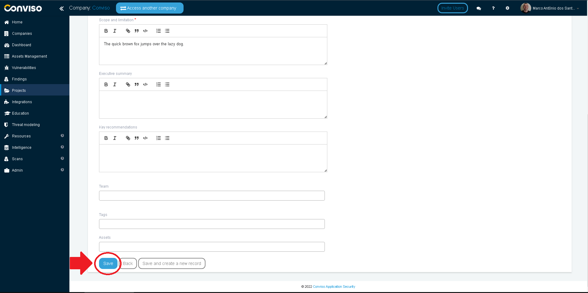
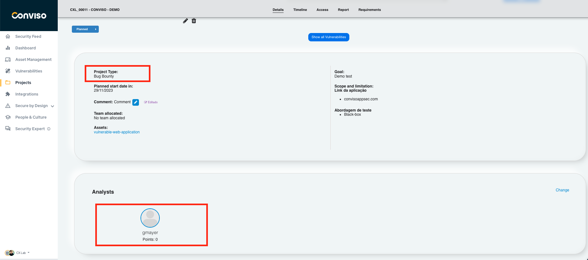

## Introduction

This feature is intended to enable the customer to create an internal "bug bounty" program and make it available to the users they want, whether it is the company's own analyst or developers.

## Bug Bounty Program configuration

To use the **Bug Bounty** program feature, we need to configure vulnerability scores for:

- Low Severity Vulnerability;

- Average Severity Vulnerability ;

- High Severity Vulnerability ;

- Critical Severity Vulnerability;

Log in to the [Conviso Platform](https://app.convisoappsec.com);

On the top bar menu, click on your **Company** Name. On the opened panel, click on the **Bug Bounty** tab, then click on the **Edit** button:

Assign values to the four levels of Vulnerability Severity. When done editing the vulnerabilities severities values, click on the **Save** button to store your configuration settings:

## Creating a Bug Bounty Project

On the main menu to the left, click on **Projects**. At the panel to the right, click on the **New Project** button:

Fill in all the mandatory form fields (if you wish to do so, you can also fill in the optional fields on the form, to better describe your project):

- **Name**: Label it as you wish;

- **Type**: Select the **Bug Bounty** type from the drop-down list;

- **Bricks**: Click on the text box to select the Brick that you want to use in your Bug Bounty Project;

- **Estimated Start Date**: Select the foreseen date the project will start from the calendar to the right;

- **Goal**: Describe what the purpose of the project you are creating;

- **Scope and Limitation**: Describe the scope and restrictions applied to the project.

After filling in at least the mandatory fields, scroll down and click on the **Save** button:

You can follow up your **Bug Bounty** project status by opening the Project and viewing your users' scores at the bottom of the screen, as in the following example:

