> To contribute to Conviso Docs, you must follow the [Documentation Writing Best Practices](./documentation-writing-best-practices.md) guide.

## Quick Start

1. Fork the repository.
2. Edit a file inside `docs/`.
3. Commit your change to your fork.
4. Open a pull request to `convisoappsec/conviso-docs:main`.
5. Wait for review and feedback.

## Prerequisites

- A GitHub account.
- Basic Markdown/MDX editing.

Optional:
- [GitHub Hello World](https://docs.github.com/en/get-started/quickstart/hello-world)

## Contribution Flows

### Flow A: Edit directly on GitHub (fastest)

1. Open the page source file in your fork under `docs/`.
2. Click the edit button.
3. Make your change in Markdown/MDX.
4. Use Preview to verify rendering.
5. Commit with a clear title and description.
6. Open a pull request against `main`.

### Flow B: Edit locally

1. Clone your fork.
2. Run `npm install`.
3. Start docs locally with `npm run start`.
4. Edit files in `docs/`.
5. Validate the page locally.
6. Commit, push, and open a pull request.

## Pull Request Checklist

Before opening your PR, confirm:

- The page content is accurate and clear.
- Markdown/MDX renders correctly.
- Links and images work.
- Title and description explain the change.
- Scope is limited to the intended documentation update.

## Standardized Screenshots (Required)

Install the screenshot runtime once:

1. Install browser runtime:

```bash
npm run screenshot:install
```

For screenshot execution and standards, follow:
[Documentation Writing Best Practices](./documentation-writing-best-practices.md#screenshot-execution-standard-flow)

## Detailed Visual Guide

If you prefer a step-by-step visual walkthrough, use the screenshots below.

### Repository and Fork

<div style={{textAlign: 'center'}}>

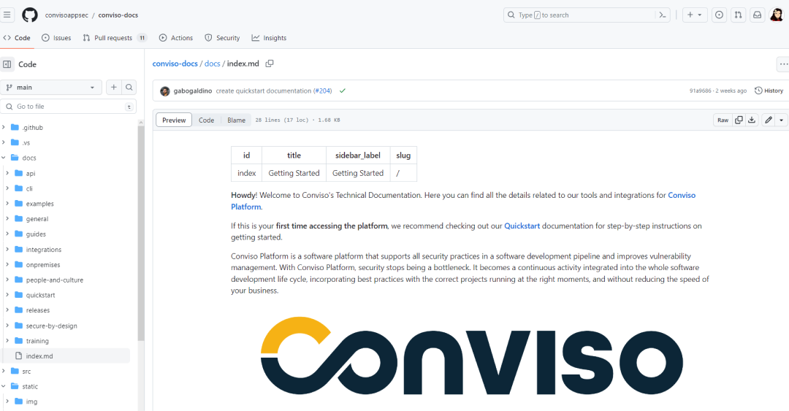

</div>

<div style={{textAlign: 'center'}}>

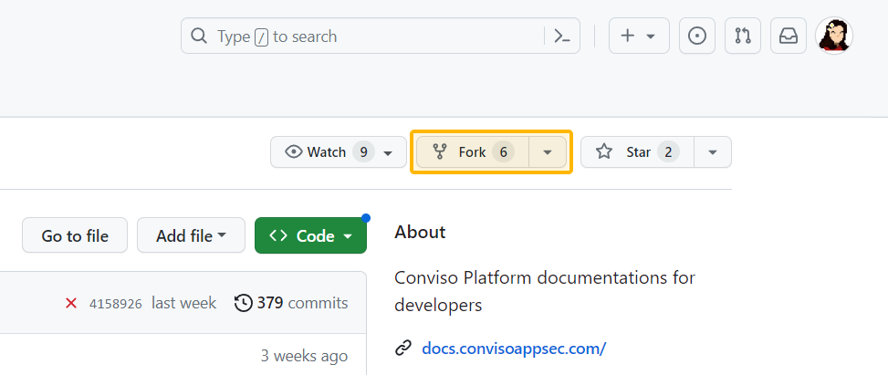

</div>

<div style={{textAlign: 'center'}}>

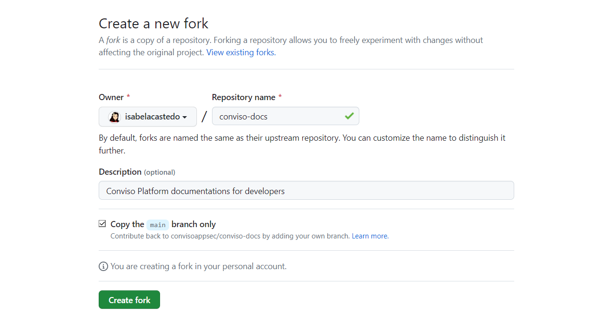

</div>

<div style={{textAlign: 'center'}}>

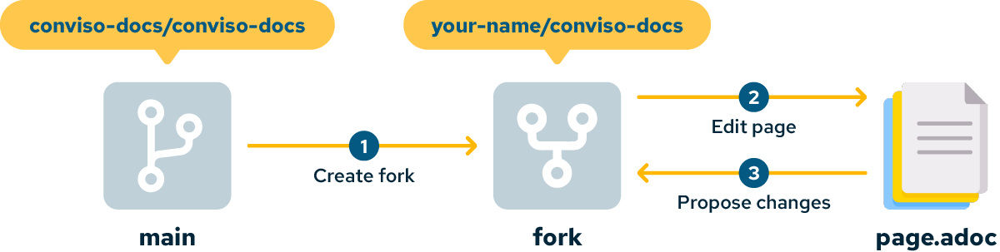

</div>

### Edit and Commit

<div style={{textAlign: 'center'}}>

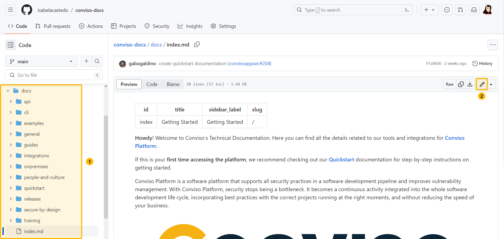

</div>

<div style={{textAlign: 'center'}}>

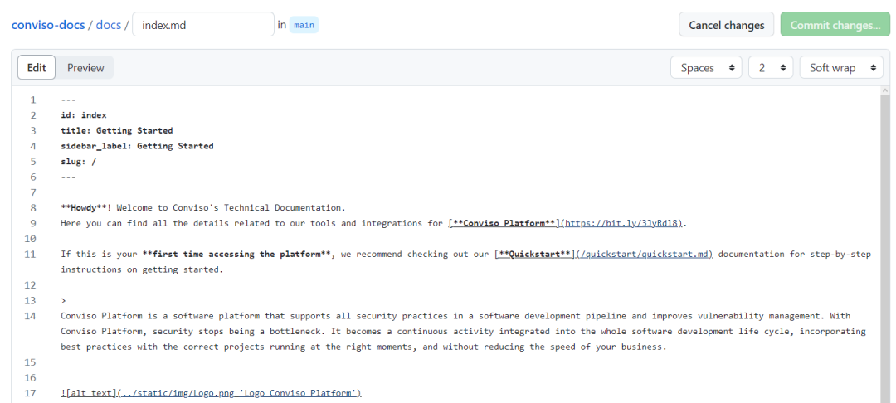

</div>

<div style={{textAlign: 'center'}}>

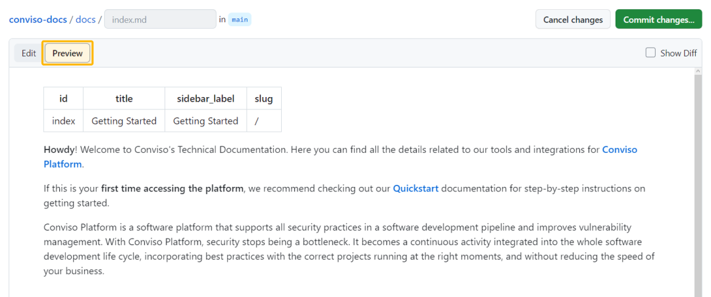

</div>

<div style={{textAlign: 'center'}}>


</div>

### Pull Request

<div style={{textAlign: 'center'}}>

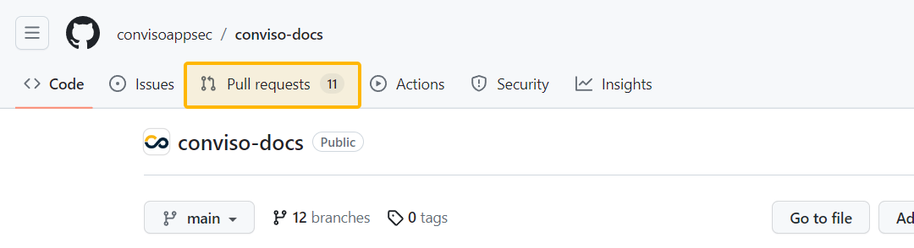

</div>

<div style={{textAlign: 'center'}}>

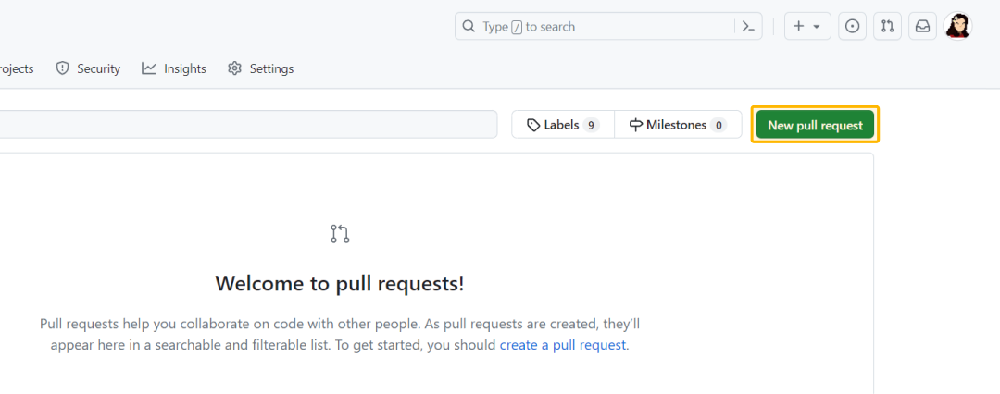

</div>

<div style={{textAlign: 'center'}}>

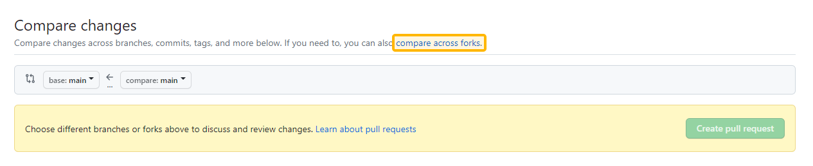

</div>

<div style={{textAlign: 'center'}}>

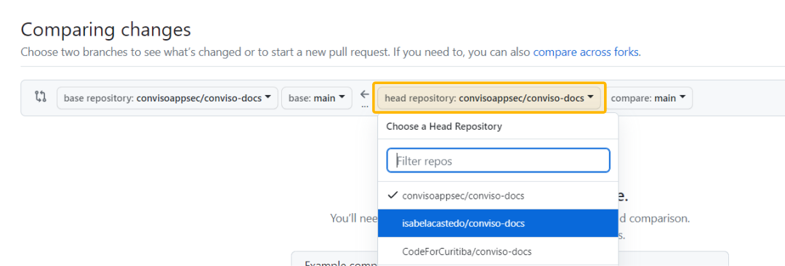

</div>

<div style={{textAlign: 'center'}}>

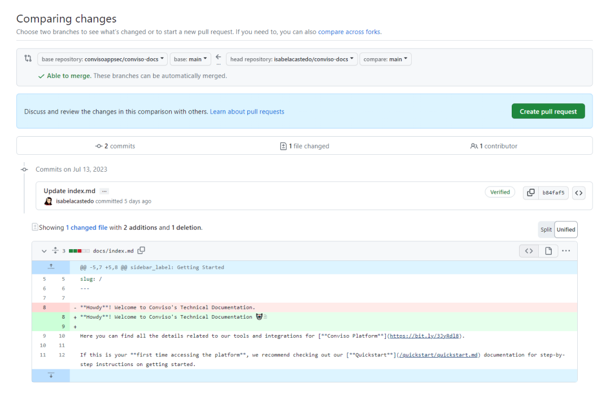

</div>

<div style={{textAlign: 'center'}}>

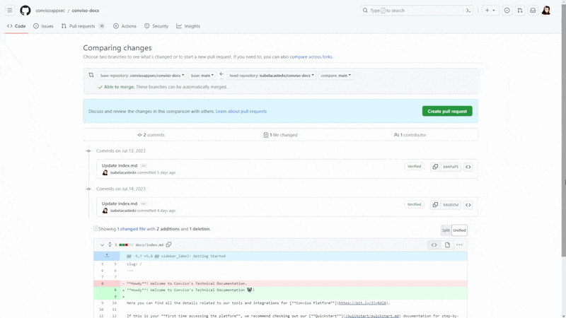

</div>

## Support

If you need help, contact [support@convisoappsec.com](mailto:support@convisoappsec.com).
