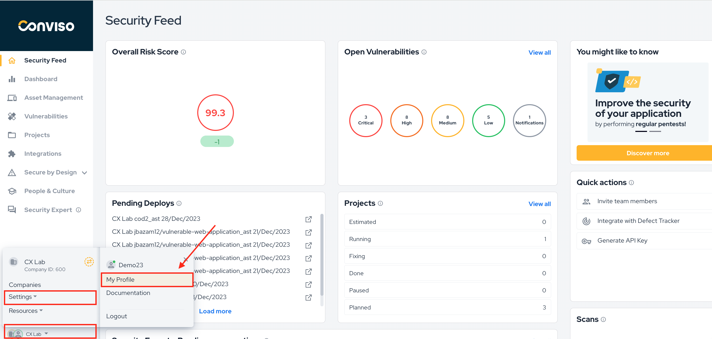
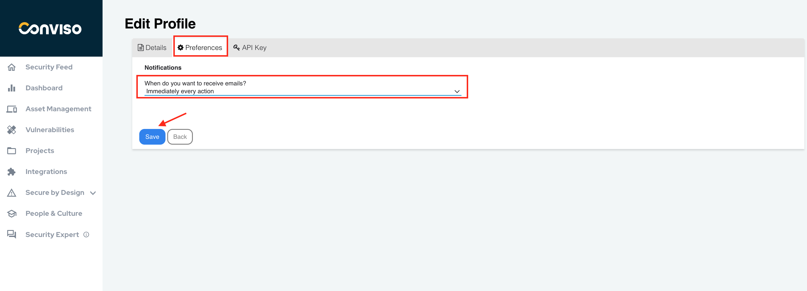
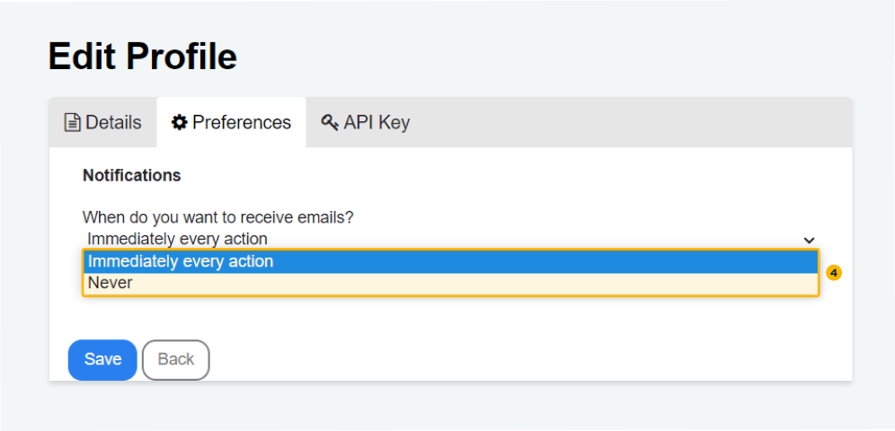

## Introduction
This feature allows users to stay informed about every action performed in the projects they have access to.

It's worth noting that users currently have two options: receiving notifications for every action or opting out of notifications entirely.

## Usage: Configuring email notifications

To configure email notifications, follow these steps:

**Step 1** - Log in to Conviso Platform. On the top bar menu, click on your **Profile (1)**. From the drop-down list, select **"Edit Profile” (2)**.

Step 2 -. Navigate to the **"Preferences" (3)** tab to configure your notification settings:

**Step 4** - Select one of the two currently available options have two options: **receiving notifications for every action or opting out of notifications entirely (4)**:

## Support
If you have any questions or need help using Conviso Platform, please don't hesitate to contact our support team.
