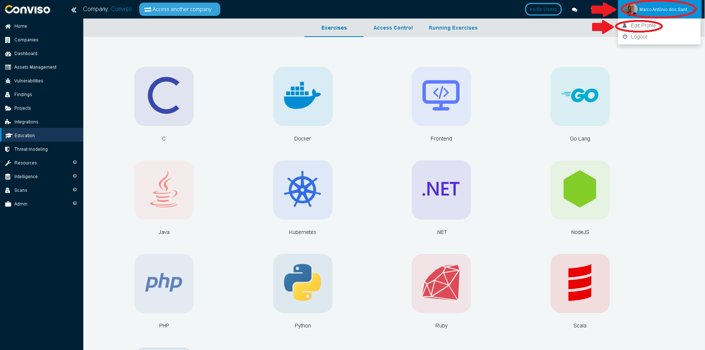
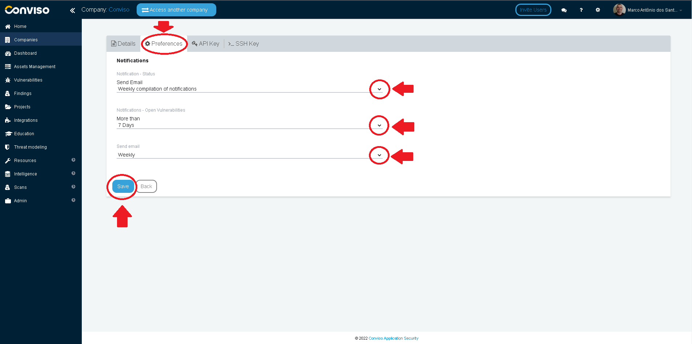

## Introduction

This feature helps the user to keep tracking of each action performed in the projects he has access. As this notification is optional, the user can choose to disable or configure to receive emails in a timely basis, according to his needs.

## Configuring E-mail Notifications

Log in to the [Conviso Platform](https://app.convisoappsec.com);

On the top bar menu, click on your **Username**. On the drop-down list, click on the **Edit Profile** option:

In user profile screen, click on **Preferences** tab to configure notifications. When done, click on the **Save** button to store your configuration settings:

- **Notification - Status**: This type of notification will send an e-mail to the user whenever there is a status change in any project. It can be set as any of the following values:
    - Immediately every action;
    - Daily build notifications;
    - Weekly compilation of notifications;
    - Biweekly compilation of notifications;
    - Monthly compilation of notifications;
    - Never.

- **Notifications - Open Vulnerabilities**: This type of notification will send an e-mail to the user whenever there is a vulnerability without any action. It can be set as any of the following values:
    - From a minimum of 3 and up to 10 days;
    - 15 days;
    - 20 days;
    - 30 days;
    - 60 days.

- **Send email**: This option will set the e-mail sending frequency. It can be set as any of the following values:
    - Daily;
    - Weekly;
    - Two weeks;
    - Monthly;
    - Never.
