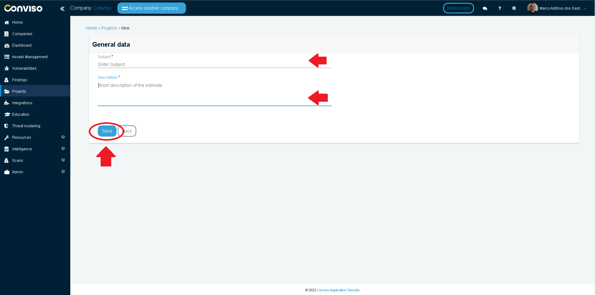
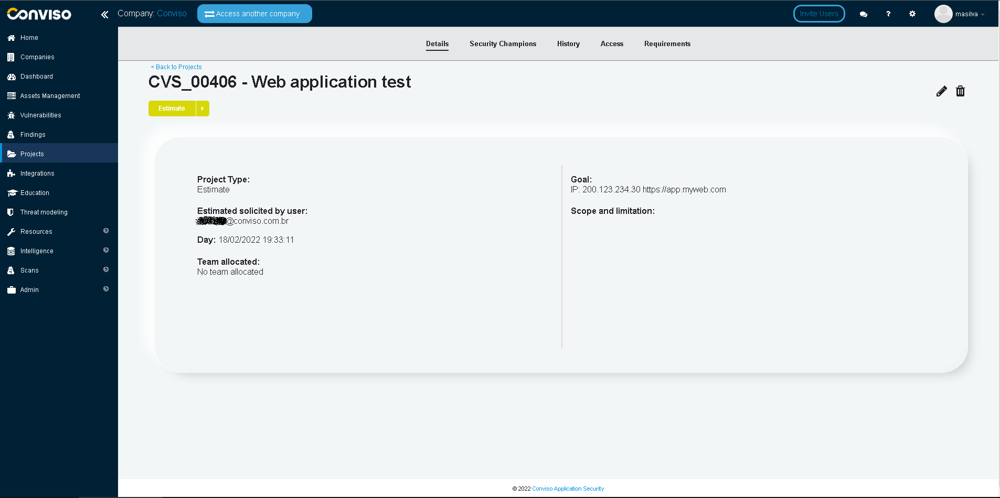
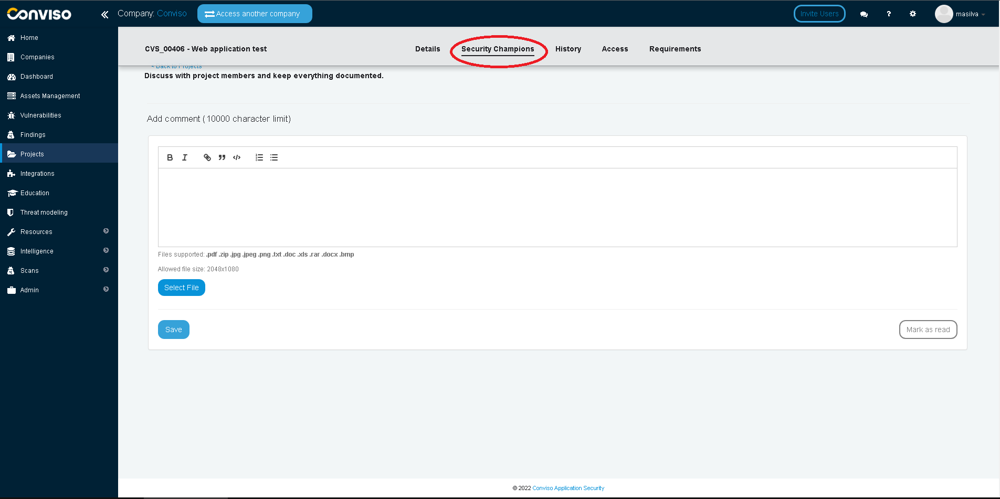
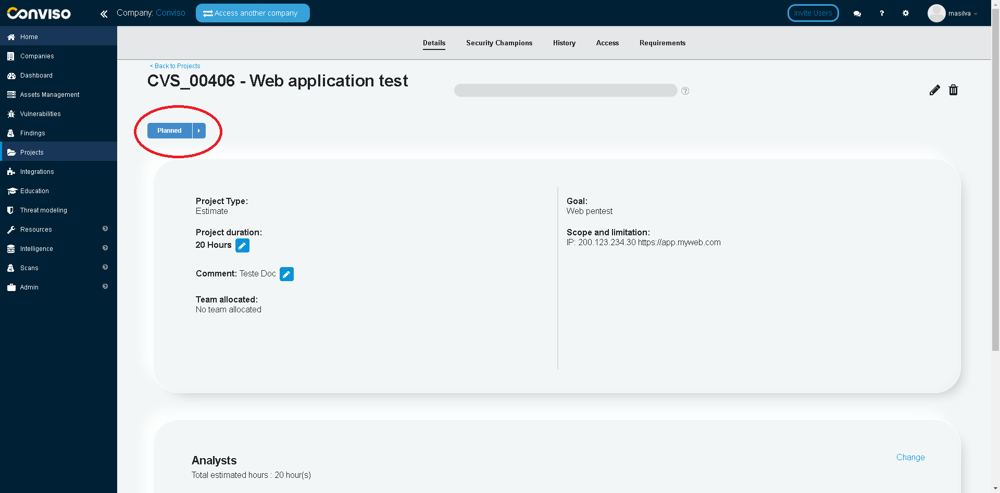

Log in to the [Conviso Platform](https://app.convisoappsec.com);

On the main menu to the left, click on **Projects**. At the panel to the right, click on the **New estimate** option:

 

:::info
Requesting an estimate is allowed only for users with enterprise (admin) access permissions.
:::

Fill in **Subject** and **Description**.

 

:::info
It is possible to request an estimate for all types of services (as long as it is within the contract), such as pentests, code review, training, consulting, etc.
:::

**Subject**: Describe what you want to be executed, as **Web Pentest in application x**, **Code review in application x**, **Network Pentest on x ip addresses**, etc.

**Description**: Detailed information regarding the scope of the request, such as:

- Brief description of the application;
- URL;
- IP addresses;
- Exceptions;
- The methodology of your choice (Black Box, Gray Box or White Box);
- Application size (considering, for example, number of application pages or API endpoints).

- Application pages examples:
  - app.site.com/cadastro
  - app.site.com/users
  - app.site.com/carrinho

- API endpoints examples:
  - api.site.com/cadastro
  - api.site.com/users
  - api.site.com/carrinho

:::info
This information will be used to estimate the required effort to  the requested demand.
:::

After filling the form, just click on **Save** button.

After clicking Save, the requested estimate should appear like this:

 

Conviso will contact you through the **Security Champions** of the Project, informing the amount of hours needed to execute the requested demand and if they are in agreement.

 

:::info 
Conviso may also contact you in order to obtain more information to execute the requested demand.
:::

When all information is sufficient for the execution of the requested demand, Conviso will change the status from **Estimated** to **Planned**:

 

