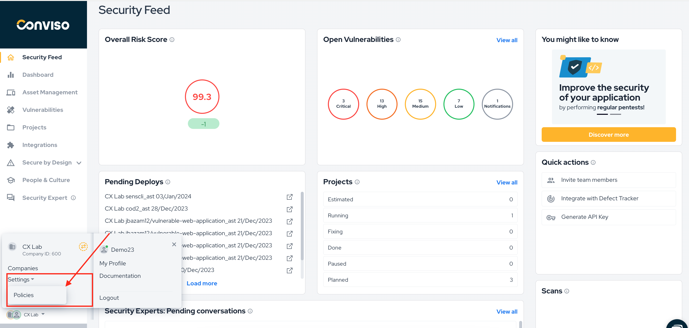

## Introduction

The **Integration Policy** feature aims to send the Conviso Platform vulnerabilities automatically to the integrated Defect Tracking tools such as Bitbucket, Github, Jira, Redmine, ServiceNow or Trello, or automatically classify as vulnerabilities the findings from Scanning tools such as Fortify, Qualys, Sonarcloud, Sonarqube or Amazon Inspector.

With this setting enabled, the user will not need to send issues manually whenever a new vulnerability is identified and registered in Conviso Platform. The issue will be automatically created in the defect tracking tool.

## Setting up Conviso Platform

Log in to the [Conviso Platform](https://app.convisoappsec.com);

To configure the **Integration Policy**, first you must have integrated a **Defect Tracker** tool or a **Scanner** tool with Conviso Platform. If you don't have any integrated tools yet, please read the documentation regarding the integration of the Defect Tracker tool or Scanning tool you are using.

In the upper right corner click on the **Gear** icon, then click on **Policies**:

The following screen will be shown:

### Vulnerabilities

**Automatically send vulnerabilities to Defect Tracking tools**: If you are using a Defect Tracking tool, this box must be checked. It will automatically send selected vulnerability classes from Conviso Platform to the Defect Tracking tool you are currently using at your environment. It is mandatory that you select at least one vulnerability severity level from those listed below:

- **All Vuln**: If you check this box, all vulnerabilities will be automatically sent to your Defect Tracking tool.

- **Low**: By checking this box, only vulnerabilities with low severity will be sent to your Defect Tracking tool.

- **Medium**: If you check this box, only vulnerabilities with medium severity will be sent to your Defect Tracking tool.

- **High**: By checking this box, only vulnerabilities with high severity will be sent to your Defect Tracking tool.

- **Critical**: If you check this box, only vulnerabilities with critical severity will be sent to your Defect Tracking tool.

When selecting the desired options, click on the **Save** button so that the integration policy is successfully made between Conviso Platform and your Defect Tracking tool.

### Scans

**Classify the findings as vulnerabilities**: If you are using a Scanner tool, this box must be checked. It will automatically send selected vulnerability classes from Conviso Platform to the Scanner tool you are currently using at your environment. It is mandatory that you select at least one vulnerability severity level from those listed below:

- **All Vuln**: If you check this box, all vulnerabilities will be automatically sent to your Scanner tool.

- **Low**: By checking this box, only vulnerabilities with low severity will be sent to your Scanner tool.

- **Medium**: If you check this box, only vulnerabilities with medium severity will be sent to your Scannerg tool.

- **High**: By checking this box, only vulnerabilities with high severity will be sent to your Scanner tool.

- **Critical**: If you check this box, only vulnerabilities with critical severity will be sent to your Scanner tool.

When selecting the desired options, click on the **Save** button so that the integration policy is successfully made between Conviso Platform and your Scanner tool.