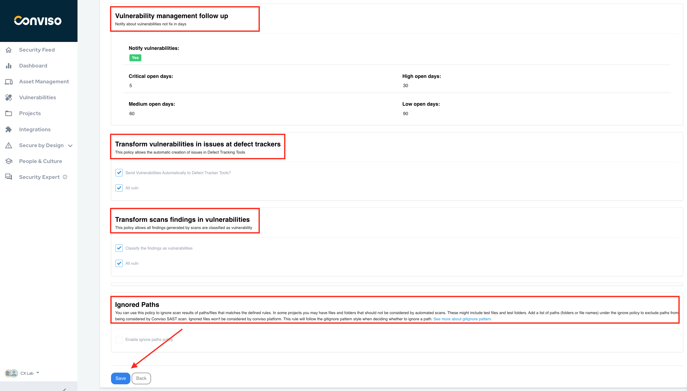
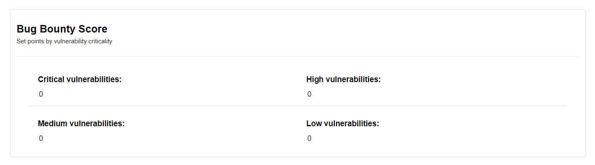
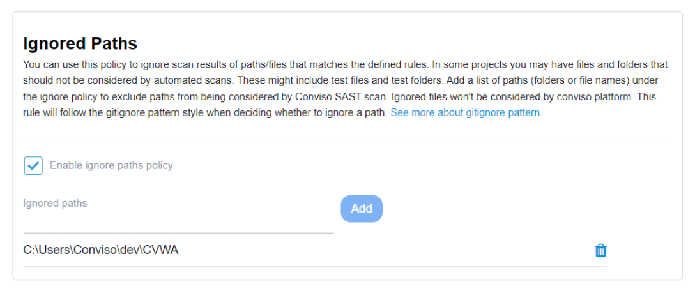

## Introduction

Discover the efficiency of Integration Policies for [Vulnerability Management](../general/vulnerabilities_management.md) with Conviso Platform. Automate Notifications, Vulnerability Classification, and more. This powerful integration empowers your developer team to focus on critical risks, respond promptly to security concerns, and foster a culture of secure development within your organization.

[**Embrace Vulnerability Management with Conviso Platform's Policies Integration.**](https://cta-service-cms2.hubspot.com/web-interactives/public/v1/track/redirect?encryptedPayload=AVxigLKtcWzoFbzpyImNNQsXC9S54LjJuklwM39zNd7hvSoR%2FVTX%2FXjNdqdcIIDaZwGiNwYii5hXwRR06puch8xINMyL3EXxTMuSG8Le9if9juV3u%2F%2BX%2FCKsCZN1tLpW39gGnNpiLedq%2BrrfmYxgh8G%2BTcRBEWaKasQ%3D&webInteractiveContentId=125788977029&portalId=5613826)

**Prerequisites**
Ensure that you have already integrated a Defect Tracker tool or a Scanner tool with [Conviso Platform](https://cta-service-cms2.hubspot.com/web-interactives/public/v1/track/redirect?encryptedPayload=AVxigLKtcWzoFbzpyImNNQsXC9S54LjJuklwM39zNd7hvSoR%2FVTX%2FXjNdqdcIIDaZwGiNwYii5hXwRR06puch8xINMyL3EXxTMuSG8Le9if9juV3u%2F%2BX%2FCKsCZN1tLpW39gGnNpiLedq%2BrrfmYxgh8G%2BTcRBEWaKasQ%3D&webInteractiveContentId=125788977029&portalId=5613826). If you haven't integrated any tools yet, refer to the respective [documentation](../integrations/integrations_intro.md) on how to perform the integration.

## Usage

To access the Integration Policy configuration:

Click on the **Gear icon (1)** located in the upper-right corner.

Select **"Policies" (2)** from the dropdown menu.

[ in the upper-right corner. The user is selecting 'Policies' (2) from the dropdown menu.")](https://cta-service-cms2.hubspot.com/web-interactives/public/v1/track/redirect?encryptedPayload=AVxigLKtcWzoFbzpyImNNQsXC9S54LjJuklwM39zNd7hvSoR%2FVTX%2FXjNdqdcIIDaZwGiNwYii5hXwRR06puch8xINMyL3EXxTMuSG8Le9if9juV3u%2F%2BX%2FCKsCZN1tLpW39gGnNpiLedq%2BrrfmYxgh8G%2BTcRBEWaKasQ%3D&webInteractiveContentId=125788977029&portalId=5613826)

You will be presented with the following features that ensure a more effective approach to [vulnerability management](../general/vulnerabilities_management.md), making the process more agile, consistent and secure.

## Vulnerability management follow up

This policy shows how well notifications are configured for unresolved vulnerabilities based on the number of days they remain open:

## Transform vulnerabilities in issues at defect trackers

By enabling this policy, you enable the automatic creation of issues in Defect Tracking Tools for identified vulnerabilities. You can choose to send vulnerabilities automatically to the Defect Tracker Tool for all severity levels:

## Transform scans findings in vulnerabilities

This policy streamlines the management of findings generated by scans by classifying them as vulnerabilities automatically. All findings from the scans will be treated as vulnerabilities with the specified severity levels:

## Bug Bounty Score

With this feature, you have a complete view of the Bug Bounty Program score from the identified vulnerabilities.

**Get in touch with our team to find out more.**

## Ignored Paths

This feature empowers you to exclude specific paths or files from automated scans, enabling the omission of irrelevant files and folders during scanning, such as test files and folders. You have the flexibility to add or remove paths as needed.

After selecting your desired options, simply click the Save button to successfully integrate the policy between the Conviso Platform and your Scanner tool. Streamline your scanning process for enhanced security assessments.

## Support

If you have any questions or need help using Conviso Platform, please don't hesitate to contact our support team. 

## Resources

By exploring our content you'll find resources to help you understand vulnerability management:

[How Vulnerability Management Works in Conviso Platform](https://blog.convisoappsec.com/en/how-vulnerability-management-works-in-conviso-platform/): Discover the key features of the platform and how it helps detect, prioritize, and remediate vulnerabilities.

[Prioritization of Vulnerabilities](https://blog.convisoappsec.com/en/how-vulnerability-management-works-in-conviso-platform/): Learn best practices for prioritizing vulnerabilities and creating a strategy that works for your organization.

[Vulnerability Management Process](https://blog.convisoappsec.com/en/vulnerability-management-process-what-is-it/): Get an overview of the process and learn how to implement it in your organization.

