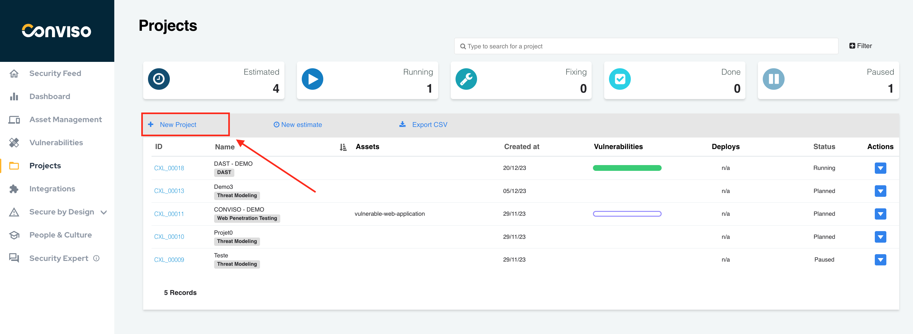
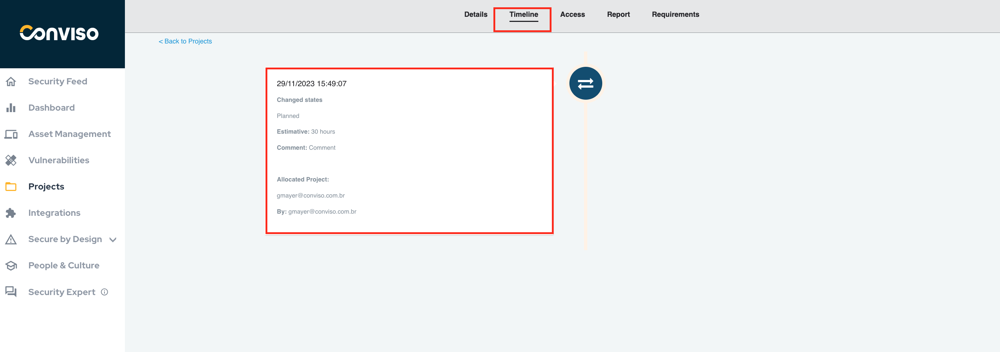
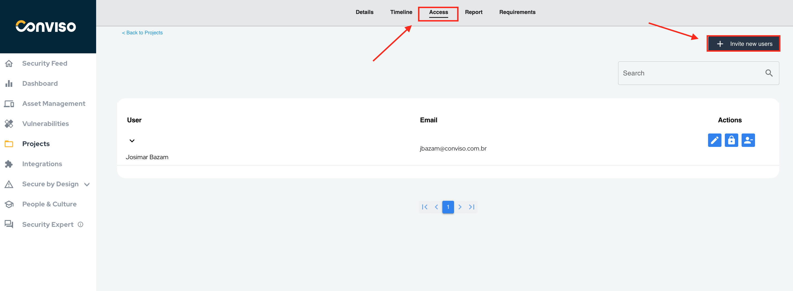

## Introduction

Projects management in Conviso Platform aims to centralize all projects and exhibit the software failures identified in the security analyses, which may lead to risks and system performance features.

Manage all security reviews in one place:

- Code Review;
- SAST;
- DAST;
- Web Penetration Testing;
- Requirements validation;

With the **Projects Management** feature, it is possible to create different types of projects, orchestrate data from other tools such as Network scan, SAST, DAST and centralize in one place for proper treatment.

## Benefits

The benefits of Projects Management:

- History timeline by Project;
- Create different types of Project;
- Project status;
- Security Champions;
- Vulnerability Fix Workflow;
- Resources;
- Access management by Project.

## Projects Management

Log in to the [Conviso Platform](https://app.convisoappsec.com);

At the left menu, click on **Projects**. At the right panel, select the Project you want to manage or create a new one, by clicking on the **+ New Project** option:

### Project Details and Properties

After selecting a Project, the default **Details** screen will be shown. You can review the project properties here, or edit them by clicking on the **Edit** icon to the right: 

### Security Champions

It aims to act as "gurus" to assist with issues, recommend training and interact directly with experts to identify specific issues or growing problems.

This **Security Champions** feature is a link between development and security. Security Champions manages to guide safely, maintain an understanding of both worlds, mitigating possible conflicts, where both teams can exchange their experiences, ask questions to implement vulnerability fixes:

### History

Follow the entire timeline through the project history. The **History** contains the entire record of each action taken on the project:

### Access

Manage accesses by project. By using this feature, the manager or person in charge can send invitations to new users who must have access in the project. To get more information, please refer to the [following guide](./user_management).

If you need to share access user or supporting document for a particular system, we recommend using Conviso Platform Resources, where you can register credentials and files as attachments. To get more information, please refer to the [following guide](./resources).

### Requirements

Keeping large teams working with the same goals, and following a pattern within the process is not the easiest of tasks. The **Requirements** allows you to create an action plan based on tasks that must be accomplished. For more information on how to use this, please refer to the [following guide](./requirements)

In some cases these tasks can be placed as mandatory for closing a project, this ensures that the manager has full control over the execution.

