## Introduction

In Conviso Platform, the admin user can send an invitation to new users and manage who should have access to their information.

You can manage three types of access:

- **Company**: User has full company access to all features;

- **Projects**: the user will only have control of the projects he has been granted access to;

- **Vulnerabilities**: The user will only have control of the vulnerabilities he has been granted access to.

## Inviting New Users

Log in to the [Conviso Platform](https://app.convisoappsec.com);

On the top bar menu to the right, click on **Invite Users** button:

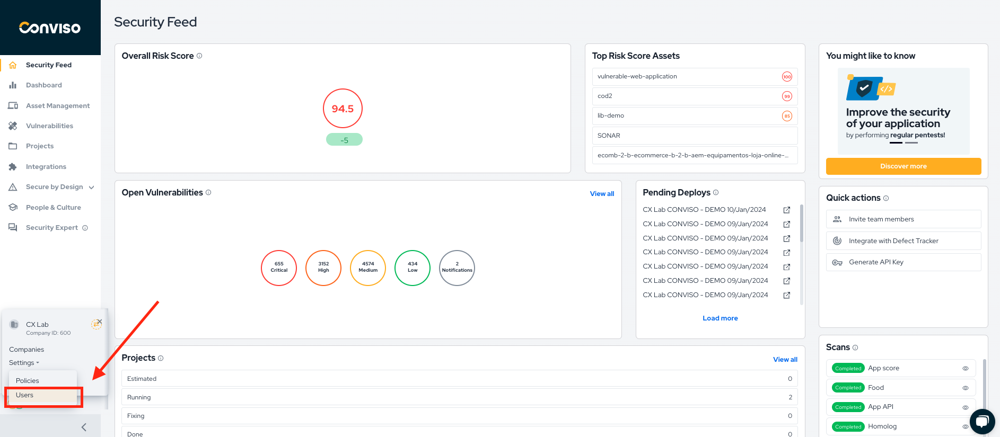

On the users access screen, click on the blue **+** button to the right, to create a new user invitation:

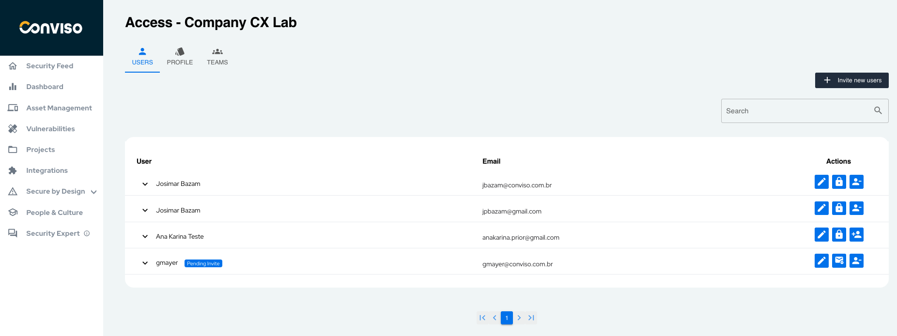

The **Add a new** user modal will be shown. On the **E-mails** field, type the new user e-mail address (or choose an existing one, if you are changing an existing user access profile) and choose a Team wich the user will be assigned to on the drop-down list **Teams**. Next, choose what kind of access will be granted to the user, by choosing one of the three radio buttons: **Company**, **Projects** or **Vulnerabilities** (details on the next section in this document). When done filling the form, click on the **Create** button to store the user access profile. An e-mail will be sent to the user, who must accept the invitation.

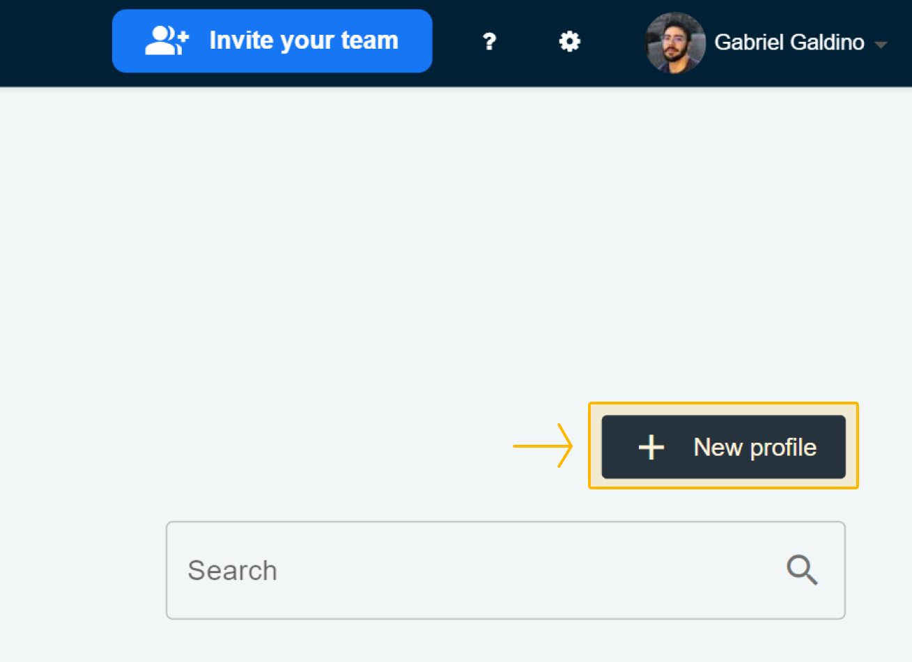

## Access types

- **Company**: User has full company access to all features.

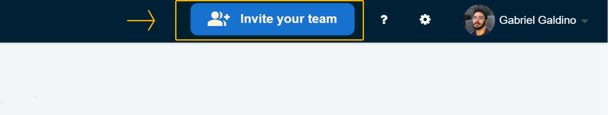

- **Projects**: the user will only have control of the projects he has been granted access to. You need to choose what project (or projects) the user will be granted access to, by clicking on the **Projects** dop-down list:

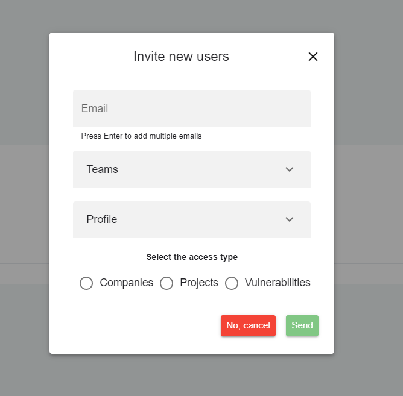

- **Vulnerabilities**: The user will only have control of the vulnerabilities he has been granted access to. You need to choose what project (or projects) the user will be granted access to, by clicking on the **Projects** dop-down list, and then choose what vulnerabilities the user will be granted access to, by clicking on the **Vulnerabilities** dop-down list:

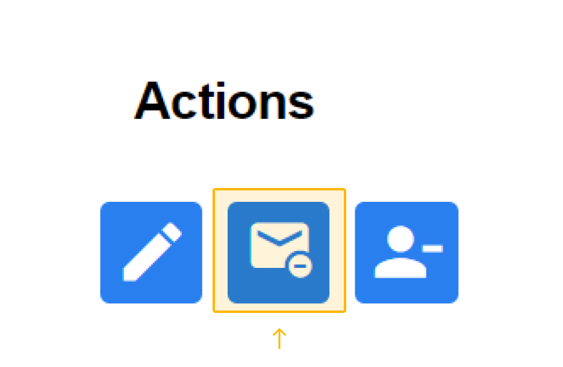

## Other user controls

There are some additional controls available at **User Management**:

In the main **User Management** screen, you can click on this button to navigate through the screen, expanding or colapsing user detaisl or refreshing the entire user list: 

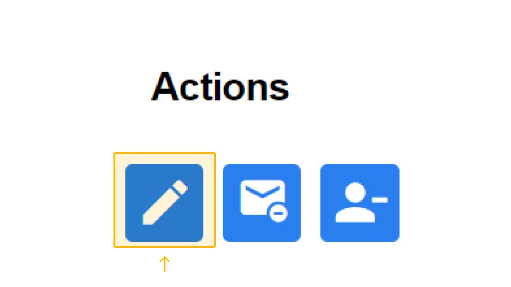

The availble controls exhibited when you click the button:

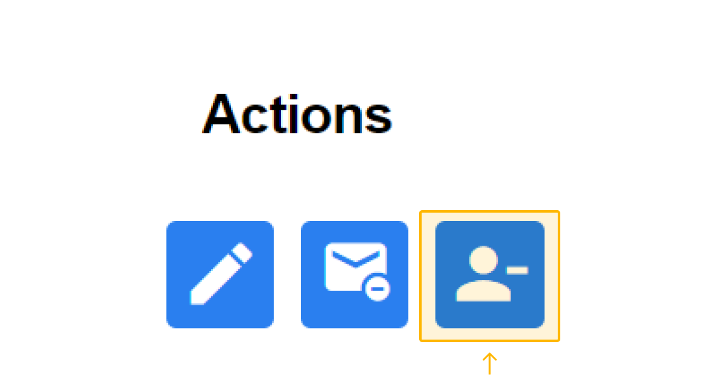

Also, at the right of each user, you have some additional controls available, depending of the context.

**Grant Access to Education Module** (the user currently has no access to the Education Module):

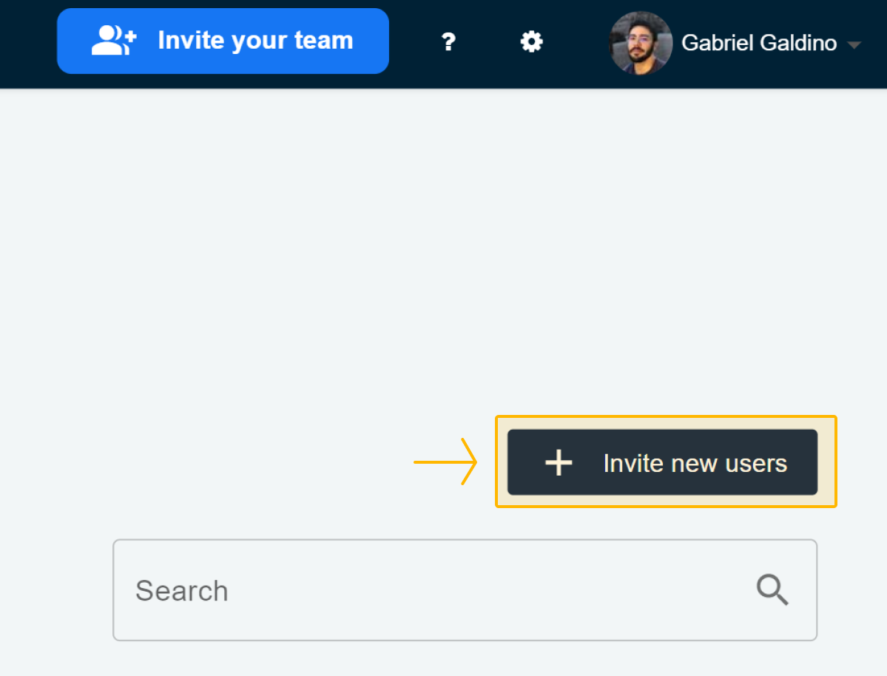

**Delete Access** (the user currently has access Education Module):

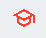

**Remove Analyst Profile** (the user has the Analyst Profile assigned):

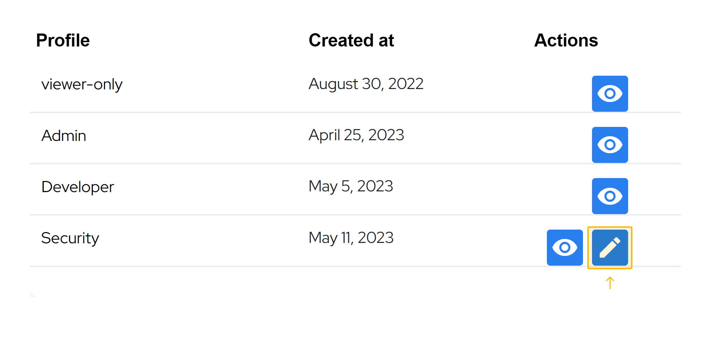

**Add Analyst Profile** (the user do not have the Analyst Profile assigned):

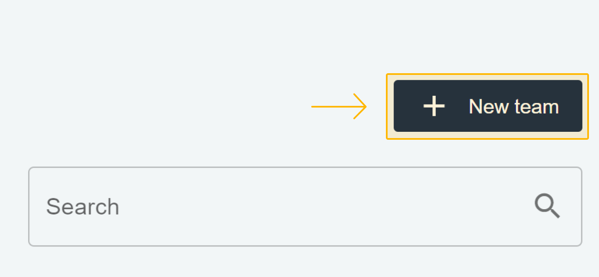

**Unblock User's Access** (the user is currently blocked at Conviso Platform):

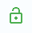

**Block User** (the user is permitted to log in to the Conviso Platform):

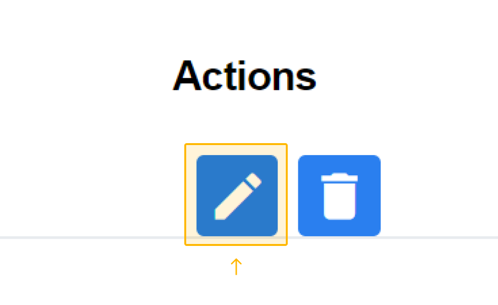

**Copy the Invitation link** (you can copy the invitation URL to send to the user by other means):

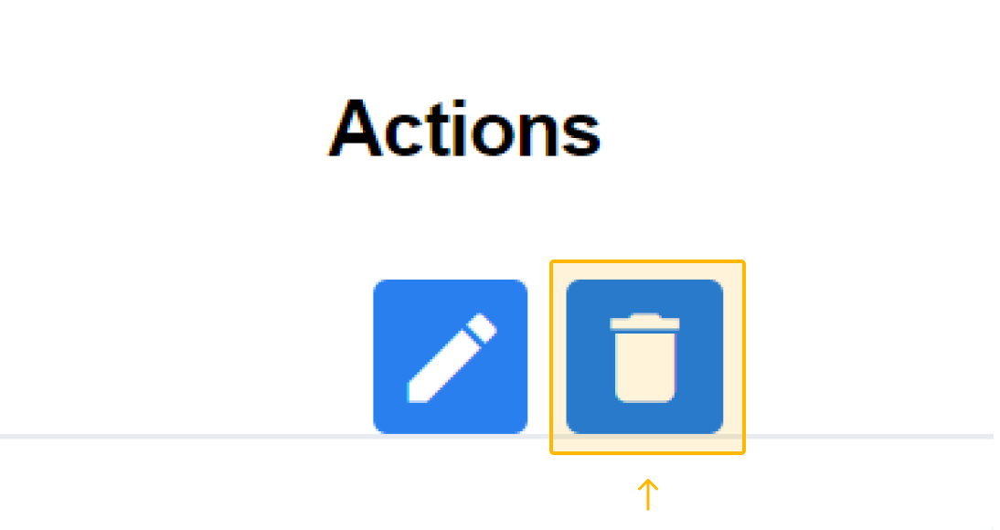

**Cancel User's Invitation** (use it to cancel an user invitation):

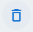

