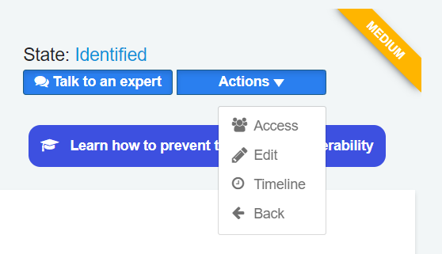
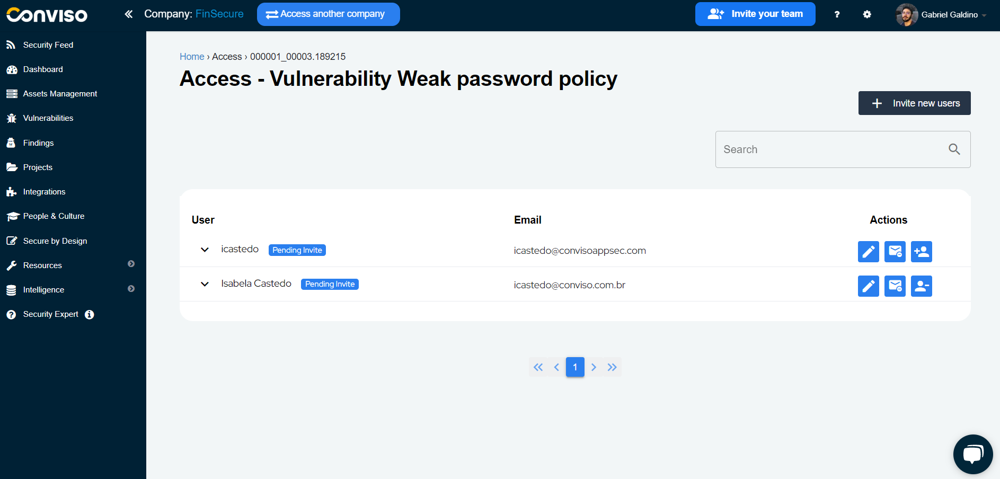
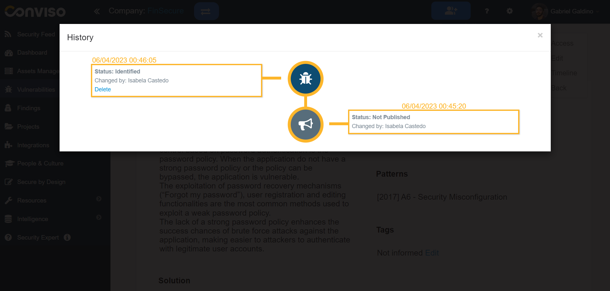
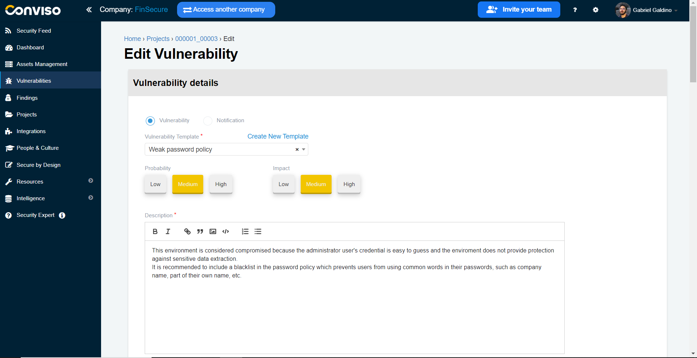

## Introduction
Conviso Platform has a complete workflow for vulnerability management, such as the process cycle to evaluate, remediate, and mitigate security weaknesses in systems or applications. 

## Usage
To view all identified vulnerabilities, simply click on the "Vulnerabilities" option in the left-hand menu. 

The vulnerabilities will then be displayed according to their respective statuses, which may include:

Notifications Identified: It does not necessarily refer to a specific vulnerability, but to some update or security advisory as a notification identified;

**False Positive:** indicates that the vulnerability is actually a false positive;

**Unpublished:** indicates that the vulnerability has restricted visibility by certain security analysts and needs some evaluation before going into identified status;

**Identified:** indicates that a vulnerability has been identified or discovered;

**Risk Accepted:** indicates that the vulnerability has been accepted as an acceptable risk, and no action will be taken to fix it;

**In Progress:** indicates that the vulnerability remediation workflow has started and that the vulnerability is under correction;

**Waiting Validation/Waiting Review:**  indicates that the vulnerability has been fixed, and the solution is awaiting validation;

**Fix Accepted:** indicates that the solution to the vulnerability has been accepted;

**Fix Refused:** indicates that the solution to the vulnerability has been rejected.

On this page there is a **Filter** for you to be able to view vulnerabilities by a specific status, project or asset.

When viewing the list of identified vulnerabilities, you can quickly access a summary of each vulnerability. 

Select the vulnerability you want to manage. The vulnerability will expand, exhibiting all projects where it was identified. Click on the project you want to manage to access a Vulnerability Workflow.

## Vulnerability Workflow

Clicking on a specific vulnerability’s project will allow you to view its corrective workflow process in detail.

On the vulnerability page, you can identify all the details needed to analyze the vulnerability identification and also work on its correction, with references and evidence.

The available statuses for the workflow are:

**Identification:** means that the vulnerability is in the process of being identified and analyzed;

**Correction:** means that the vulnerability has already been analyzed and is now in the process of being corrected;

**Validation:** means that the vulnerability has been corrected by the developers and is now being validated by security analysts;

**Concluded:** means that the vulnerability has been successfully corrected and is no longer an issue.

You can start the workflow by assigning a new status to the vulnerability in **Assign:**

And you can also:

**Validate:** to ask the responsible to ensure that your corrections were successfully made and fixed the vulnerability;

**Accept Risk:** to accept the risk of not fixing the vulnerability for some reason;

**False Positive:** to mark the vulnerability as a false occurrence;

Clicking on the **Assign** button and filling the form with the required data. When finished filling the form, click on the **Change** button to start the vulnerability workflow. 

The vulnerability status will be assigned to **In progress:**

## Vulnerabilities Management Options

On any selected vulnerability, you have some operations in the upper right corner at your disposal:

### Talk to an expert

Need help or have questions? Our team of experts is here to assist you! You can easily communicate with the Conviso expert who is responsible for your project by using this action.

### Actions
You can access various operations through the "Actions" button:

#### Access

Under “Access”, you can assign permissions to the vulnerability [(see this guide on how to do this)](./user_management).

#### Timeline

In “Timeline”, you can view the entire history of the vulnerability management process.

#### Edit

In "Edit" you can change the information about this vulnerability.

## Support
If you have any questions or need help using our product, please don't hesitate to contact our [support team](mailto:support@convisoappsec.com).

## Resources
By exploring our content you'll find resources to help you understand vulnerability management:

[How Vulnerability Management Works in Conviso Platform:](https://bit.ly/3LBxR0m) Discover the key features of the platform and how it helps detect, prioritize, and remediate vulnerabilities.

[Prioritization of Vulnerabilities:](https://bit.ly/3LBxR0m) Learn best practices for prioritizing vulnerabilities and creating a strategy that works for your organization.

[Vulnerability Management Process:](https://bit.ly/3LgMDIn) Get an overview of the process and learn how to implement it in your organization.

