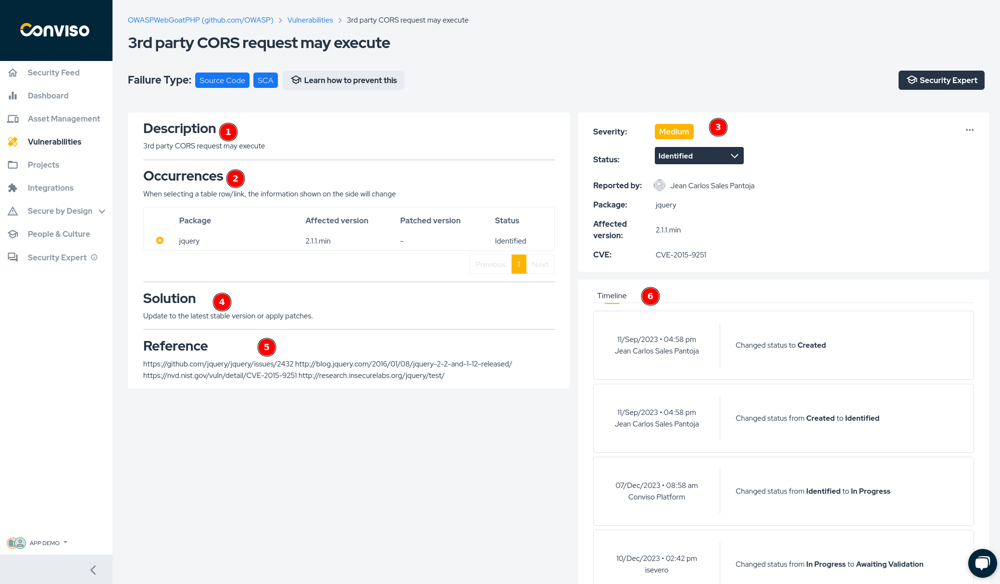

## Introduction

The Conviso Platform has a complete workflow for vulnerability management, such as the process cycle for assess, remediate, and mitigate security weaknesses in systems or applications. As part of this process, policy and scope definition, assessment, correction, mitigation and monitoring of assets are required.

## Benefits

The benefits of vulnerability management:

- Workflow for fixing vulnerabilities;

- Vulnerability Fix Status;

- Status by severity;

- Correction timeline;

- Solution to mitigate problems.

## Vulnerabilities Management

With the Vulnerability Management feature, create a process to prioritize corrections. However, it must be observed from other angles so that prioritizations can be  correctly assigned.

Log in to the [Conviso Platform](https://app.convisoappsec.com);

At the left menu, click on **Vulnerabilities**. All identified vulnerabilities will be shown, grouped by their statuses, which can be:

- **Identified**;
- **In Progress**;
- **Waiting Validation**;
- **Fix Accepted**;
- **Risk Accepted**;
- **Unpublished**;
- **False Positive**;
- **Fix Refused**;
- **Notifications Identified**.

## Vulnerability Workflow

Create a vulnerability correction process using Workflow, where you can allocate a professional and set a correction date according to your enterprise policy.

The available statuses for the workflow are:

- **Identification**;
- **Correction**;
- **Validation**;
- **Concluded**.

Select the vulnerability you want to manage. The vulnerability will expand, exhibiting all projects where it was identified. Click on the project you want to manage:

The Workflow will be shown below the vulnerabilty title. All identified vulnerabilities will start with the **Identified** status. You can start the workflow by assigning a new status to the vulnerability, clicking on the **Assign** button and filling the form with the required data. When finished filling the form, click on the **Change** button to start the vulnerability workflow. The vulnerability status will be assigned to **In progress**:

Later in the vulnerability workflow, you will be able to assign other statuses to the vulnerability, like:

- **Validate**, to ask the responsible to ensure that your corrections were successfuly made and fixed the vulnerability;
- **Accept Risk**, to accept the risk of not fixing the vulnerability for some reason;
- **False Positive**, to mark the vulnerability as a false occurrence. 

## Vulnerabilities Management Options

At any selected vulnerability, you have at your disposal some operations through using the **Actions** button: 

### Security Champions

You can use this action to exchange information (messages, evidence files) with the Conviso professional who is responsible for your project:

### Access

You can use this action to assign permissions to the vulnerability (please refer to [this guide](./user_management) on how to do it):

### History

By using this action, you will be able to view all the history of the vulnerability management process:

### Back

Use this action to return to the main vulnerabilities screen:

