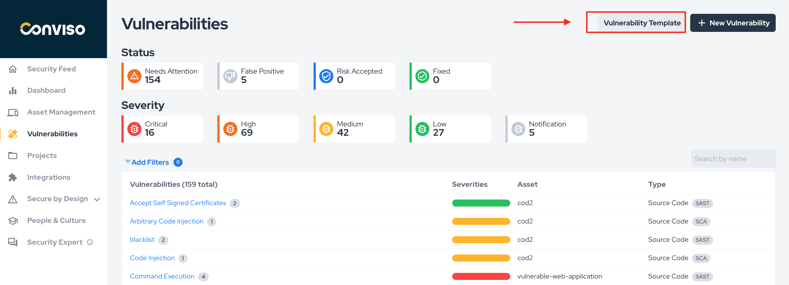
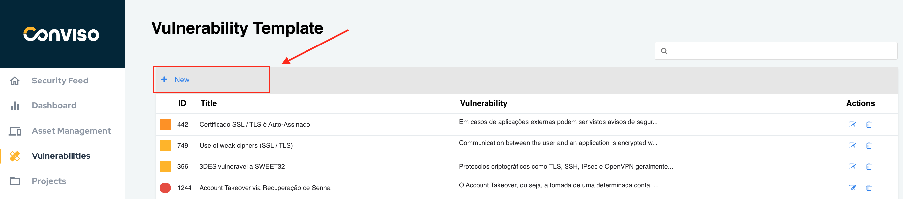
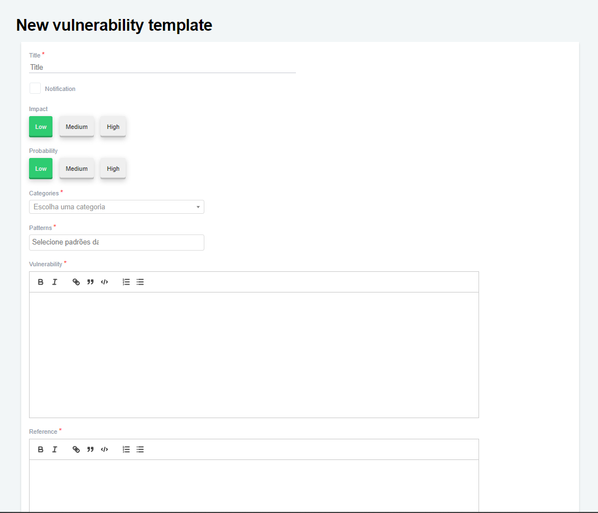
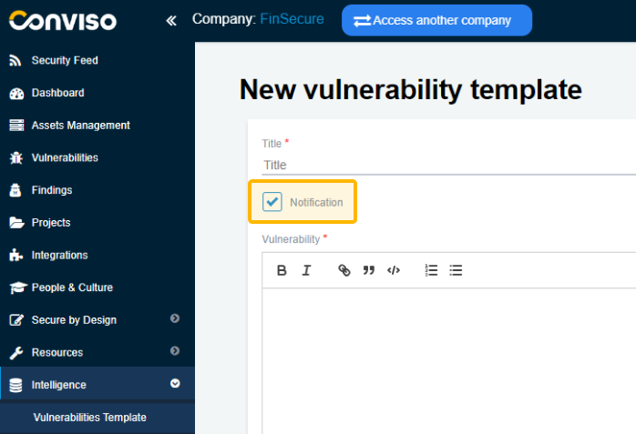

## Introduction

Customers who have a Conviso Platform subscription have access to all our vulnerability templates created and used by Conviso daily, but it is also possible to create your own templates.

:::note
To be able to create templates, a user with company access permissions (admin) is required.
:::

## Creating Vulnerabilities Templates

Log in to the [Conviso Platform](https://app.convisoappsec.com);

At the left menu, click on **Intelligence**, then click on the **Vulnerabilities Template** option:

Click on the **+ New** option:

In the opened screen, fill in all the required fields of the form. When finished filling the form, click on the **Save** button to store your new vulnerability template:

- **Title**: A label describing the vulnerability (mandatory);

- **Impact**: Select the impact this vulnerability could have (optional);

- **Probability**: Select how likely this vulnerability is to occur (optional);

- **Categories**: Select which CWE this vulnerability belongs to (mandatory);

- **Patterns**: Select which currently used patterns (OWASP, SANS, etc.) this vulnerability belongs to (mandatory);

- **Vulnerability**: Description of the vulnerability (mandatory);

- **Reference**: Place the sources where the information regarding this vulnerability was taken (mandatory).

- **Solution**: Description of how to fix the vulnerability (mandatory).

- **Notification**: By checking this box, the template will be changed from Vulnerability to Notification. By doing this, only the Title, Vulnerability, Reference and Solution fields will be shown.

This is because it's just a notification, so there's no need to have Impact, Probability, Categories or Standards.

### What is the difference between vulnerability and notification?

We always make revisions to all our templates. In a technical forum held internally, the conclusion was reached that vulnerability is what actually allows the application to be exploited. Many headers and some good practices do not allow direct exploration when performed, but their implementation makes exploration difficult, so we adopted the process of calling these cases of notifications.