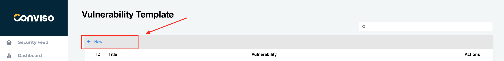
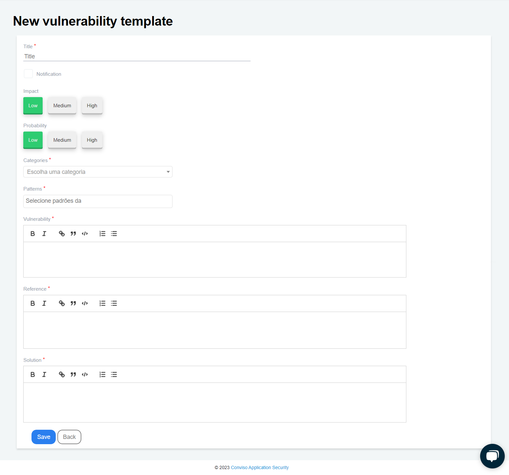
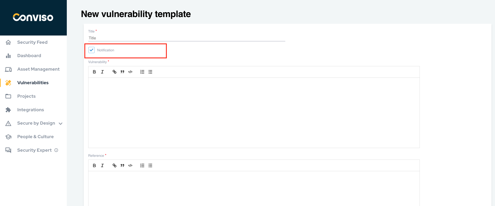

## Introduction
Conviso Platform allows users access to a comprehensive collection of vulnerability templates used daily on the platform. Users can also create their own templates based on their specific needs.

## Usage
To access the vulnerability templates on the Conviso Platform, click on "**Intelligence**" in the left menu and select the "**Vulnerabilities Template**" option:

On this screen, you will have a complete view of all vulnerability templates for Conviso Platform.

## Creating Vulnerabilities Templates
Creating a new vulnerability template is simple! Just follow these steps:

**Step 1** - Click on the "+ New" button located at the top left of the table.

**Step 2** - Fill in all required fields on the form: 

To create your vulnerability template, please ensure that you fill in all the required fields on the form:

**Title:** A label describing the vulnerability (mandatory);

**Notification:** By checking this box, the template will be changed from Vulnerability to Notification. See what changes in [this section of the documentation](#what-is-the-difference-between-vulnerability-and-notification);

**Impact:** Select the impact this vulnerability could have (optional);

**Probability:** Select how likely this vulnerability is to occur (optional);

**Categories:** Select which CWE this vulnerability belongs to (mandatory);

**Patterns:** Select which currently used patterns (OWASP, SANS, etc.) this vulnerability belongs to (mandatory);

**Vulnerability:** Description of the vulnerability (mandatory);

**Reference:** Place the sources where the information regarding this vulnerability was taken (mandatory);

**Solution:** Description of how to fix the vulnerability (mandatory).

**Step 3** - Once you have filled in all the necessary fields, click the “Save” button to store your new vulnerability template.

## What is the difference between Vulnerability and Notification?

When the "Notification" box is checked, the template is changed from Vulnerability to Notification, displaying only the Title, Vulnerability, Reference, and Solution fields. 

Impact, Probability, Categories, and Standards are not required for notifications:

At Conviso, we regularly review and update our templates. Through internal technical discussions, we concluded that a vulnerability refers to an actual security weakness that can be exploited.

Some headers and good practices may not directly allow exploitation, but their implementation strengthens security measures and makes exploitation more difficult. Hence, we classify such cases as notifications.

## Support
If you have any questions or need help using our product, please don't hesitate to contact our [support team](mailto:support@convisoappsec.com).

## Resources
By exploring our content you'll find resources to help you understand vulnerability management:

[How Vulnerability Management Works in Conviso Platform:](https://bit.ly/3LBxR0m) Discover the key features of the platform and how it helps detect, prioritize, and remediate vulnerabilities.

[Prioritization of Vulnerabilities:](https://bit.ly/3LBxR0m) Learn best practices for prioritizing vulnerabilities and creating a strategy that works for your organization.

[Vulnerability Management Process:](https://bit.ly/3LgMDIn) Get an overview of the process and learn how to implement it in your organization.