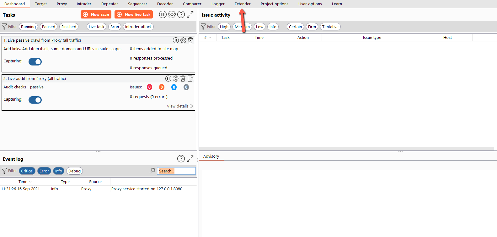
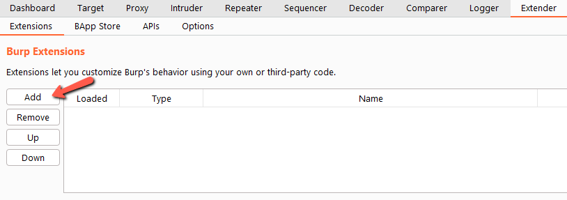
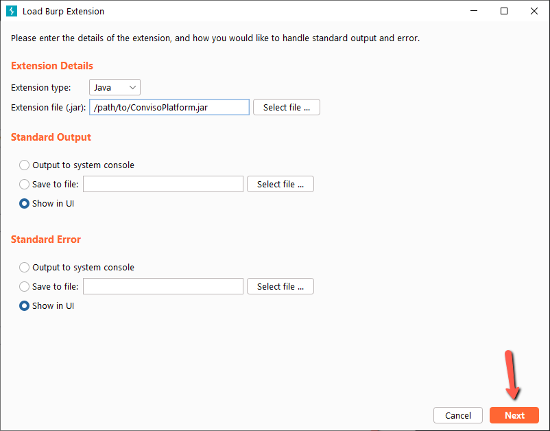
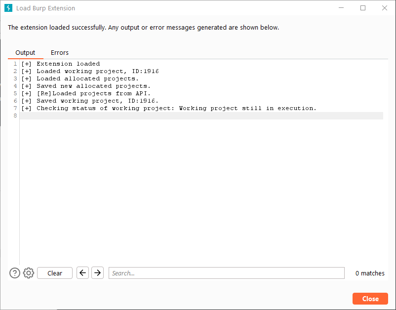

To add an extesion to Burp manually, follow the steps below. 

### **1.** 

### **2.** 

### **3.**

### **4.**

### **5.**
If you can see the message **Extension loaded** the extension loaded correctly. So if you have already used the extesion, it will load already known and stored info, like working project, activities of that project, etc. It will also request to the API, to update already known informations.

### **6.**

