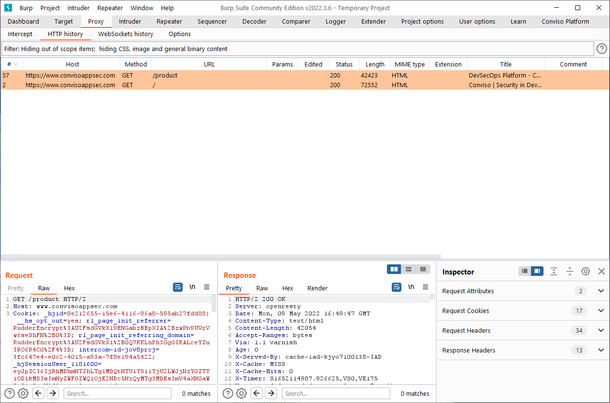
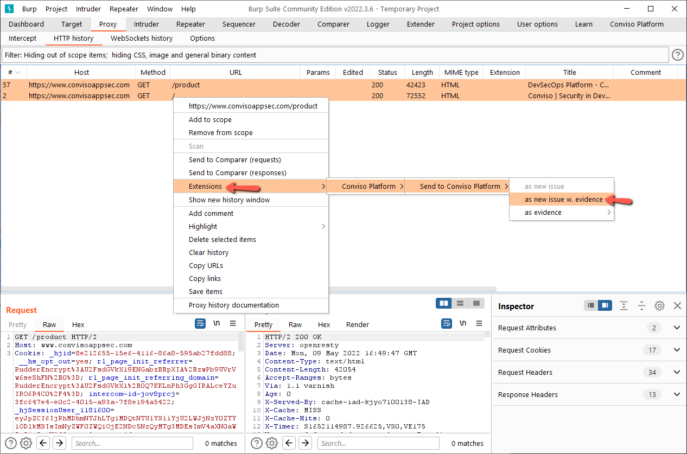
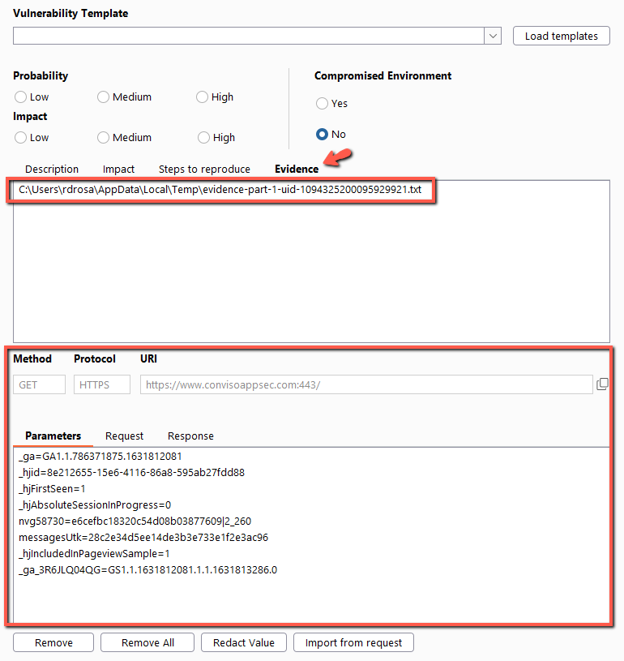

When we select multiple requests and response to send to AppSec Flow, the extension will get the first request/response and autofill the camps of the form. The other selected requests will be appended as a **.txt** in the evidence tab.

### **1.**

### **2.**
**RIGHT CLICK**

### **3.**
