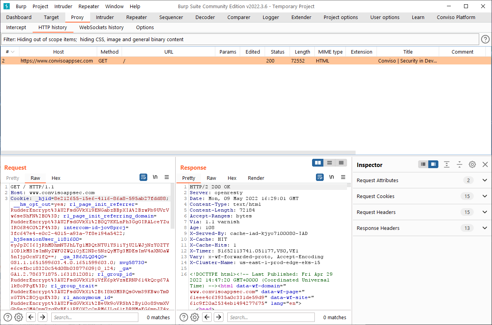
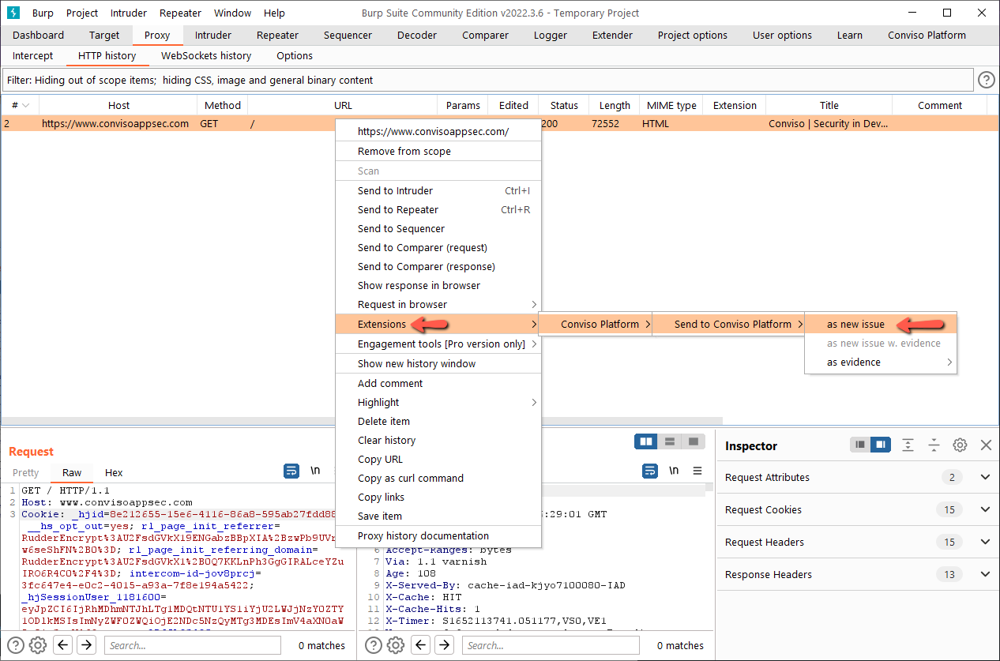
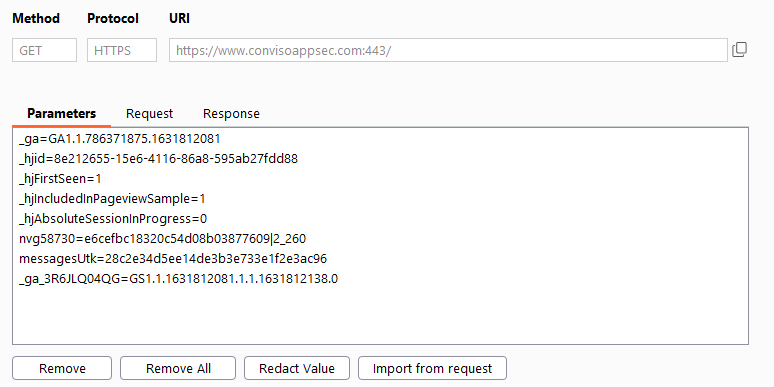
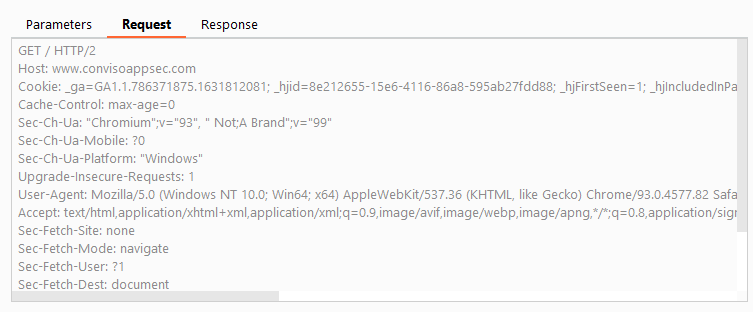
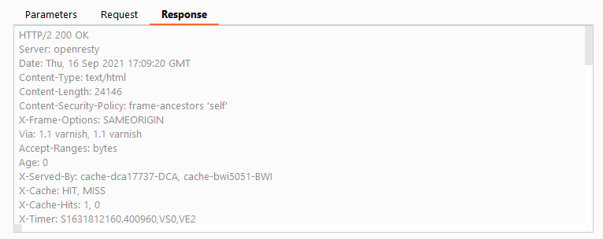

To use the information of a request/response in Burp to autofill the camps in the submit vulnerability form, follow the steps below:

### **1.**

### **2.**
**RIGHT CLICK**

### **The filled parameters will be:**

