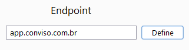
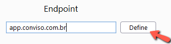
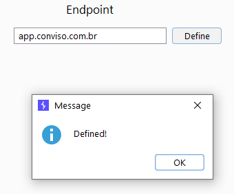

If needed, you can define a customized endpoint, follow the steps below. 
But, if you don't use the **On Premise** version of the platform, leave it as **app.conviso.com.br**

### **1.**

### **2.**

### **3.**

