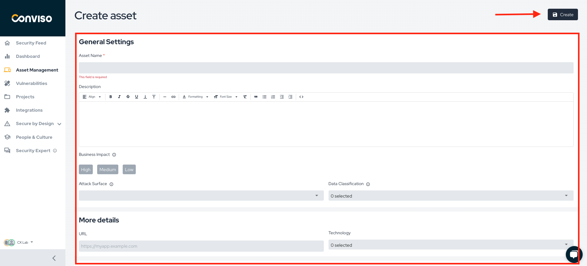

## Introduction

The Asset Management page provides users with a comprehensive overview of all assets related to their projects or registered with their company. It's important to note that some of the information on this page may be generated by other platform features, such as the Risk Score, which requires additional information to calculate its value. Users can access important information about each asset, including the Risk Score, open vulnerabilities, impact on the business, integration status, and other relevant actions providing a complete view of all assets and enabling quick status assessments.

Effective asset management is essential for understanding how your risk profile can contribute to decision-making. This proves especially beneficial for developers in prioritizing which vulnerabilities to address first.

## Adding a New Asset Manually**

You'll find the menu to add a new asset in the top right corner of the page, as depicted in the image below. Clicking on the menu reveals two options: integration through integrations functionality and manual entry.

In the image below, you can observe the options available to create a new asset manually.

Firstly, assign a name to your asset and provide a description to make it easy for everyone who interacts with it to understand. Understanding the potential impact of a compromised asset on the company's business is crucial. Therefore, choose one of the three options available to identify the Risk Score of your asset.

It is important for the asset's name to match the one in the repository. When using Conviso AST to run an automatic scan, the system checks whether the asset exists on the Conviso platform. If not, the system creates it automatically.

Next, select the appropriate option under **"Attack Surface"** to understand your asset's situation. You can also enter the data classification in the **"Data Classification"** and **"Business Impact"** option.

After providing all the necessary information, you can move on to the next options. If your asset has a URL, you can indicate the predominant technology by selecting it under the "URL" option. Lastly, select the team responsible for the asset, ensuring that the team is created in the Platform's Teams functions beforehand. If needed, add tags to facilitate asset retrieval using filters.

## Filtering the assets

The Conviso Platform equips users with the ability to search through its filters. The image below displays different options for users to search for desired information, such as assets. The filter tool is designed to be intuitive and self-explanatory, encouraging users to explore search options by using the filters.

To view a specific asset, simply click on it, and you'll be redirected to the relevant page, as shown in the image below. Once all the data required to calculate the Risk Score is entered, it will be displayed as one of the first pieces of information.

This understanding of the risks associated with each asset is crucial for effective management. On this page, you can access the asset's description, related projects, and integrations. Additionally, view relevant information, such as the technology used, URL, and tags assigned to the asset, along with the teams and developers responsible for it. Having access to this comprehensive set of information facilitates a better understanding of our assets, leading to more informed decision-making and enhanced overall security.

**Contacts:** It is also possible to add the contact of the responsible people for the asset to be notified about its situation.

## Support
If you have any questions or need help using our product, please don't hesitate to contact our [support team](mailto:support@convisoappsec.com).

## Resources
By exploring our content you'll find resources to help you understand assets management:

[Continuous monitoring and management of the application:](https://bit.ly/45TbWK0) The monitoring and validation of findings from analyzes performed – whether through dynamic tests (DAST), interactive tests (IAST), or Network Scans need to be monitored and maintained in a centralized and organized way by the teams involved in the process.

[Security Risk Management - Best Practices and Processes:](https://bit.ly/45RKSL7) In this article, we will discuss the importance of security risk management and share best practices for effectively executing this process.

