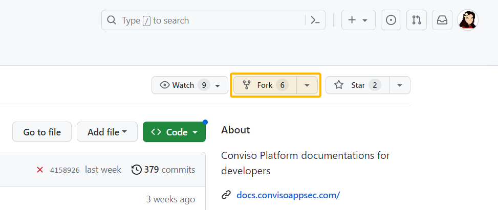
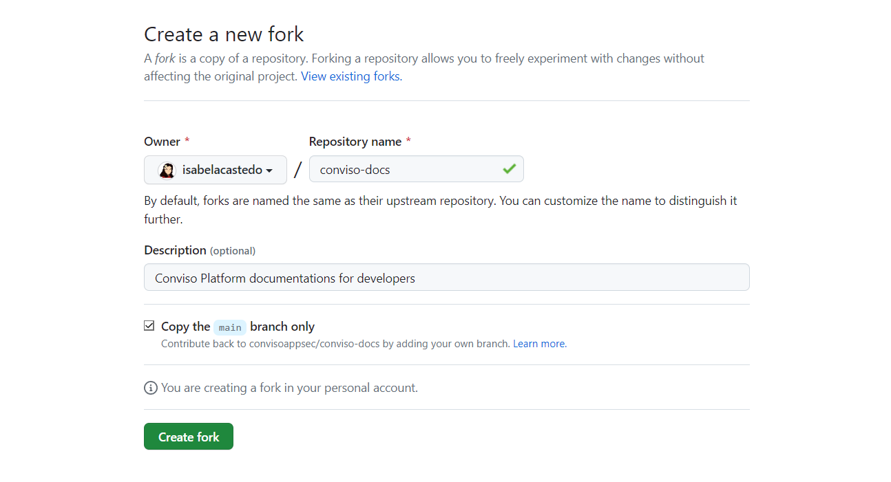
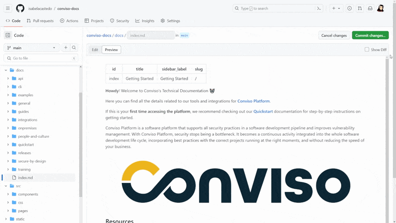
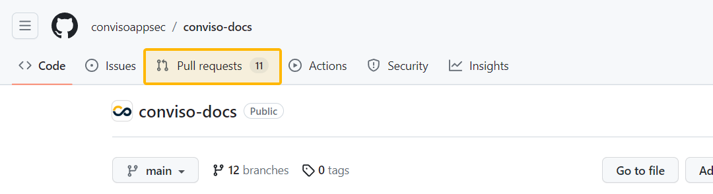
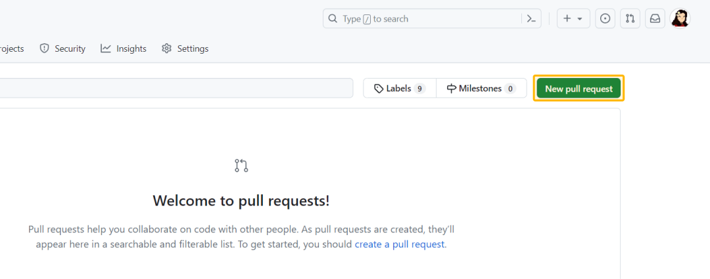
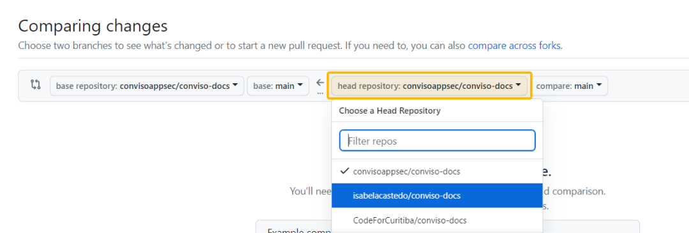
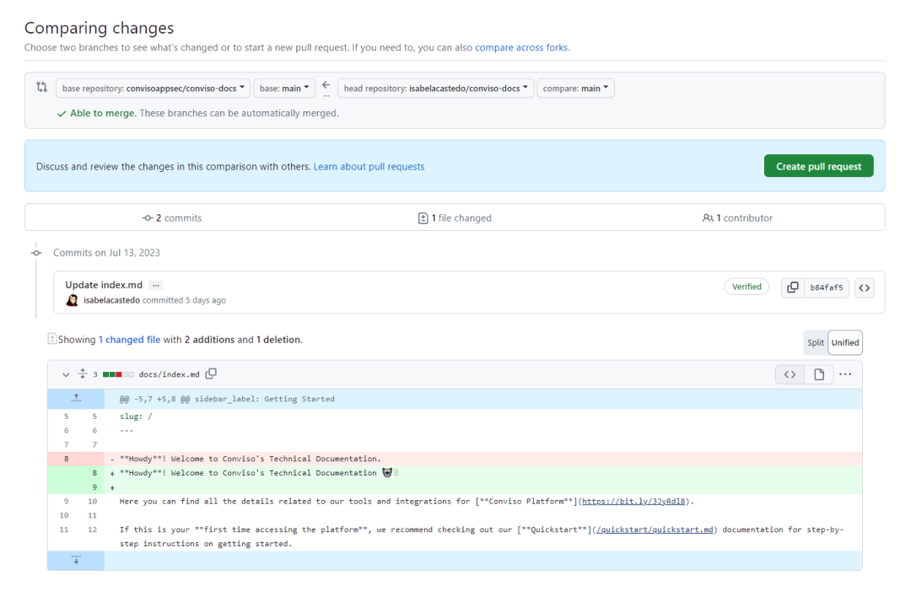
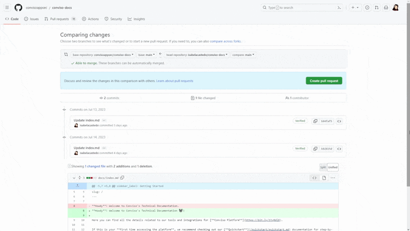

## Introduction

This is a simple guide that shows you the steps to make changes to a documentation page in Conviso Docs, contributing to an open source project.

**Note:** You can also learn more about contributing to Conviso Docs by following this [technical tutorial](https://github.com/convisoappsec/conviso-docs/blob/main/CONTRIBUTING.md).

**[Level up your security with Conviso Platform - the SaaS solution for the entire security development lifecycle. Get started now!](https://cta-service-cms2.hubspot.com/web-interactives/public/v1/track/redirect?encryptedPayload=AVxigLKtcWzoFbzpyImNNQsXC9S54LjJuklwM39zNd7hvSoR%2FVTX%2FXjNdqdcIIDaZwGiNwYii5hXwRR06puch8xINMyL3EXxTMuSG8Le9if9juV3u%2F%2BX%2FCKsCZN1tLpW39gGnNpiLedq%2BrrfmYxgh8G%2BTcRBEWaKasQ%3D&webInteractiveContentId=125788977029&portalId=5613826)**

### Prerequisites 
You need a GitHub account. If you don’t have one, you can create one [here](https://github.com/signup).

It might be helpful to check out the [GitHub Hello World tutorial](https://docs.github.com/en/get-started/quickstart/hello-world) before you continue, but it is not required.

## Go to the page you want to edit or fix 
All documentation is available at [docs.convisoappsec.com](https://github.com/convisoappsec/conviso-docs) and the source code for each page can be found in the **conviso-docs/docs** directory.

The documentation pages have the following appearance:

## Fork the Repository
When entering the Conviso Docs Github repository, you can access the "Fork" option by clicking on the menu above the code:

A fork is essentially a copy of the repository. You may be accustomed to working on the main repository or a branch. However, in this case, you only have read access and not write access.

To address this, you need to fork the repository:

By doing so, you create your copy in your personal space, which grants you write access.

## Edit the Page
In the **/docs/ (1)** directory of the Conviso Docs in your repository as a Fork, go to the documentation you want to edit and access it in **edit mode (2)**.

The content you see is written in AsciiDoc markup. You can find the full documentation for the AsciiDoc syntax [here](https://asciidoctor.org/docs/).

**Note:** Since you are working on your copy of the docs, there is no risk of breaking anything. Moreover, you do not have write access to the main repository. So feel free to edit the page as you like.

Use the “**Preview button**” to see what your edits will look like. This preview will only show you if your AsciiDoctor syntax is correct:

Once you have made your changes, proceed to the next step.

## Commit the Changes
In the right corner of the editor, click the **"Commit changes" (1)** button to access a box to detail the changes made. 

Enter a title and description of the changes and choose to commit to the same branch or create a new one for this repository. This can help you better organize your changes. Finally, click **"Commit changes" (2)** to save.

This action will save your changes to your forked version of the repository.

## Pull Request 
After committing, return to the [Conviso Docs][https://github.com/convisoappsec/conviso-docs] main page and then click on "**Pull Requests**" in the top menu.

On this page, you will have access to all "pull requests" or change requests from various member users of Conviso Docs. You can even see if there have been any requests similar to yours.

To add your change for review, click the green button to your left "**New Pull Request**":

As your change was made via a fork of the repository, go to **"compare across forks"** to be able to analyze a comparison of the original code with your code:

Now you can then select which repositories you want to compare to place the change order. The first will always be the original Conviso Docs repository in your "main" branch and the second you select your repository and your specific branch where it was changed:

After that, you will see the comparing changes.

## Comparing changes 
When you perform the Pull Request, you can view a code comparison screen. This view allows you to review the modifications you've made:

**Note:** Deletions are indicated by red lines, while additions are indicated by green lines.

Next, let's click on the "Create pull request" button. A new screen will appear where you can provide a "Title" for your changes and a detailed "Description" of the modifications. Feel free to describe the changes in as much detail as possible.

Once you're ready, click on "Create pull request" to send the changes to the Conviso Docs team.

That's it! Now you just need to wait. After your pull request has been reviewed, it can be merged into Conviso Docs repository.

**[Secure your development lifecycle with Conviso Platform. Join us now and embrace a security-first culture!](https://cta-service-cms2.hubspot.com/web-interactives/public/v1/track/redirect?encryptedPayload=AVxigLKtcWzoFbzpyImNNQsXC9S54LjJuklwM39zNd7hvSoR%2FVTX%2FXjNdqdcIIDaZwGiNwYii5hXwRR06puch8xINMyL3EXxTMuSG8Le9if9juV3u%2F%2BX%2FCKsCZN1tLpW39gGnNpiLedq%2BrrfmYxgh8G%2BTcRBEWaKasQ%3D&webInteractiveContentId=125788977029&portalId=5613826)**

## Support
If you have any questions or need help using our product, please don't hesitate to contact our [support team](mailto:support@convisoappsec.com).

## Resources
By exploring our content, you'll find resources that will enhance your understanding of the importance of a Security Application Program.

[Conviso Blog](https://bit.ly/3JtXM8A): Explore our blog, which offers a collection of articles and posts covering a wide range of AppSec topics. The content on the blog is primarily in English.

[Conviso's YouTube Channel](https://bit.ly/3NIbbfM): Access a wealth of informative videos covering various topics related to AppSec. Please note that the content is primarily in Portuguese.

[AppSec to Go - Conviso's Podcast on AppSec](https://spoti.fi/43UJQwN): Tune in to our podcast, where we discuss AppSec-related subjects, providing valuable insights and discussions. The podcast is conducted in Portuguese.

