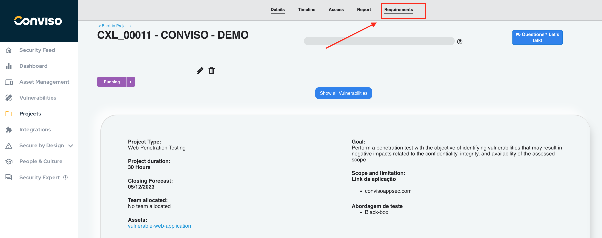

## Introduction

Requirements help keep large teams working towards the same goals, and following a pattern within a process is not the easiest of tasks. Requirements allow you to create an action plan based on tasks that must be accomplished. These tasks, in some cases, can be placed as mandatory for the closing of a project, which guarantees the manager total control over the execution.

## Create requirements

In the 'Secure by Design' section, click on 'Requirements' to view all existing requirements in the database

To create a new requirement, click on **New Requirements**.

At this stage, we need to define the requirement name, description, requirement type, link the requirement to the project type, and add activities.

In activities, we need to define all the activities that are part of the requirement.

## Using Requirements

- Log Into the Conviso Platform: Access your account on the Conviso Platform.
- Navigate to Projects: In the main menu on the left, click on 'Projects'.

To use one or more requirements, we need to create a project and choose the requirement according to the project. For instance, in a web pentest project, we can search for the requirement

Choose your requirement and click the Save button at the bottom of the page.

To view the requirement that has been linked to the project, click on **Requirements** in the top toolbar

At this window, you may follow up the Requirements activities, grouped by their statuses:

