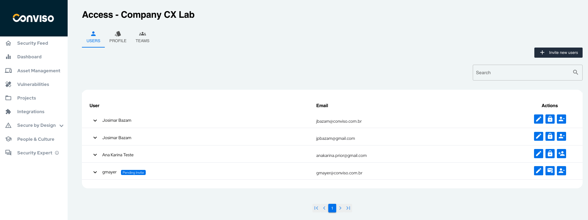
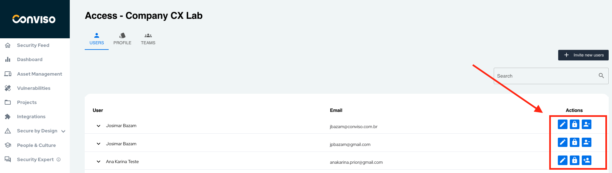
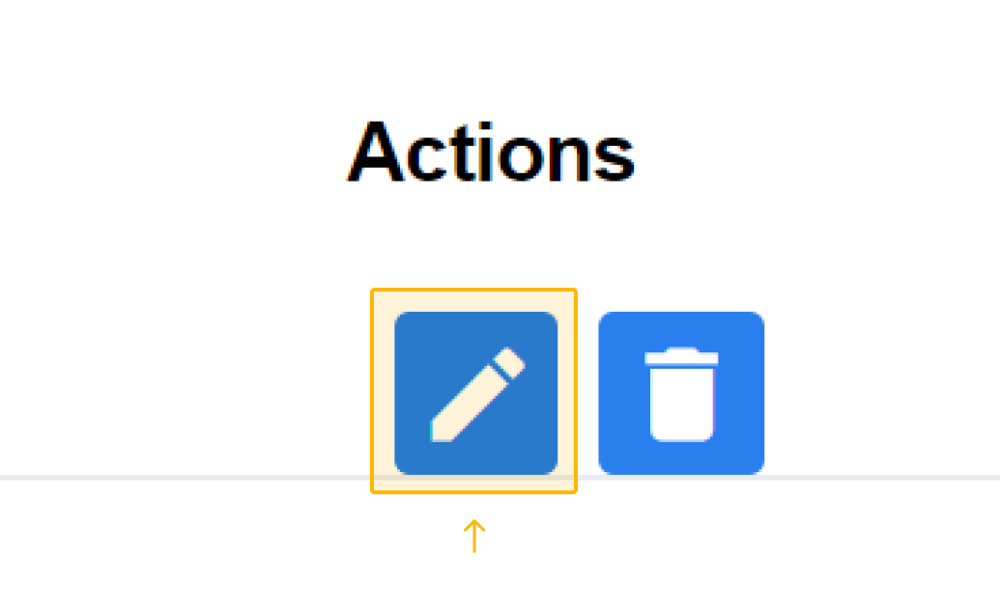
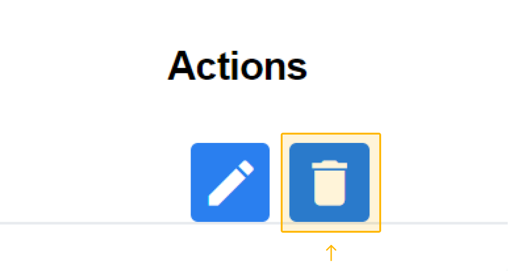

## Introduction
Conviso Platform allows you to manage users, groups and roles to ensure the proper information and authorization is given for the right people.

## Description
There are types of **Users** that are categorized according to the type of permission, called **Profiles** and it is possible to group them into **Teams**.

### About Users
Conviso Platform users are all those who have access to the platform and are linked to an email and one or more companies. They are created through the [Invite New Users](#adding-new-users-by-sending-invites) action and can be managed in [Access Control](#using-access-control-to-perform-user-management).

Users have different levels of permissions, and are defined in Profiles.

### About Profiles
Profiles are predefined sets of permissions that determine what a user can do on the system. Each profile is created for a specific role or function within the organization and is composed of a set of permissions that define which features and functionality of the system the user will have access to.

#### Custom profiles  

Custom profiles are created by administrators and allow you to define access permissions according to the organization's needs. 

There are more resources to come in the [following releases](../releases/intro.md) so you can make a more granular configuration of your custom profiles. 

[Learn how to create Profiles.](#creating-a-new-profile-type)

#### Standard Profiles
On the Platform, there are 3 default profiles:

#### Developer Profile
Profile Developer was created with the aim of streamlining the platform for software engineers, so that they only have access to what is relevant to their work. Permissions:

- Limited vulnerability status update (False Positive and Risk Accepted are not allowed);
- Create, view, and edit Assets;
- Create, view, and edit Projects.

To add new users with Developer Profile roles, [see here how to invite new users.](#adding-new-users-by-sending-invites)

#### Admin Profile
The Admin profile is designed to provide full access to all the functionalities of the company's platform to which they belong, in addition to the following exclusive accesses:

- Full access to Access Control:
- Management of users in their account;
- Profile management;
- Team management ;
- Business unit management.

#### Viewer-only
The Viewer-Only profile,  a global Profile, refers to users who only have permission to view what was assigned to them on the platform by the administrator.  

### About Teams
On the platform, you can assign responsibilities in project activities to groups of users that represent similar roles, for which we have the Teams feature.

Our goal is to offer a more effective interconnection between profiles and users. So you can create a team for developers, security analysts, QA, product team and much more! 

[See how to create a team.](#creating-a-new-team)

## Usage
In this section we explain the following ways to manage users in Conviso Platform:

## Using Access Control to perform User Management

To access the 'Access Control,' go to 'Settings' next to the picture of your profile in the lower left corner:

On this screen, you can edit the permissions that your users have in your company. In addition, it is also possible to edit, create/invite or delete **users**, types of permissions "**profiles**" or **teams**:

### Adding New Users by sending invites
To add new users to your company, you can do it in two ways:

- **Sending invitation through Access Control**
Clicking the "Invite New Users" button on the right in the "Users" subarea of Access Control:

To add, you will need to have the guest's email and then decide if he will participate in any **Team** and what kind of permission he will receive as **Profile**. If your Profile is of type "Developer" you can invite other developers to Profile Developer.  

Next, choose what kind of access will be granted to the user, by choosing one of the three radio buttons: Companies, Projects or Vulnerabilities:

- **All**: Here it refers to the company in which you are working.
- **Asset** The user will have access to the asset and the projects associated with it
- **Projects**: The user will only have control of the projects he has been granted access to. You need to choose what project (or projects) the user will be granted access to, by clicking on the Projects drop-down list.
- **Vulnerabilities**: The user will only have control of the vulnerabilities he has been granted access to. You need to choose what project (or projects) the user will be granted access to, by clicking on the Projects drop-down list, and then choose what vulnerabilities the user will be granted access to, by clicking on the Vulnerabilities drop-down list:

### Canceling user invitation
If you need to cancel a user's invite, just go to actions and press the "Cancel User's Invitation" button in the "User" subarea in Access Control:

Once this button is clicked, the email will not activate the subscription.

### Editing User Access
To edit the user's access type, as well as the team he belongs to, click on the "Edit User Access" button in the "User" subarea in Access Control:

### Removing user
And to remove a user is also very simple, just click on "Remove Analyst Profile" button in the "User" subarea in Access Control:

### Creating a new Profile type

To create a new type of Profile for your company, simply click on the "New Profile" button in the "Profiles" subarea of the Access Control page.

And then a form will appear for you to fill in the following information for your new type of Profile.

- **User Access**: View, Invite Users.
- **Vulnerabilities**: View, Create, Edit, Delete.
- **Projects**: View,Change status, Create, Edit and Delete.
- **Integrations** Allows user to create and modify configurations for intrations.

### Editing Profile type
To edit the Profile type, click the "Edit Profile" button in the "Profile" subarea in Access Control:

**Note:** As you can see, it is not possible to edit the platform's default Profiles.

### Creating a new Team

Creating a team on the Conviso Platform is also very simple. Just go to the "Teams" section of Access Control and click on the "+ New Team" button on the right side:

This action will prompt a form where you can easily define the team's name and enter the email addresses of the registered users.

### Editing team
In the Actions of the Teams area,click on the following icon  to edit a team:

### Removing team
In Actions of the Teams area, click on the following icon to remove a team:

## Support
If you have any questions or need help using our product, please don't hesitate to contact our [support team](mailto:support@convisoappsec.com).

## Resources
By exploring our content you'll find resources to help you to understand the benefits of the Conviso Platform:

[Promoting a collaborative environment between Security and Development](https://bit.ly/3I0tsSc): The security and development teams have distinct but complementary goals, and working together can result in more effective and secure solutions.

