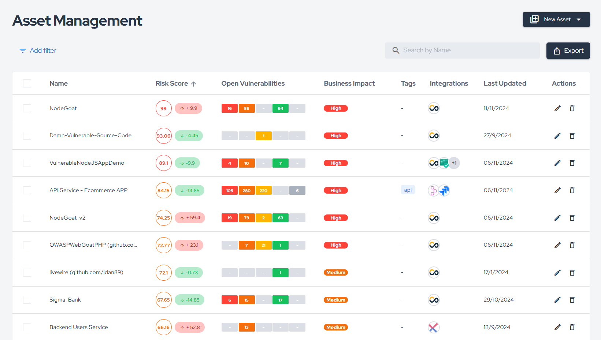

# Conviso Platform Docs - An ASPM Platform

[Conviso Platform](https://cta-service-cms2.hubspot.com/web-interactives/public/v1/track/redirect?encryptedPayload=AVxigLKtcWzoFbzpyImNNQsXC9S54LjJuklwM39zNd7hvSoR%2FVTX%2FXjNdqdcIIDaZwGiNwYii5hXwRR06puch8xINMyL3EXxTMuSG8Le9if9juV3u%2F%2BX%2FCKsCZN1tLpW39gGnNpiLedq%2BrrfmYxgh8G%2BTcRBEWaKasQ%3D&webInteractiveContentId=125788977029&portalId=5613826) is a comprehensive solution for Application Security Posture Management (ASPM), designed to empower development teams in building secure applications from the outset. The platform provides a detailed view of the entire application security ecosystem, encompassing threat modeling, risk and vulnerability identification, remediation, and metrics gathering, all integrated within a single environment. This process supports teams in structuring application security programs in a continuous and efficient manner.

With features ranging from security analysis to integration with external tools, Conviso Platform adapts to development workflows, enabling security practices to be seamlessly and sustainably embedded. In this way, the platform fosters a security-driven culture integrated into the development lifecycle and across all teams involved.

By centralizing and correlating security information, Conviso Platform offers a holistic view of an application's security posture, helping to anticipate potential risks with business impact. Thus, development professionals are equipped with the tools and insights needed to plan, build, and deliver secure software with agility, confidence, and consistency. 

---

## Getting Started with Conviso Platform

- **[Platform](./platform/asset-management.md)** - Explore the main features and tools within Conviso Platform.

---

## Integrate with Conviso Platform

Explore our integration options to connect Conviso Platform with your CI/CD pipelines, defect tracking, notifications, and more:

- **[Integrations for CI/CD](./integrations/integrations_intro.md#conviso-platform-cicd-integration)** - Adopt incremental CI/CD integration with Conviso Platform to automate analysis and enhance team insights.
- **[Integrations for Defect Tracking](./integrations/integrations_intro.md#defectbug-tracking-integration)** - Integrate Conviso Platform with your Defect Tracker to streamline defect management, enhancing workflow and team collaboration.
- **[Notification Integrations](./integrations/integrations_intro.md#communication-and-notification)** - Integrate with a communication tool to send platform events, including vulnerability updates, directly to your team’s designated channel.
- **[Scanner Integrations](./integrations/integrations_intro.md#consolidate-vulnerability-management-through-integrated-security-scans)** - Integrate external scanners with Conviso Platform to centralize findings, providing a unified view for effective vulnerability management across tools.
- **[Identity Management](./integrations/integrations_intro.md#set-up-conviso-platform-single-sign-on-sso)** - Set up Single Sign-On (SSO) to allow your developers and teams easy access to Conviso Platform through your current SSO provider.
- **[API](./api/api-overview.md)** - Access Conviso Platform's GraphQL API documentation to seamlessly interact with our services, retrieve data, and integrate security workflows into your development process.

---

## Scan using Conviso Platform

Learn how to use Conviso’s scanning features to protect your code, libraries, infrastructure, and secrets:

- **[Scan with Conviso AST](./security-scans/conviso-ast/conviso-ast.md)** - Scan application source code, open-source libraries, and more.
- **[Scan with Conviso DAST](./security-scans/conviso-dast/conviso-dast.md)** - Dynamic analysis to detect vulnerabilities during runtime.
- **[Generate Conviso SBOM](./security-scans/conviso-sbom/conviso-sbom.md)** - Automatically produce a Software Bill of Materials for your applications.
- **[Conviso Security Gate](./cli/security-gate.md)** - Secure your CI/CD pipeline with enhanced control and oversight on security checks.
- **[Conviso CLI](./cli/installation.md)** - Command-line tool enabling seamless integration with Security Gate, AST execution, and vulnerability import from SARIF files, enhancing automation and security in development workflows.
