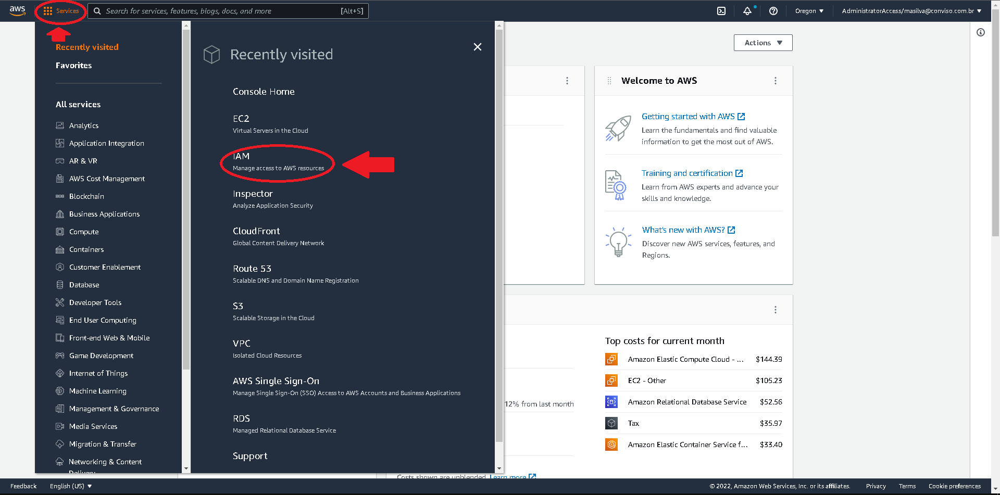
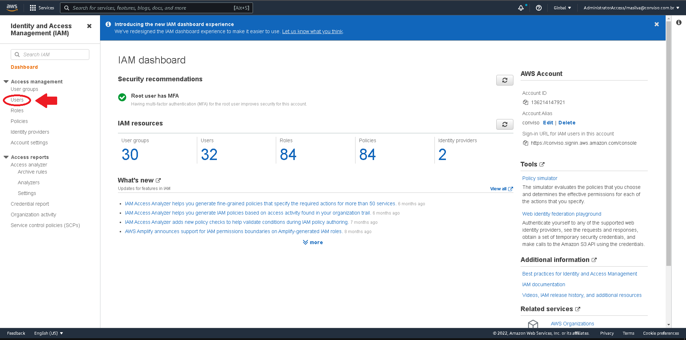
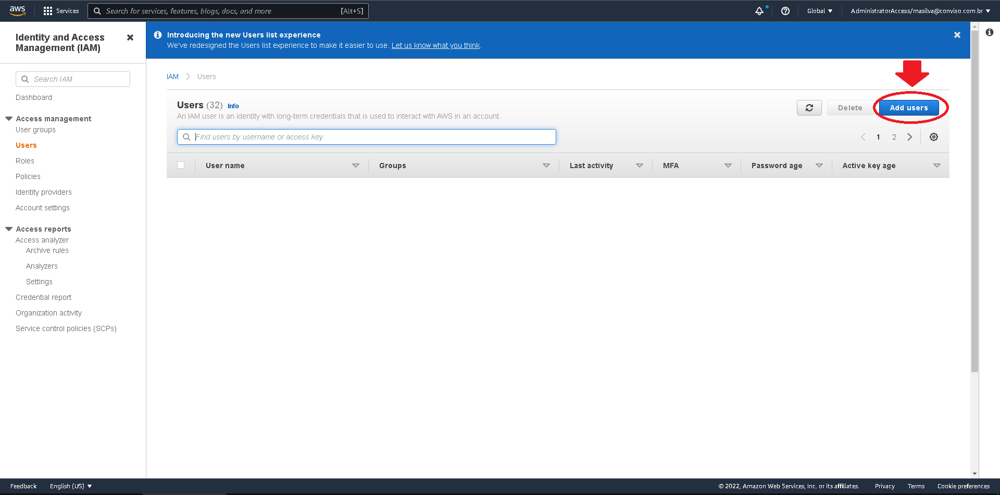
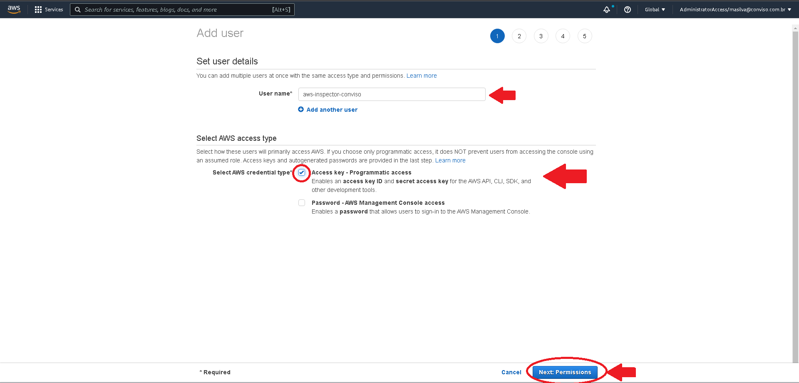
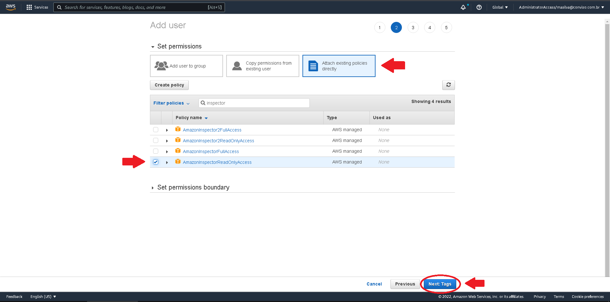
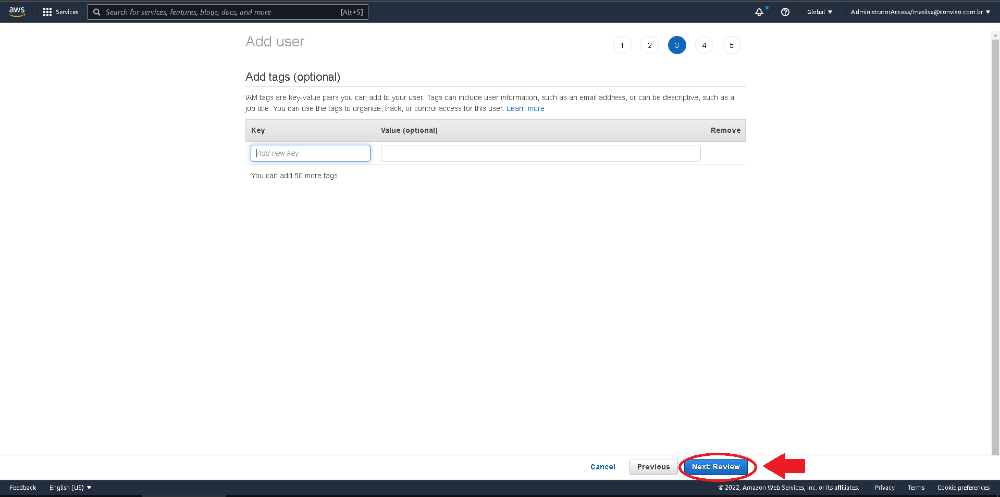
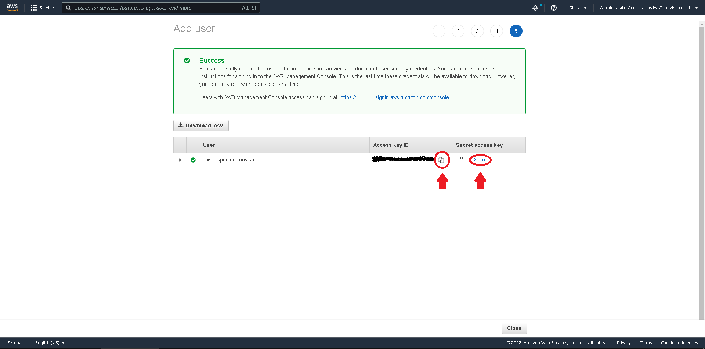
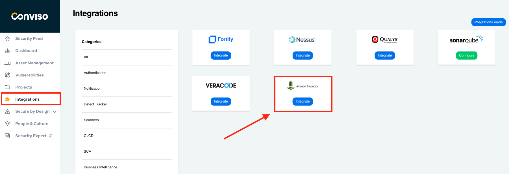
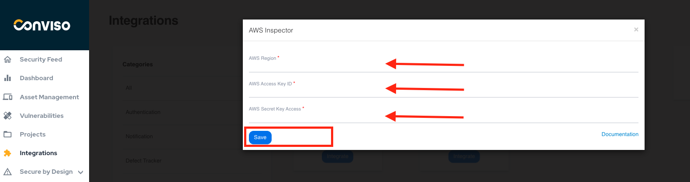

:::note
First time using Amazon Inspector? Please refer to the [following documentation](https://docs.aws.amazon.com/inspector/).  
:::

## Introduction

Consolidate vulnerabilities: from a single console, you can consolidate and apply vulnerabilities review identified by scan and develop action plans for vulnerabilities management.

This integration allows the import of issues (vulnerabilities) found in Amazon Inspector to Conviso Platform, allowing the user to take advantage of Conviso Platform's full potential for vulnerability management.

## Requirements

The Conviso Platform and AWS Inspector Integration needs 3 pieces of information:

- AWS Region;

- AWS Access keys ID;

- AWS Secret key Access.

In the next section, you will be guided through AWS Console to be able to retrieve these data. 

## Amazon Inspector Setup

Logon to your AWS Console as an Administrator;

On the top bar menu, click on Services and then choose IAM: 

On the menu to the left, click on **Users**:

At the right panel, click on the **Add Users** button:

Label the new user as you wish, at the **User Name** field. At the **Select AWS Access Type** section, check the box next to **Access Key - Programmatic Access**. When done, click on the **Next - Permissions** button at the lower right corner of the form:

At the next form, choose the **Attach existing policies directly** option, then select the **AmazonInspectorReadOnlyAccess**. When done, click on the **Next:Tags** button at the lower right corner of the form:

This step is optional. Use it if you want to associate any TAGS to the new user. When done, click on the **Next:Review** button at the lower right corner of the form:

Review the new user data and click at the **Create User** button at the lower right corner of the form to finish the user configuration:

:::note
This is the only time when you are able to get your user **Secret Access Key**. Beyond this point, if you do not copy the secret, you will be unable to recover it later!!!
:::

Copy the **Access Key ID** and store it in a text file, to be able to recover it later. Next, click on the **Show** link next to the **Secret Access Key** to exhibit it and copy it to a safer place, you will use this data later on configuring Conviso Platform integration:

Now, to get the AWS Region where your Amazon Inspector is configured, click on the **Services** at the top menu bar and choose **Amazon Inspector**. Now, at the top menu bar, expand the **Amazon Region** to get the AWS region string where your Amnazon Inspector is configured (in our example, the AWS is **us-west-2**. Change it according your current configuration):

## Conviso Platform Setup

Log in to the [Conviso Platform](https://app.convisoappsec.com);

At the left menu, choose **Integrations**. At the right panel, click on **Scanners** menu option, then click on the **Integrate** button of the **Amazon Inspector** card:

Paste the retrieved data from AWS at the corresponding fields of the form. When done copying the data, click at the **Save** button to store your new integration configuration settings:

