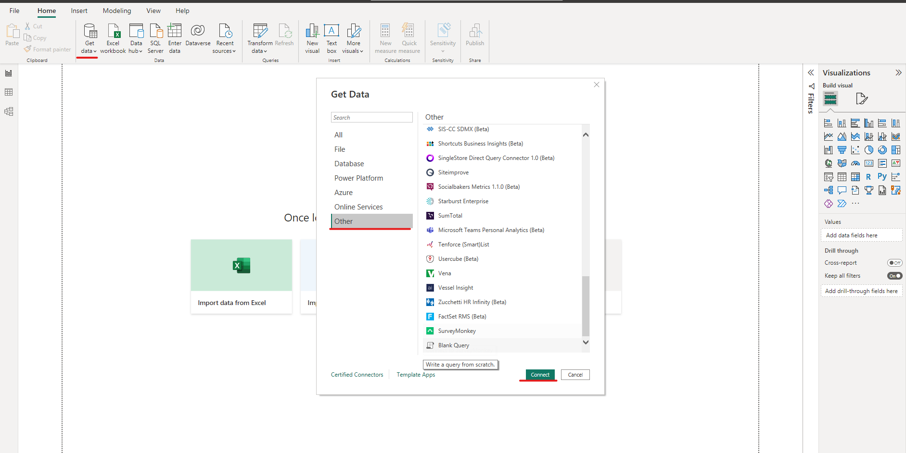
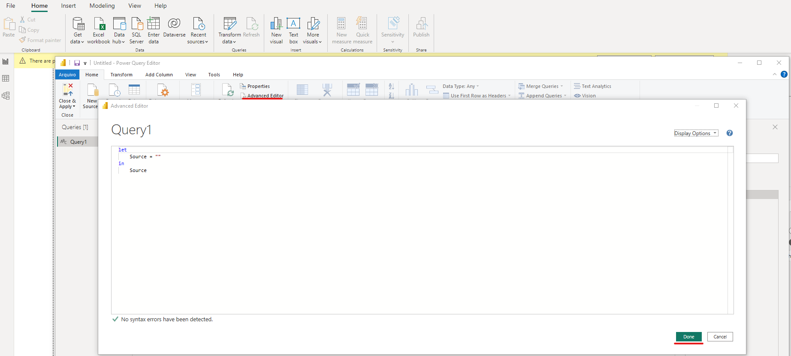
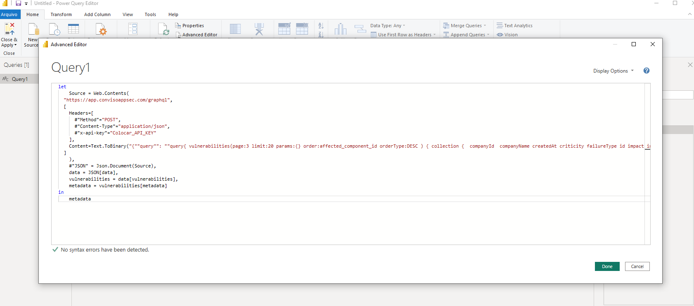
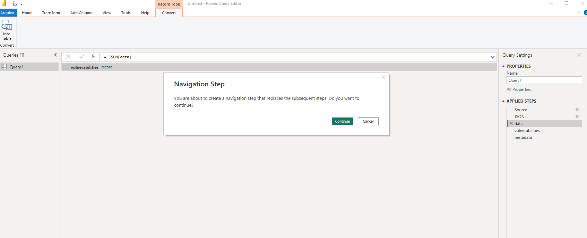
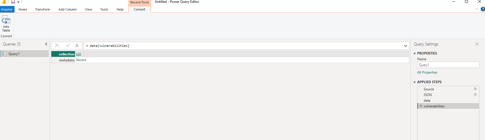

<div style={{textAlign: 'center'}}>


</div>

## Introduction

Through the Business Intelligence integration, it is possible to optimize time by easily issuing customized reports, in addition to allowing data to be extracted and consumed on BI platforms.

## Requirements


To create a connector with the BI tool, you we'll need:


1. Conviso Platform GraphQL URL (https://app.convisoappsec.com/graphql);
2. Your x-api-key (you can generate your x-api-key by following the instructions here) and; 
3. The integration script avaliable in this documentation;
4. Conviso's GraphQL documentation: https://docs.convisoappsec.com/;


In order to test your GrapQL queries you can use the Conviso's Playgorund avaliable here: https://docs.convisoappsec.com/playground-graphql.html

## PowerBI Setup


1. Open PowerBI Desktop;
2. Click on the Get Data button;
3. At the floating window click on Others;
4. Choose Consulta Nula.

<div style={{textAlign: 'center'}}>



</div>

- Click on **Connect**;
- At the floating window click on **Advanced Editor**;


<div style={{textAlign: 'center'}}>



</div>

At the floating window, copy and paste the code below:

```yml
	let
    Source = Web.Contents(
  "https://app.convisoappsec.com/graphql",
  [
    Headers=[
      #"Method"="POST",
      #"Content-Type"="application/json",
      #"x-api-key"="Your_API_KEY"
    ],
    Content=Text.ToBinary("{""query"": ""Your_Query""}")
  ]
    ),
    #"JSON" = Json.Document(Source)
in
    #"JSON"
```

 It is necessary to insert your API-KEY into the variable (Your_API_KEY) and configure the query in the Your_Query field.

 - You can find a detailed description of all available queries at this link:  https://docs.convisoappsec.com/;
 - In the image below, we are using a query that obtains the total lines of code for a company with ID 00:


 ``` yml
 	let
    Source = Web.Contents(
  "https://app.convisoappsec.com/graphql",
  [
    Headers=[
      #"Method"="POST",
      #"Content-Type"="application/json",
      #"x-api-key"="Your_API_KEY"
    ],
    Content=Text.ToBinary("{""query"": ""query{ company(id: 00) { estimatedLinesConsumed }}""}")
  ]
    ),
    #"JSON" = Json.Document(Source)
in
    #"JSON"

 ```


Click on **Done**;

<div style={{textAlign: 'center'}}>



</div>

At the floating window click on **Connect**;


<div style={{textAlign: 'center'}}>



</div>

To access the data retrieved click on **List**;

<div style={{textAlign: 'center'}}>



</div>

-  To create indicators based on the query data, go back to the Power BI home screen
-  Click on Data;
-  To access the data retrieved click on List;

<div style={{textAlign: 'center'}}>


</div>

You will see the information as detailed below and from there you are free to configure PowerBI the way you want.

<div style={{textAlign: 'center'}}>


</div>


> **Further details in de original documentation, example: [Table.GenerateByPage](https://docs.microsoft.com/en-us/power-query/helperfunctions#tablegeneratebypage)**
