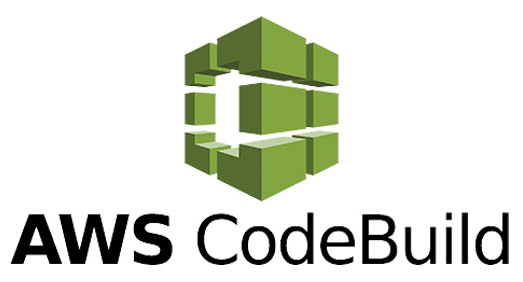

<div style={{textAlign: 'center'}}>



</div>

:::note
First time using AWS Codebuild? Please refer to the [following documentation](https://docs.aws.amazon.com/codebuild/).  
:::

## Introduction

CodeBuild is the AWS Continuous Integration service. It is possible to configure pipelines from different sources, from AWS CodeCommit itself to other widely used tools such as: GitHub, GitHub Enterprise and BitBucket. You can also use a storage bucket in S3 as a code provider. The integration with Conviso is carried out through a build project in CodeBuild, which can be totally independent from the existing Pipeline for your code. This document will cover the creation process from scratch.

## Requirements

To integrate a project into AWS CodeBuild, be sure to meet the requirements below:

1. Basic knowledge of the AWS platform;

2. User with write and read privileges to use the following services: CodeBuild, IAM, Secret Manager, S3 and/or Cloudwatch for execution logs and CodeCommit, if the repository is in it; 

3. Project with source code available from one of the sources supported by CodeBuild: AWS CodeCommit, Amazon S3, Github, Github Enterprise or BitBucket;

4. If using Amazon S3, the code bucket must contain the .git directory.

## Creating a Build Project

To create a new build project, follow the step by step below:

1. From the AWS console's main menu, locate the CodeBuild service;

2. Click **Create Build Project**;

3. In the section **Project Configuration** fill in the name and description of your project;

4. At the **Source** section, in the **Source Provider** field, select the location where your repository is hosted;

5. Depending on the chosen source, specific fields will appear for each one to select the code repository as well as its version (branchs, tags, etc). In case of SCM type sources, ensure that in the additional settings, at the git clone depth selection, the option **Full** is selected. If the source is S3, you must ensure that the .git directory is present along with the source code;

6. At the **Environment** section, configure the options below:

    1. In the **Buildspec** section, select the option **Use a buildspec file**. If you already have a buildspec file in the project, we recommend creating a conviso-buildspec.yml file at the root of the repository. In the field **Buildspec name**, enter the path of the desired buildspec file. The contents of the conviso-buildspec.yml file will depend on the desired actions (see next sections on this document);

    2. In the **Logs** section, if S3 or CloudWatch services are available, choose the one that best suits your work. These logs will contain information about the execution of the pipelines;

    3. After finishing these settings, click on the button at the bottom of the page **Create Build Project**.

In case of success, a new build project was created. However, its execution instructions are empty. Note that, by default, if the build project was automatically associated with an SCM, whenever there is a change in the repository in the specified version, the pipeline (buildspec) will already be triggered, which is still empty.

## Secret Manager Setup

Before we proceed to specify the pipeline routine, it is necessary that the API key from Conviso Platform is properly configured. In CodeBuild, the safest way to store variables is using another AWS service: **Secret Manager**. The service consists of a vault of secrets that can be accessed via the API of various programming languages, as well as other AWS services such as CodeBuild.

Below is a step-by-step guide to setting up a new vault in Secret Manager, if you don't use it yet:

1. From the main menu of the AWS console, locate the Secret Manager service;

2. Click **Store a New Secret**;

3. Select **Other types of secrets** as the secret type;

4. Below, a list of key-value objects is expected;

5. As key, fill ```CONVISO_API_KEY``` with the value of the Conviso Platform API key. If you don't have a key, follow [this guide](../api/generate-apikey) to generate one;

6. In the encryption key field, select the desired one and click **Next**;

7. Identify the new secret (done in step 2) conveniently. For example: Conviso (in the rest of the tutorial we will treat the secret manager identification like this).

8. Be sure to check **Disable automatic switchover** and click **Next**;

9. A summary of the new secret will be shown, as well as code snippets for integration in some languages. Click **Store** to save the secret.

After creating the secret in the Secret Manager service, it is necessary to give access permissions to the service role associated with the build project. One way to do this is by attaching the predefined policy called SecretsManagerReadWrite. Follow the steps below to carry out this process:

1. From the main menu of the AWS console, locate the IAM service;

2. In the left menu, under **Access Management**, click on **Roles**;

3. In the search box, look for the name of the service role associated with the build project;

4. Click on the role and then click on attach policies;

5. Look for the predefined **SecretsManagerReadWrite** or a custom policy that contemplates the read permission called **GetSecretValue** from the Secret Manager service.

After these procedures, the secret will be available to be used by CodeBuild.

## Code Review

Before proceeding, we recommend reading the following [guide](../guides/code-review-strategies) to understand the different strategies/approaches for deploying Code Review.

After choosing the strategy to be used to send deploys to Code Review, it is possible to create a specific buildspec for this action in the CodeBuild build project. The requirements for executing this functionality are the settings made previously (creation of the compilation project and definition of the ```CONVISO_API_KEY``` secret) and also the existence of a project at Conviso Platform, as the project key is required, which in the code will be the ```CONVISO_PROJECT_CODE``` variable.

Below are code snippets from the ```conviso-buildspec.yml``` file, which illustrates the creation of a unique job for deploying code review in the three available strategies:

**With TAGS, sorted by timestamp**

```yml
version: 0.2

env:
 variables:
   CONVISO_PROJECT_CODE: '<Project Key>'
 secrets-manager:
   CONVISO_API_KEY: Conviso:CONVISO_API_KEY

phases:
 install:
   commands:
     - nohup /usr/local/bin/dockerd --host=unix:///var/run/docker.sock --host=tcp://127.0.0.1:2375 --storage-driver=overlay2&
     - timeout 15 sh -c "until docker info; do echo .; sleep 1; done"
     - pip3 install conviso-flowcli
 pre_build:
   commands:
     - conviso deploy create with tag-tracker sort by time
```

**With TAGS, sorted by versioning-style**

```yml
version: 0.2

env:
 variables:
   CONVISO_PROJECT_CODE: '<Project Key>'
 secrets-manager:
   CONVISO_API_KEY: Conviso:CONVISO_API_KEY

phases:
 install:
   commands:
     - nohup /usr/local/bin/dockerd --host=unix:///var/run/docker.sock --host=tcp://127.0.0.1:2375 --storage-driver=overlay2&
     - timeout 15 sh -c "until docker info; do echo .; sleep 1; done"
     - pip3 install conviso-flowcli
 pre_build:
   commands:
     - conviso deploy create with tag-tracker sort-by versioning-style
```

**Without TAGS, sorted by GIT Tree**

```yml
version: 0.2

env:
 variables:
   CONVISO_PROJECT_CODE: '<Project Key>'
 secrets-manager:
   CONVISO_API_KEY: Conviso:CONVISO_API_KEY

phases:
 install:
   commands:
     - nohup /usr/local/bin/dockerd --host=unix:///var/run/docker.sock --host=tcp://127.0.0.1:2375 --storage-driver=overlay2&
     - timeout 15 sh -c "until docker info; do echo .; sleep 1; done"
     - pip3 install conviso-flowcli
 pre_build:
   commands:
     - conviso deploy create with values
```

## SAST

In addition to deploying for code review, it is also possible to integrate a SAST-type scan into the compilation project, which will automatically perform a scan for potential vulnerabilities, treated in Conviso Platform as findings.

The requirementss for running the job are the same as already practiced: Build project, ```CONVISO_API_KEY``` and ```CONVISO_PROJECT_CODE``` defined as variables in the buildspec file:

```yml
version: 0.2

env:
 variables:
   CONVISO_PROJECT_CODE: '<Project Key>'
 secrets-manager:
   CONVISO_API_KEY: Conviso:CONVISO_API_KEY

phases:
 install:
   commands:
     - nohup /usr/local/bin/dockerd --host=unix:///var/run/docker.sock --host=tcp://127.0.0.1:2375 --storage-driver=overlay2&
     - timeout 15 sh -c "until docker info; do echo .; sleep 1; done"
     - pip3 install conviso-flowcli
 pre_build:
   commands:
     - conviso sast run
```

In the above pipeline, we didn't use any options to the ```conviso sast run``` command. In this case, the default behavior is to perform the analysis of the entire repository. This is because the default values used for the ```--start-commit``` and ```--end-commit``` options use first commit and current commit (HEAD), respectively.

Alternatively, we can specify the diff range manually. In the example below, we scan between the current commit and the immediately previous one on the current branch, so the findings will be found only at the last commit changes:

```yml
version: 0.2

env:
 variables:
   CONVISO_PROJECT_CODE: '<Project Key>'
 secrets-manager:
   CONVISO_API_KEY: Conviso:CONVISO_API_KEY

phases:
 install:
   commands:
     - nohup /usr/local/bin/dockerd --host=unix:///var/run/docker.sock --host=tcp://127.0.0.1:2375 --storage-driver=overlay2&
     - timeout 15 sh -c "until docker info; do echo .; sleep 1; done"
     - pip3 install conviso-flowcli
 pre_build:
   commands:
     - export START_COMMIT=`git rev-parse @~1`
     - conviso sast run --start-commit $START_COMMIT --end-commit $CODEBUILD_RESOLVED_SOURCE_VERSION
```

## SCA

The following code snippet will trigger a SCA scan and send the results to Conviso Platform:

```yml
version: 0.2

env:
 variables:
   CONVISO_PROJECT_CODE: '<Project Key>'
 secrets-manager:
   CONVISO_API_KEY: Conviso:CONVISO_API_KEY

phases:
 install:
   commands:
     - nohup /usr/local/bin/dockerd --host=unix:///var/run/docker.sock --host=tcp://127.0.0.1:2375 --storage-driver=overlay2&
     - timeout 15 sh -c "until docker info; do echo .; sleep 1; done"
     - pip3 install conviso-flowcli
 pre_build:
   commands:
     - conviso sca run
```

## Getting everything together: Code Review + SAST + SCA Deployment

The SAST and SCA analysis can be complementary to the code review carried out by the professional at Conviso, even serving as input for the analyst. The job below will perform the deploy for code review of the code and will use the same diff identifiers to perform the SAST and SCA analysis, forming a complete solution in the compilation project. An example of a complete buildspec with all solutions can be seen in the snippet below:

```yml
version: 0.2

env:
 variables:
   CONVISO_PROJECT_CODE: '<Project Key>'
 secrets-manager:
   CONVISO_API_KEY: Conviso:CONVISO_API_KEY

phases:
 install:
   commands:
     - nohup /usr/local/bin/dockerd --host=unix:///var/run/docker.sock --host=tcp://127.0.0.1:2375 --storage-driver=overlay2&
     - timeout 15 sh -c "until docker info; do echo .; sleep 1; done"
     - pip3 install conviso-flowcli
 pre_build:
   commands:
     - deploy_create_output_vars="$(mktemp)"
     - conviso deploy create -f env_vars with values > "$deploy_create_output_vars"
     - . "$deploy_create_output_vars"
     - conviso sast run --start-commit "$CONVISO_DEPLOY_PREVIOUS_VERSION_COMMIT" --end-commit "$CONVISO_DEPLOY_CURRENT_VERSION_COMMIT"
     - conviso sca run
```

## Troubleshooting

* **fatal: not a git repository (or any parent up to mount point/codebuild)**

The AWS Pipelines service, which aggregates the CodeCommit, CodeArtifact, CodeBuild and CodeDeploy services, is not compatible with Conviso's services, since the repository (.git directory) is not maintained through it at the time of Pipeline execution. Make sure you are running the build project through AWS CodeBuild itself, where you can even select the clone depth option (git depth). More information about this AWS limitation can be found [here](https://forums.aws.amazon.com/thread.jspa?threadID=248267).

* **Cannot connect to the Docker daemon at ```unix:///var/run/docker.sock```. Is the docker daemon running?**

In the environment setup, check that the **Privileged** checkbox is correctly checked.