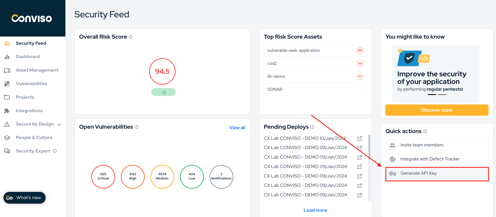

<div style={{textAlign: 'center'}}>


</div>


:::note
First time using AWS Codebuild? Please refer to the [following documentation](https://docs.aws.amazon.com/codebuild/). 
:::


## Introduction


AWS CodeBuild is a continuous integration service provided by Amazon Web Services. It allows for the configuration of pipelines using a variety of sources, including AWS's own CodeCommit, as well as other popular tools like GitHub, GitHub Enterprise, and BitBucket. Additionally, an S3 storage bucket can be used as a code provider.


You can run Conviso Platform **AST (Application Security Testing)**. This product offers **Static Application Security Testing (SAST)**, **Software Composition Analysis (SCA)**, **Infrastructure as Code (IaC)** and enables **Continuous Code Review** performed by our Security Analysts (when supported in your plan) or by your own Security Analyst team.


## Requirements


Before integrating your project with AWS CodeBuild, ensure you meet the following requirements:


1. Basic Knowledge of AWS: Familiarity with navigating and using the AWS platform.


2. User Privileges: The user must have read and write privileges for the following services: CodeBuild, IAM, Secret Manager, S3, Cloudwatch (for execution logs), and CodeCommit (if the repository is hosted there).


3. Source Code Availability: The project's source code must be accessible from one of CodeBuild's supported sources: AWS CodeCommit, Amazon S3, GitHub, GitHub Enterprise, or BitBucket.


4. Amazon S3 Specific Requirement: If using Amazon S3 as a source, ensure the code bucket contains the .git directory.


## Creating a Build Project


To create a new build project, follow these steps:


1. In the AWS console's main menu, locate and open the CodeBuild service.


2. Click on **Create Build Project**;


3. In the **Project Configuration** section, enter the name and description of your project.


4. At the **Source** section, choose the location of your repository in the **Source Provider** field;


5. Depending on the chosen source, specific fields will appear for each one to select the code repository as well as its version (branches, tags, etc.). For SCM-type sources, ensure that the git clone depth option is set to **Full** in the additional settings. If using S3, verify that the .git directory is included with the source code. Additional fields will be available to specify the repository and its version (branches, tags, etc.).


6.Configure the following options in the **Environment** section:


   1. Buildspec Configuration: In the **Buildspec** section, select **Use a buildspec file**. If you already have a buildspec file in the project, we recommend creating a conviso-buildspec.yml file at the root of the repository. Specify the path of your buildspec file in the  **Buildspec name** field. The contents of the conviso-buildspec.yml should align with the actions you wish to execute. (see next sections on this document);


   2. In the **Logs** section, if S3 or CloudWatch services are available, choose the one that best suits your work. These logs will document the execution of your pipelines.


   3. After finishing these settings, click **Create Build Project** at the bottom of the page.


Upon successful creation, your new build project will be ready, but its execution instructions will initially be empty. Note that if the build project is automatically linked to an SCM, any change in the specified version of the repository will trigger the (currently empty) pipeline.


## Secret Manager Setup


Before defining the pipeline routine in CodeBuild, it's crucial to configure the Conviso Platform API key securely. The recommended method is to use the AWS **Secret Manager** service, which provides a secure vault for storing secrets accessible via various programming language APIs and AWS services like CodeBuild.


If you're not already using Secret Manager, follow these steps to set up a new vault:


1. From the main menu of the AWS console, locate the Secret Manager service;


2. Click on **Store a New Secret**;


3. Select **Other types of secrets** as the secret type;


4. Below, a list of key-value objects is expected;


5. Enter Key-Value: In the key-value section, input  ```CONVISO_API_KEY``` as the key and fill in the value with your Conviso Platform API key. 

<div style={{textAlign: 'center'}}>



</div>


6. Choose an encryption key and click **Next**;


7. Label your new secret for easy identification, e.g., 'Conviso';


8. Be sure to check **Disable automatic switchover** and proceed by clicking  **Next**;


9. A summary of the new secret will be shown, as well as code snippets for integration in some languages. Review the summary and code snippets for integration, then click . **Store** to save the secret.


After creating the secret in the Secret Manager service, it is necessary to give access permissions to the service role associated with the build project. One way to do this is by attaching the predefined policy called SecretsManagerReadWrite. Follow the steps below to carry out this process:


1. In the AWS console's main menu, find and open the IAM service;


2. In the left menu, under **Access Management**, select **Roles**;


3. In the search box, look for the name of the service role associated with the build project;


4. Click on the role and then click on attach policies;


5. Look for the predefined **SecretsManagerReadWrite** or a custom policy that contemplates the read permission called **GetSecretValue** from the Secret Manager service.


With these steps completed, the secret is ready to be used by CodeBuild.


## Conviso AST

You can run Conviso Platform **AST (Application Security Testing)**. This product offers **Static Application Security Testing (SAST)**, **Software Composition Analysis (SCA)**, **Infrastructure as Code (IaC)** and enables **Continuous Code Review** performed by our Security Analysts (when available in your plan) or by your own Security Analysts team.

The prerequisites for executing this AST scan are consistent with the ones already established for the build project. These include:


Setup of the Build Project: Ensure that your AWS CodeBuild project is properly set up and configured as per the earlier steps.


Secret Manager Configuration: The Conviso Platform API key must be securely stored and configured in AWS Secret Manager, as previously outlined.


Correct Buildspec Configuration: The buildspec file (conviso-buildspec.yml) should include instructions for initiating and completing the AST scan.


```yml
version: 0.2

env:
  secrets-manager:
    CONVISO_API_KEY: DEFINED_SECRET_NAME_HERE:CONVISO_API_KEY

phases:
  install:
    commands:
      - nohup /usr/local/bin/dockerd --host=unix:///var/run/docker.sock --host=tcp://127.0.0.1:2375 --storage-driver=overlay2&
      - timeout 15 sh -c "until docker info; do echo .; sleep 1; done"
      - pip3 install conviso-cli
  pre_build:
    commands:
      - conviso ast run --vulnerability-auto-close
```

## Troubleshooting


* **fatal: not a git repository (or any parent up to mount point/codebuild)**


The AWS Pipelines service, which aggregates the CodeCommit, CodeArtifact, CodeBuild and CodeDeploy services, is not compatible with Conviso's services, since the repository (.git directory) is not maintained through it at the time of Pipeline execution. Make sure you are running the build project through AWS CodeBuild itself, where you can even select the clone depth option (git depth). More information about this AWS limitation can be found [here](https://forums.aws.amazon.com/thread.jspa?threadID=248267).


* **Cannot connect to the Docker daemon at ```unix:///var/run/docker.sock```. Is the docker daemon running?**


In the environment setup, check that the **Privileged** checkbox is correctly checked.


[](https://cta-service-cms2.hubspot.com/web-interactives/public/v1/track/redirect?encryptedPayload=AVxigLKtcWzoFbzpyImNNQsXC9S54LjJuklwM39zNd7hvSoR%2FVTX%2FXjNdqdcIIDaZwGiNwYii5hXwRR06puch8xINMyL3EXxTMuSG8Le9if9juV3u%2F%2BX%2FCKsCZN1tLpW39gGnNpiLedq%2BrrfmYxgh8G%2BTcRBEWaKasQ%3D&webInteractiveContentId=125788977029&portalId=5613826)
