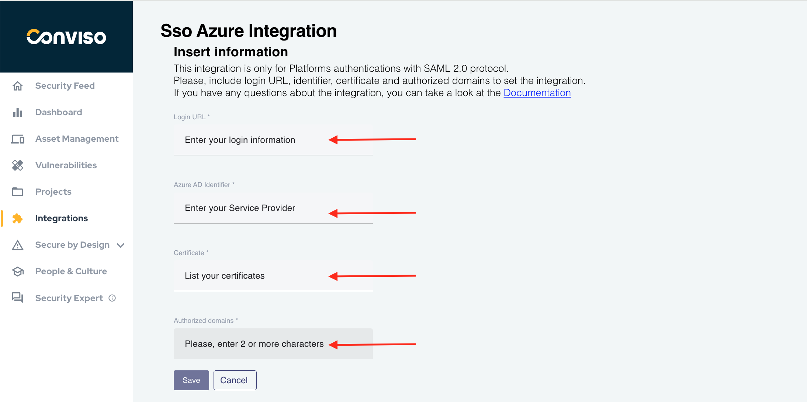

## Introduction

The AD (Active Directory) integration aims to facilitate access to the Conviso Platform and simplify the management of enterprise customer users.

Within Azure's marketplace, you can install Conviso's proprietary application to configure authentication on the platform through SSO.

## Installing the Conviso SSO App

1. Access the [Azure Portal](https://portal.azure.com/) with your admin account:

<div style={{textAlign: 'center'}}>


</div>

2. In the left menu, look for **Azure Active Directory** service, then click at the **Enterprise Applications** menu option:

<div style={{textAlign: 'center'}}>



</div>

3. Select **All Applications** and then click at **+ New Application**:

<div style={{textAlign: 'center'}}>


</div>

4. The **Browse Azure AD Gallery** window will be shown: 

<div style={{textAlign: 'center'}}>


</div>

5. At the search box, type **AppSec Flow SSO** to search for the app:

<div style={{textAlign: 'center'}}>


</div>

6. Select **AppSec Flow SSO** and install the app by clicking at the **Create** button at the right panel. Wait until its installation is finished:

<div style={{textAlign: 'center'}}>


</div>

7. Click at the recent installed application to open its configuration: 

<div style={{textAlign: 'center'}}>


</div>

8. Click at the **Single Sign-On** menu on the left:

<div style={{textAlign: 'center'}}>


</div>

9. Copy the required information to be able to paste them at the proper form fields at Conviso Platform:

<div style={{textAlign: 'center'}}>


</div>

:::note
After downloading the certificate from Azure, open it in a text editor to copy its contents or use the command ```cat <your_certificate>``` at your terminal to be able to copy its contents.
:::

## Assigning users to the SSO Application

After creating the SSO Application, you must populate it with your user accounts. Click on the **Users and groups** Application menu: 

<div style={{textAlign: 'center'}}>


</div>

On the top menu bar, click on the **Add user/group** option:

<div style={{textAlign: 'center'}}>


</div>

At the Add Assignment screen, select the link **None selected** below the Users label:

<div style={{textAlign: 'center'}}>


</div>

At the right panel, select all of the users you want to assign to the Conviso Platform SSO login:

<div style={{textAlign: 'center'}}>


</div>

When done selecting users, click on the **Select** button at the end of the right panel:

<div style={{textAlign: 'center'}}>


</div>

When your users are selected, you will be back to the previous screen, and now the Userds label show how many users were selected. Click at the **Assign** button to finish this configuration: 

<div style={{textAlign: 'center'}}>


</div>

At last, the SSO Application will exhibit which users are granted access to it:

<div style={{textAlign: 'center'}}>


</div>

## Conviso Platform setup

First, logon to the Conviso Platform;

At the left menu, click on **Integrations**. On the right panel, choose **Authentication** and, then click on the **Integrate** button on the Azure card:

<div style={{textAlign: 'center'}}>


</div>

Fill the form with corresponding data obtained at step 9 of the **Installing the Conviso SSO App** section of this document.

 At the **Allowed Domains** field, insert the domain name and all domain aliases used by your organization to log in. After filling the form, click at **Save** button to store your SSO configuration:

<div style={{textAlign: 'center'}}>


</div>

After saving the data and getting a success message, you can test by logging in again using an email from the domain defined in the integration, using the **SSO Access** option in the Conviso Platform login form.

[More information](https://docs.microsoft.com/en-us/azure/active-directory/saas-apps/appsec-flow-sso-tutorial)