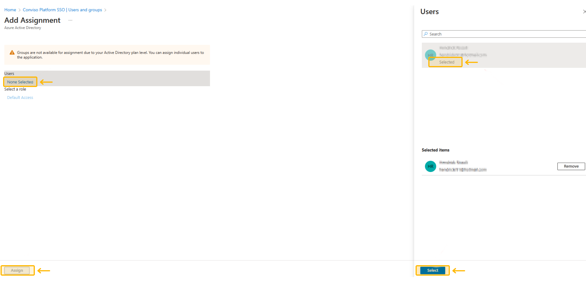

## Introduction
The AD (Active Directory) integration in the Conviso Platform simplifies user management for enterprise customers. 

Installing the Conviso Platform SSO Application from the Azure marketplace, you can enable Single Sign-On (SSO) authentication, allowing you to manage access to the Conviso Platform from Azure directly. 

### Prerequisites
Before getting started, ensure you have the following prerequisites:
- An Azure AD subscription. If you don't have a subscription, you can create a [free account](https://azure.microsoft.com/free/).
- A subscription with enabled single sign-on for the Conviso Platform SSO Application.

## Usage
This section provides a comprehensive guide on using the Conviso Platform SSO Application, covering installation and assigning user permissions. 

- **Installing the Conviso Platform SSO Application**
- **Performing Conviso Platform setup**
- **Assigning users to the Conviso Platform SSO application**

Following these steps, you can efficiently configure and manage user access to the Conviso Platform, ensuring a streamlined and secure experience for your enterprise customers.

## Installing the Conviso Platform SSO Application
To install the Conviso Platform SSO application, follow these steps:

1. Sign in to the [Azure Portal](https://portal.azure.com/) using your admin account.

2. In the left navigation pane, go to **Azure Active Directory** service and select **Enterprise Applications**. 

3. Choose **All Applications** and click on **New Application**.

4. On the Browse **Azure AD Gallery** page, search for "**Conviso Platform SSO**" in the search box.

5. Select the **Conviso Platform SSO** application and click **Create**.

6. You will be redirected to Conviso Platform SSO application's **Overview** page.

7. In the left navigation pane, select **Single Sign-On**.

8. On the **Select a single sign-on method** page, choose **SAML**.

9. The **Basic SAML Configuration** must be edited as it is a requirement by Microsoft itself. Select **Edit**, then **Save** with the data already filled in and close the pop-up window.

10. Now, find the **Certificate (Base64)** and download it.

11. Along with the certificate, you need the **Login URL** and the **Azure AD Identifier**.

12. Conviso Platform uses the **Certificate (Base64), Login URL**, and **Azure AD Identifier** as credentials to communicate with Azure.

## Performing Conviso Platform setup
To set up the Conviso Platform, follow these steps:

1. Log in to the Conviso Platform.

2. In the left navigation pane, click on **Integrations**.

3. From the Integrations panel, select **Authentication**, and choose **Azure**. Click the **Integrate** button.

4. Fill out the form with the corresponding information obtained previously. Enter the domain name and all domain aliases used by your organization to log in at the **Authorized Domains** field. Click the Save button after completing the form to save your SSO configuration.
- **Authorized Domains example: company.com**

The next step is to assign which Azure users will use SSO to access the Conviso Platform.

## Assigning users to the Conviso Platform SSO Application
To assign users to the Conviso Platform SSO application, follow these steps:

1. After configuring the Azure Integration in the Conviso Platform, you must permit users to use the SSO. Go back to your Azure Portal. In the **Enterprise Applications | All applications page**, select your recently configured Conviso Platform SSO application. If it doesn't show your new application, refresh the page.

2. In the left navigation pane within the application's page, select **Users and Groups**.

3. Search for the **Add user/group** button.

4. Select **None Selected** under **Users**. A window will appear displaying all your Azure AD users. Choose the desired users, then click **Select** and then **Assign**.

Finally, you can view the Azure AD users with access to the Conviso Platform.

You are now ready to go. To log in again with an email from the domain specified in the integration, use the **SSO Access** option on the [Conviso Platform website](https://app.convisoappsec.com/).

Note: Also consult the [Microsoft Documentation](https://learn.microsoft.com/en-us/azure/active-directory/saas-apps/appsec-flow-sso-tutorial) for further guidance. There you will find a similar tutorial to help you.

## Support
If you have any questions or need help using our product, please don't hesitate to contact our [support team](mailto:support@convisoappsec.com).

## Resources
By exploring our content, you'll find resources to help you to understand the benefits of the Conviso Platform integrations:

[AppSec: Integrations with CI/CD tools through Conviso Platform:](https://bit.ly/3ODN0jw) Follow this article to understand how we can integrate your main tools within a single platform.

[Security Precautions in Kubernetes for Cloud scenarios – IaaS (Infrastructure as a Service):](https://bit.ly/3qaizqR) What is the importance of using Kubernetes in a Cloud environment? And what are the security practices that we need to apply for this context?

