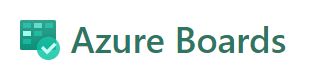
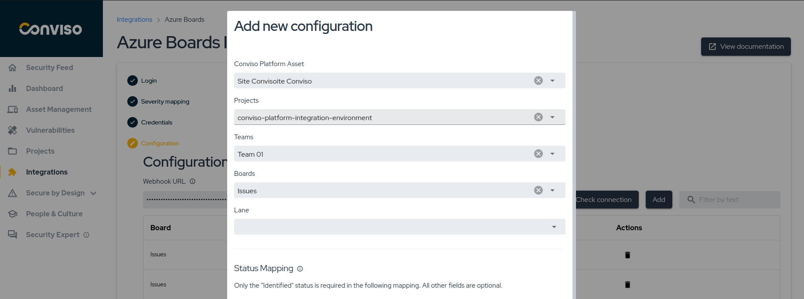
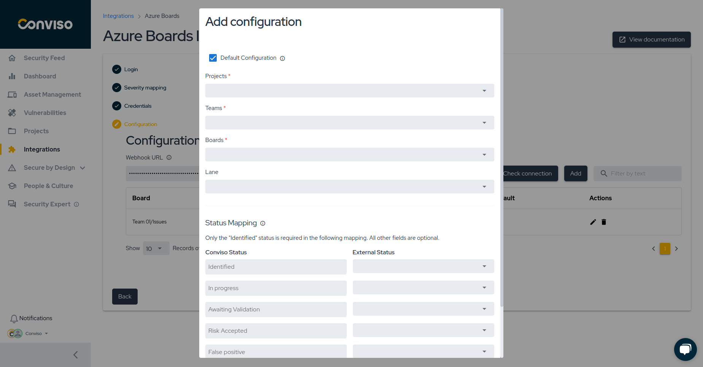

# Azure Boards

# Azure Boards Integration

## Introduction[​](https://docs.convisoappsec.com/integrations/azure_boards/#introduction)

The [Conviso Platform](https://cta-service-cms2.hubspot.com/web-interactives/public/v1/track/redirect?encryptedPayload=AVxigLKtcWzoFbzpyImNNQsXC9S54LjJuklwM39zNd7hvSoR%2FVTX%2FXjNdqdcIIDaZwGiNwYii5hXwRR06puch8xINMyL3EXxTMuSG8Le9if9juV3u%2F%2BX%2FCKsCZN1tLpW39gGnNpiLedq%2BrrfmYxgh8G%2BTcRBEWaKasQ%3D&webInteractiveContentId=125788977029&portalId=5613826&__hstc=36751231.4f0e20f0cfb8e070ca47855aa5207464.1713288582555.1713795830588.1713802784475.4&__hssc=36751231.3.1713802784475&__hsfp=202023877) integrates with [Azure Boards](https://azure.microsoft.com/en-us/products/devops/boards) enabling the creation of issues and a Webhook for updating issue status.

This integration streamlines issue control management and vulnerability consolidation. Integrate the Conviso Platform with Azure Boards. Through this integration, you can use Webhooks to synchronize vulnerability statuses between the Conviso Platform and Azure Boards.

### Integration Capabilities[​](https://docs.convisoappsec.com/integrations/azure-#integration-capabilities)

This integration enhances issue control management and vulnerability consolidation between systems. It facilitates seamless interaction and communication between various aspects of the process. The integration offers the following capabilities:

**From Azure Boards to Conviso Platform:**

*   Foster interaction by providing data from Azure Boards with the development team responsible for corrections in Vulnerability Management from Conviso Platform.

**From Conviso Platform to Azure Boards:**

*   Generates new issues in Azure Boards based on events within Conviso Platform's Vulnerability Management System, such as identified vulnerabilities or completed security assessments.
*   Establishes a linkage between vulnerabilities detected in Conviso Platform and their relevant issues in Azure Boards, enhancing traceability and collaborative efforts.
*   Updates Azure Boards issues when specific actions occur in Conviso Platform's Vulnerability Management System, such as changes in vulnerability status, assessment completions, or updates to risk levels.
*   Transitions Azure Boards issues to appropriate workflow stages when vulnerabilities are resolved or mitigated within Conviso Platform's Vulnerability Management System.

### Prerequirements[​](https://docs.convisoappsec.com/integrations/azure_boards#prerequirements)

To set up the integration, you'll need the following information:

1. Azure Boards's login
2. Admin permission in the project you're integrating

## Usage[​](https://docs.convisoappsec.com/integrations/azure_boards#usage)

To seamlessly integrate Conviso Platform with Azure Boards, follow these step-by-step procedures:

[1 - Configure the integration between Conviso Platform and AzureBoards](#configure-the-integration-between-conviso-platform-and-azure-boards)

[2 - Synchronize vulnerability statuses between Conviso Platform and Azure Boards using Webhooks](#synchronize-vulnerability-statuses-between-conviso-platform-and-azure-boards-using-webhooks)

[3 - Check integration status](#check-integration-status)

## Configure the integration between Conviso Platform and Azure Boards

Follow the instructions below to complete the integration setup.

**Step 1 -** Go to **Conviso Platform**, look for the **Integrations (1)** on the left side menu, choose **Defect Tracker (2)** at the Categories panel to the right and finally click the **Integrate (3)** button just below Azure Boards's card, as illustrated in the example image below:

**Step 2** **Log in** with your **Azure** account and authorize **Conviso Platform** to integrate with your Organization and Projects

**Step 3 -** **Severity Mapping** refers to Azure Boards's card priority. Select which severity will be referenced to Azure Boards's priority:

**Step 4 -** Enter your **Organization Name(1)**, then click **Continue(2)**, you can get it by following **image 2**

If you don't know your **Organization Name**, there's no problem, you can get it by logging in your **Azure Boards's** account, it shows in the page and in the url

**Step 5 -** Click the **Add** button the link an asset in **Conviso Platform** to a board in **Azure Boards**

### Custom Configuration vs Default Configuration
At this point in the process, you have two options: **Custom Configuration** or **Default Configuration**.

With **Custom Configuration**, you can specifically link a Conviso Platform asset to a single Azure Boards board. On the other hand, Default Configuration enables you to link all available assets under Conviso Platform to a single Azure Boards board by default — providing a standard integration setup.

**Note:** In the event that you have both a custom configuration for a specific asset and a default configuration for the integration, the custom configuration will always take precedence over the default configuration.

### a) Custom Configuration

**Step 6 -** Select the **Conviso Platform Asset** you want to associate with your **Azure Boards Project**, **Teams**, **Boards**, and finally **Azure Boards Lane**.

### b) Default Configuration

**Step 6 -** Check the **Default Configuration** field, notice that the Asset label will is no longer available, select the **Azure Boards Project**, **Boards**, and **Lane**.  

**Step 7 -** Consider the following in order to map Conviso Platform statuses to Azure Boards statuses: **Identified status (1)** is required to map the vulnerabilities from Conviso Platform to Azure Boards, while **other fields (2)** are optional. After mapping all the statuses, click on the **Add button**.

## Synchronize vulnerability statuses between Conviso Platform and Azure Boards using Webhooks

**Step 1 -** Copy and save the **WebHook URL**, you're going to use it in Azure Boards for a future step

**Step 2 -** In the Project page, go for **Project Settings**, then to **Service hooks(you'll only be able to get here if you're a project admin) ,** and then, click in the add icon

**Step 3 -** In the service hooks, choose the option **Web Hooks**

**Step 4 -** Select the Trigger(1) **Work item updated**, and select the **Board Column** option in the Field filter(2)

**Step 5 -** Paste your **WebHook URL** that you got from **Conviso Platform**

The integration with **Azure Boards** is done and every update in your boards will be updated in **Conviso Platform** as well

## Check integration status

In **Configuration** page, click on the **Check connection (1)** button to verify if the authentication is **working properly (2)**:

## Support[​](https://docs.convisoappsec.com/integrations/azure_boards#support)

Should you have any questions or require assistance while using the Conviso Platform, feel free to contact our dedicated support team.

## Resources[​](https://docs.convisoappsec.com/integrations/azure_boards#resources)

By exploring our comprehensive content, you’ll discover resources that will enhance your understanding of AppSec.

[Conviso Blog](https://bit.ly/3JtXM8A): Access a wealth of informative videos covering various topics related to AppSec. Please note that the content is primarily in Portuguese.

[Conviso's YouTube Channel](https://www.youtube.com/@convisoappsec): Engage with our informative podcast, where we discuss AppSec-related subjects, providing valuable insights and discussions. The podcast is conducted in Portuguese.

[AppSec to Go - Conviso's Podcast on AppSec](https://spoti.fi/43UJQwN): Explore our blog, which offers a collection of articles and posts covering a wide range of AppSec topics. The content on the blog is primarily written in English.

