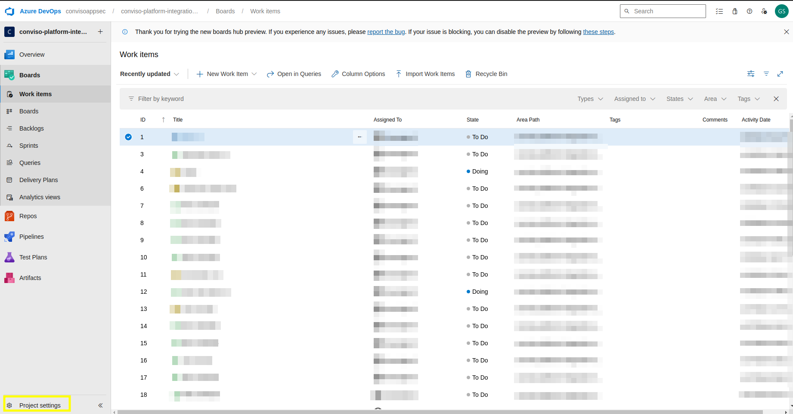
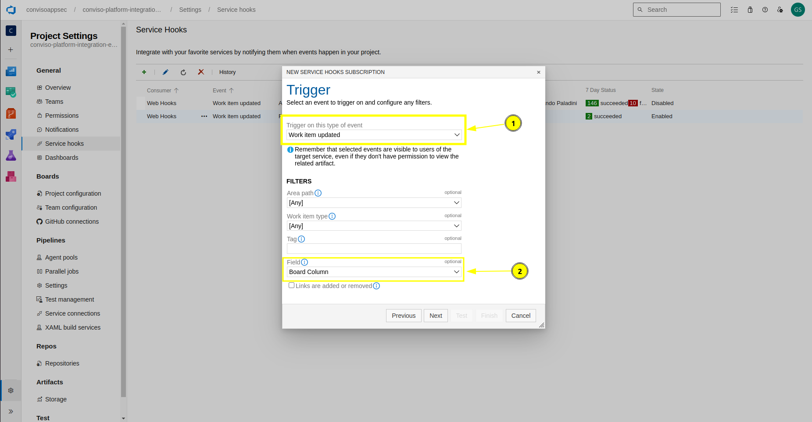

# Azure Boards

# Azure Boards Integration

## Introduction[​](https://docs.convisoappsec.com/integrations/azure_boards/#introduction)

Integrating Azure Boards in Conviso Platform will let developers gain productivity while we do all the hard work by automating the whole vulnerability management triage process.

New vulnerabilities identified in Conviso Platfom are created in real time directly in Azure Boards.

With our two-way integration capability, every status update from both solutions are automatically updated in order to reduce the toil and increase productivity.

This integration is designed to:
- Maintain traceability between vulnerabilities and development tasks
- Reduce manual triage effort
- Ensure continuous technical validation through security scans
- Provide governance without coupling security validation to workflow actions

### Key Concepts[​](https://docs.convisoappsec.com/integrations/azure_boards/#key-concepts)

Before configuring the integration, it is important to understand how vulnerability lifecycle, status, and workflow states work together.

Core Principle
- Azure Boards manages the development workflow.
- Conviso Platform manages vulnerability lifecycle and validation.

Actions taken in Azure Boards reflect progress and intent, but never replace technical validation, which is always scan-driven. Closing or moving a card in Azure Boards does not validate a vulnerability. **Validation only happens through security scans.**

### Vulnerability Lifecycle in Conviso Platform[​](https://docs.convisoappsec.com/integrations/azure_boards/#vulnerabilty-lifecycle)

https://docs.convisoappsec.com/platform/vulnerabilities

### Status Mapping: Conviso ↔ Azure Boards[​](https://docs.convisoappsec.com/integrations/azure-#status-mapping)

**Identified**
Meaning: Vulnerability detected
Typical Azure Boards State: New

**In Progress**
Meaning: Under remediation
Typical Azure Boards State: Active

**Awaiting Validation**
Meaning: Fix applied, awaiting scan
Typical Azure Boards State: Testing / Done

**Risk Accepted**
Meaning: Business decision
Typical Azure Boards State: Risk Accepted

**False Positive**
Meaning: Technical discard
Typical Azure Boards State: Done

### Integration Capabilities[​](https://docs.convisoappsec.com/integrations/azure-#integration-capabilities)

This integration enhances issue control management and vulnerability consolidation between systems. It facilitates seamless interaction and communication between various aspects of the process. The integration offers the following capabilities:

**From Azure Boards to Conviso Platform:**

- Foster interaction by providing data from Azure Boards with the development team responsible for corrections in Vulnerability Management from Conviso Platform.
- Synchronizes workflow state and board movement
- Does **not** trigger scans or technical validation

**From Conviso Platform to Azure Boards:**

- Generates new issues in Azure Boards based on events within Conviso Platform's Vulnerability Management System, such as identified vulnerabilities or completed security assessments.
- Automatically creates one Azure Boards work item per vulnerability. A vulnerability will never generate more than one card in Azure Boards.
- Keeps a persistent linkage between vulnerabilities detected in Conviso Platform and their relevant issues in Azure Boards, enhancing traceability and collaborative efforts.
- Updates Azure Boards issues when specific actions occur in Conviso Platform's Vulnerability Management System, such as changes in vulnerability status, assessment completions, or updates to risk levels.
- Transitions Azure Boards issues to appropriate workflow stages when vulnerabilities are resolved or mitigated within Conviso Platform's Vulnerability Management System.

### Prerequisites[​](https://docs.convisoappsec.com/integrations/azure_boards#prerequirements)

To set up the integration, you'll need the following information:

1. Azure Boards's login
2. Admin permission for the project you're integrating (to ensure this, verify that your user is listed on the page below by accessing **Project Settings**):

3. Ensure you have the **Third-party application access via OAuth** policy enabled.

## Usage[​](https://docs.convisoappsec.com/integrations/azure_boards#usage)

To seamlessly integrate Conviso Platform with Azure Boards, follow these step-by-step procedures:

[1 - Configure the integration between Conviso Platform and AzureBoards](#configure-the-integration-between-conviso-platform-and-azure-boards)

[2 - Synchronize vulnerability statuses between Conviso Platform and Azure Boards using Webhooks](#synchronize-vulnerability-statuses-between-conviso-platform-and-azure-boards-using-webhooks)

[3 - Check integration status](#check-integration-status)

## Configure the integration between Conviso Platform and Azure Boards

Follow the instructions below to complete the integration setup.

**Step 1 -** Go to **Conviso Platform**, look for the **Integrations (1)** on the left side menu, choose **Defect Tracker (2)** at the Categories panel to the right and finally click the **Integrate (3)** button just below Azure Boards's card, as illustrated in the example image below:

**Step 2 -** **Log in** with your **Azure** account and authorize **Conviso Platform** to integrate with your Organization and Projects

**Step 3 -** **Severity Mapping** refers to Azure Boards's card priority. Select which severity will be referenced to Azure Boards's priority:

**Step 4 -** Enter your **Organization Name(1)**, then click **Continue(2)**, you can get it by following **image 2**

If you don't know your **Organization Name**, there's no problem, you can get it by logging in your **Azure Boards's** account, it shows in the page and in the url

**Step 5 -** Click the **Add** button the link an asset in **Conviso Platform** to a board in **Azure Boards**

### Custom Configuration vs Default Configuration

At this point in the process, you have two options: **Custom Configuration** or **Default Configuration**.

With **Custom Configuration**, you can specifically link a Conviso Platform asset to a single Azure Boards board. On the other hand, Default Configuration enables you to link all available assets under Conviso Platform to a single Azure Boards board by default — providing a standard integration setup.

**Note:** In the event that you have both a custom configuration for a specific asset and a default configuration for the integration, the custom configuration will always take precedence over the default configuration.

### a) Custom Configuration

**Step 6 -** Select the **Conviso Platform Asset** you want to associate with your
**Azure Boards Project**, **Team**, **Board**, **Work Item Type**, and finally the **Lane**.

### b) Default Configuration

**Step 6 -** Check the **Default Configuration** field, notice that the Asset label will is no longer available,
select the **Azure Boards Project**, **Team**, **Board**, **Work Item Type**, and finally the **Lane**.

**Step 7 -** Consider the following in order to map Conviso Platform statuses to Azure Boards statuses: **Identified status (1)** is required to map the vulnerabilities from Conviso Platform to Azure Boards, while **other fields (2)** are optional. After mapping all the statuses, click on the **Add button**.

## Synchronize vulnerability statuses between Conviso Platform and Azure Boards using Webhooks

**Step 1 -** Copy and save the **WebHook URL**, you're going to use it in Azure Boards for a future step.

**Step 2 -** In the Project page, go for **Project Settings**, then
to **Service hooks(you'll only be able to get here if you're a project admin)**,
and then, click in the add icon.

**Step 3 -** In the service hooks, choose the option **Web Hooks**.

**Step 4 -** Select the Trigger(1) **Work item updated**, and select
the **Board Column** option in the Field filter(2) and then click in **Next**.

**Step 5 -** Paste your **WebHook URL** that you got from **Conviso Platform**
and then click in **Finish**.

**Step 6 -** Now, let's add a second webook, clicking on add button
and choosing the option **Web Hooks**.

**Step 7 -** Select the Trigger(1) **Work item updated**, and select
the **State** option in the Field filter(2) and then click in **Next**.

**Step 8 -** Paste your **WebHook URL** that you got from **Conviso Platform**
and then click in **Finish**.

The integration with **Azure Boards** is done and every update in your
boards will be updated in **Conviso Platform** as well.

## Check integration status

In **Configuration** page, click on the **Check connection (1)** button to verify if the authentication is **working properly (2)**:

## Card Creation and Update Logic

One vulnerability = one Azure Boards work item
- A work item is created when the vulnerability is first identified
- The same work item is updated throughout the vulnerability lifecycle
- No duplicate work items are created for the same vulnerability

If a vulnerability reappears after being marked as Fixed, the existing card is updated, reflecting the new status.

## Retesting and Validation Behavior

**What triggers validation?**
Validation occurs only when a new security scan is executed, such as:
- CI/CD pipeline scans
- Scheduled scans
- Manual scans

**What does not trigger validation?**
- Closing or completing a work item in Azure Boards
- Changing workflow state
- Manual status changes without scan execution

A vulnerability may remain marked as Fixed until a new scan runs. If the vulnerability still exists, it will automatically return to **Identified**.

## Webhooks and Synchronization
Two webhooks must be configured in Azure Boards:
1. Work item updated – Board Column
2. Work item updated – State

These webhooks ensure that workflow updates are reflected in Conviso Platform, while security validation remains independent and scan-driven.

## Support[​](https://docs.convisoappsec.com/integrations/azure_boards#support)

Should you have any questions or require assistance while using the Conviso Platform, feel free to contact our dedicated support team.
