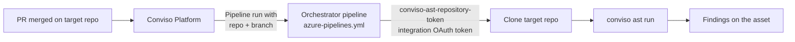

# Azure DevOps AST Orchestrator

The Conviso Platform **Azure DevOps AST Orchestrator** runs Conviso AST from **one** Azure Pipeline (the orchestrator). Application repositories do **not** need a Conviso pipeline of their own.

When an eligible pull request is **merged**, Conviso triggers that pipeline and passes the target repository and branch. The job obtains a short-lived clone credential from the Platform (using your API key), clones the target repository, runs `conviso ast run`, and sends findings to the mapped asset.

You do **not** store a PAT or map `System.AccessToken` for clone — only `CONVISO_API_KEY`.

## How it works



What Conviso checks before dispatching:

1. The event is a pull request that was **merged**.
2. **AST scans on merge** is enabled on the Azure DevOps integration.
3. The repository is an **imported asset** that is **enabled**.
4. The PR **destination branch** matches the configured [AST branch pattern](#ast-branch-pattern).

The pipeline always appears on the **orchestrator** project (not on the application repository).

:::note
**Execution costs:** Pipelines run in your Azure Pipelines environment and consume your Azure Pipeline runtime.
:::

---

## Before you begin

Work in this order: **Azure DevOps setup first**, then **Conviso Platform**.

You need:

- [Azure DevOps ALM integration](./azure-devops.md) connected (OAuth), with repositories imported as assets.
- The Microsoft account that connected the integration has **Edit subscriptions** on each Azure **project** you scan (Service Hooks for merged pull requests). Consent in Microsoft Entra is not enough — see **[Service hook permissions](./azure-devops.md#service-hook-permissions)**.
- At least one application repository **imported as an asset** and **enabled**.
- A dedicated orchestrator repository (or an empty repo you will use only for this). Example / template: [convisoappsec/pipeline-orchestrator](https://github.com/convisoappsec/pipeline-orchestrator).
- Permission to create pipelines and set **pipeline variables** on the orchestrator.
- A **Conviso API key** for the same environment you will scan against (production or staging).

| Term | Exact meaning |
| --- | --- |
| **Orchestrator pipeline** | Azure Pipeline whose YAML is `azure-pipelines.yml`. Conviso triggers this pipeline only. |
| **Target repository** | Application repo imported as an asset. It must **not** rely on a local Conviso pipeline for this flow. |
| **Ref** | Branch or tag **of the orchestrator** where Azure loads `azure-pipelines.yml` when Conviso starts the run. |
| **AST branch pattern** | Regular expression matched against the merged PR's **destination** branch on the **target** repo. Only a branch it matches triggers a scan. See below. |
| **Asset** | Imported repository in Conviso where findings are stored. |

### AST branch pattern

Conviso decides whether a merge triggers a scan by matching the merged PR's **destination branch**
against a **regular expression** you configure — the **AST branch pattern**. One pattern can name
several branches (`main|develop`) or a whole family of them (`release/.*`).

Before this, the platform compared that branch to a **single name**, with exact equality. Only two
setups were expressible: one branch, or every branch.

#### Where you set it

| Level | Where | Applies to |
| --- | --- | --- |
| **Repository** | The **Branch pattern** column on the repository table, in the integration's configuration step | That repository only |
| **Integration** | **Branch pattern that runs the AST**, on the integration configuration page | Every repository of this integration that has no pattern of its own |

#### Which one applies

The first level that is configured wins:

1. The repository's own **Branch pattern**.
2. The integration's **Branch pattern that runs the AST**.
3. The integration **Ref** — *legacy fallback*, so nothing changes for a setup that was already using Ref as a branch filter.
4. Nothing configured — **every branch** triggers a scan.

:::note Ref is the orchestrator's branch, not a branch policy
**Ref** means "which branch of the orchestrator project holds `azure-pipelines.yml`". It was reused as a branch
filter before the branch pattern existed, and it still is when nothing else is set — but it is no
longer the field to use for branch policy. Set a branch pattern instead, and leave Ref meaning the
one thing it should mean.
:::

#### How a pattern is matched

* **The whole branch name must match.** `main` matches `main` and nothing else — not `maintenance`, not `remain`.
* **A plain branch name behaves exactly as it did before.** Every value already configured in your account keeps meaning exactly what it means today. There is nothing to migrate and nothing you need to do.
* **`|` is how you list branches:** `main|develop|homolog`.
* **The pattern is validated when you save it.** One that does not compile, is longer than 500 characters, or is too slow to evaluate is refused, with the reason shown under the field.
* **A pattern that fails at merge time does not dispatch.** If a stored expression errors or times out while a merge is being evaluated, Conviso skips the scan rather than spending your CI budget on a decision it could not make.

#### Examples

| Pattern | Merges that trigger a scan |
| --- | --- |
| *(nothing set at any level)* | Every branch |
| `main` | `main` only |
| `main\|develop` | `main` and `develop` |
| `release/.*` | Every branch under `release/` |
| `main\|release/.*` | `main`, and every branch under `release/` |
| `main` *(stored before this feature)* | `main` only — unchanged |

#### Running the AST on demand

**Run AST** on the asset offers a **Branch to scan** picker, listing only the branches that match
that asset's pattern. If the pattern matches none of the asset's branches, the button is disabled
and says so — adjust the pattern in the integration settings.

---

## Part 1 – Azure DevOps setup

### Step 1 – Create the orchestrator repository

1. Create an Azure DevOps repository (recommended name: `conviso-ast-orchestrator`), **or** copy from [convisoappsec/pipeline-orchestrator](https://github.com/convisoappsec/pipeline-orchestrator) and keep only `azure-pipelines.yml`.
2. Choose the branch that will contain the YAML (almost always **`main`**). That value is what you will set as **Ref** in Conviso.

### Step 2 – Add `azure-pipelines.yml`

:::tip Example repository
Public template: **[convisoappsec/pipeline-orchestrator](https://github.com/convisoappsec/pipeline-orchestrator)**  

Pipelines file: [`azure-pipelines.yml`](https://github.com/convisoappsec/pipeline-orchestrator/blob/main/azure-pipelines.yml)
:::

On the orchestrator branch you will set as **Ref** (usually `main`):

1. Create **`azure-pipelines.yml`** at the repository root.
2. Paste the YAML below (or copy it from the example repo). Use this template as-is — it matches the public example, including the parameters Conviso sends on each run.

```yaml
parameters:
  - name: repo_full_name
    type: string
    default: ""
  - name: branch
    type: string
    default: ""
  - name: commit_sha
    type: string
    default: ""
  - name: pr_number
    type: string
    default: ""
  - name: api_url
    type: string
    default: "https://api.convisoappsec.com"
  - name: company_id
    type: string
    default: ""
  - name: asset_id
    type: string
    default: ""
  - name: scan_run_id
    type: string
    default: ""
  - name: repo_url
    type: string
    default: ""

trigger: none
pr: none

variables:
  - name: CONVISO_COMPANY_ID
    value: ""

pool:
  vmImage: ubuntu-latest

# Azure requires an empty entrypoint or container steps fail to docker exec.
container:
  image: convisoappsec/convisoast:latest
  options: --entrypoint ""

steps:
  - checkout: none

  - script: |
      set -euo pipefail
      if [ -z "${REPO_FULL_NAME}" ] || [ -z "${BRANCH}" ]; then
        echo "##vso[task.logissue type=error]repo_full_name and branch are required"
        exit 1
      fi

      export CONVISO_API_KEY="$CONVISO_API_KEY"
      export CONVISO_API_URL="${API_URL:-https://api.convisoappsec.com}"
      CONVISO_API_URL="${CONVISO_API_URL%/}"
      case "$CONVISO_API_URL" in
        https://app.convisoappsec.com)
          export CONVISO_API_URL="https://api.convisoappsec.com"
          ;;
        https://staging.convisoappsec.com)
          export CONVISO_API_URL="https://api.staging.convisoappsec.com"
          ;;
      esac

      export CONVISO_REPO_FULL_NAME="$REPO_FULL_NAME"
      case "${ASSET_ID:-}" in
        ""|none|0) unset CONVISO_ASSET_ID || true ;;
        *) export CONVISO_ASSET_ID="$ASSET_ID" ;;
      esac
      case "${SCAN_RUN_ID:-}" in
        ""|none|0) unset CONVISO_SCAN_RUN_ID || true ;;
        *) export CONVISO_SCAN_RUN_ID="$SCAN_RUN_ID" ;;
      esac

      umask 077
      TOKEN=$(conviso-ast-repository-token --provider azure_devops)
      echo "##vso[task.setvariable variable=REPO_TOKEN;issecret=true]$TOKEN"
      echo "##vso[task.setvariable variable=CONVISO_API_URL]$CONVISO_API_URL"
    displayName: Get repository token
    env:
      CONVISO_API_KEY: $(CONVISO_API_KEY)
      API_URL: ${{ parameters.api_url }}
      REPO_FULL_NAME: ${{ parameters.repo_full_name }}
      ASSET_ID: ${{ parameters.asset_id }}
      SCAN_RUN_ID: ${{ parameters.scan_run_id }}
      BRANCH: ${{ parameters.branch }}

  - script: |
      set -euo pipefail
      # Prefer repo_url from the platform (asset.repo_url). Azure webhooks send
      # project/repo while clone needs org/project/repo — reconstructing from
      # repo_full_name alone is unreliable.
      REMOTE_URL=$(python3 -c '
      import base64, json, os, urllib.request
      from urllib.parse import urlsplit, urlunsplit

      token = os.environ["REPO_TOKEN"]
      repo_url = (os.environ.get("REPO_URL") or "").strip()
      repo_full_name = (os.environ.get("REPO_FULL_NAME") or "").strip()

      def strip_auth(remote: str) -> str:
          parts = urlsplit(remote)
          host = parts.hostname or ""
          if parts.port:
              host = f"{host}:{parts.port}"
          return urlunsplit((parts.scheme, host, parts.path, parts.query, parts.fragment))

      if repo_url:
          print(strip_auth(repo_url))
          raise SystemExit(0)

      parts = repo_full_name.split("/")
      if len(parts) == 3:
          org, project, repo = parts[0], parts[1], "/".join(parts[2:])
          print(strip_auth(f"https://dev.azure.com/{org}/{project}/_git/{repo}"))
          raise SystemExit(0)

      if len(parts) != 2:
          raise SystemExit(f"repo_full_name must be organization/repository. Got: {repo_full_name!r}")

      org, repo = parts
      req = urllib.request.Request(
          f"https://dev.azure.com/{org}/_apis/git/repositories?api-version=7.1",
          headers={"Authorization": "Basic " + base64.b64encode((":" + token).encode()).decode()},
      )
      with urllib.request.urlopen(req, timeout=60) as resp:
          data = json.load(resp)
      matches = [r for r in data.get("value", []) if r.get("name") == repo]
      if not matches:
          raise SystemExit(f"Azure returned no repository named {repo!r} in org {org!r}")
      if len(matches) > 1:
          raise SystemExit(
              f"Multiple Azure repositories named {repo!r} in org {org!r}; "
              "platform must send repo_url"
          )
      print(strip_auth(matches[0]["remoteUrl"]))
      ')

      rm -rf target
      git init target
      cd target
      git remote add origin "$REMOTE_URL"
      if [ -n "${COMMIT_SHA:-}" ]; then
        git -c http.extraheader="AUTHORIZATION: bearer ${REPO_TOKEN}" fetch --depth=50 origin "$COMMIT_SHA"
        git checkout -B "$BRANCH" "$COMMIT_SHA"
      else
        git -c http.extraheader="AUTHORIZATION: bearer ${REPO_TOKEN}" fetch --depth=50 origin "$BRANCH"
        git checkout -B "$BRANCH" FETCH_HEAD
      fi
    displayName: Clone target repository
    env:
      REPO_FULL_NAME: ${{ parameters.repo_full_name }}
      REPO_URL: ${{ parameters.repo_url }}
      BRANCH: ${{ parameters.branch }}
      COMMIT_SHA: ${{ parameters.commit_sha }}
      REPO_TOKEN: $(REPO_TOKEN)

  - script: |
      set -euo pipefail
      cd target
      export CONVISO_API_KEY="$CONVISO_API_KEY"
      export CONVISO_API_URL="${NORMALIZED_BASE_URL}"
      export CONVISO_COMPANY_ID="${PARAM_COMPANY_ID:-$VAR_COMPANY_ID}"
      export CONVISO_BRANCH="$BRANCH"
      case "${ASSET_ID:-}" in
        ""|none|0) unset CONVISO_ASSET_ID || true ;;
        *) export CONVISO_ASSET_ID="$ASSET_ID" ;;
      esac
      case "${SCAN_RUN_ID:-}" in
        ""|none|0) unset CONVISO_SCAN_RUN_ID || true ;;
        *) export CONVISO_SCAN_RUN_ID="$SCAN_RUN_ID" ;;
      esac
      conviso ast run --repository-dir . --output "$(Build.ArtifactStagingDirectory)/conviso-ast-session.zip"
    displayName: Run Conviso AST
    env:
      GIT_CONFIG_COUNT: "1"
      GIT_CONFIG_KEY_0: safe.directory
      GIT_CONFIG_VALUE_0: "*"
      CONVISO_API_KEY: $(CONVISO_API_KEY)
      NORMALIZED_BASE_URL: $(CONVISO_API_URL)
      PARAM_COMPANY_ID: ${{ parameters.company_id }}
      VAR_COMPANY_ID: $(CONVISO_COMPANY_ID)
      ASSET_ID: ${{ parameters.asset_id }}
      SCAN_RUN_ID: ${{ parameters.scan_run_id }}
      BRANCH: ${{ parameters.branch }}

  - task: PublishBuildArtifacts@1
    condition: succeededOrFailed()
    target: host
    displayName: Upload session log
    inputs:
      PathtoPublish: $(Build.ArtifactStagingDirectory)
      ArtifactName: conviso-ast-session
```

3. Commit and push to that **Ref** branch.

:::important
- `trigger: none` / `pr: none` are intentional — Conviso starts the run; Azure must not auto-trigger on every push.
- Keep `options: --entrypoint ""` on the container or Azure fails to `docker exec` into the job.
- Do **not** add `variables: - group: ...` to this YAML. The API key is a **pipeline variable** (Step 4), not a Library variable group.
:::

### Step 3 – Create the pipeline and copy its ID

1. Open **Pipelines → New pipeline**.
2. Select the repository that holds `azure-pipelines.yml`.
3. Choose **Existing Azure Pipelines YAML file**, select the **Ref** branch and `/azure-pipelines.yml`, then **Continue**.
4. Save the pipeline (you can skip the first run).

Copy the pipeline ID from the browser address bar:

```text
https://dev.azure.com/my-org/my-project/_build?definitionId=42
```

The number after `definitionId=` (here `42`) is the **Orchestrator pipeline ID** you will paste into Conviso.

### Step 4 – Add `CONVISO_API_KEY` on the pipeline

On the orchestrator pipeline you just created — **Edit → Variables** on that pipeline, **not** **Pipelines → Library**:

1. Open the pipeline and click **Edit**.
2. Click **Variables** (top right of the YAML editor, next to **Run**).
3. Stay on the **Pipeline variables** tab. Do **not** open **Variable groups** and do **not** create a group under **Pipelines → Library**.
4. Add:

| Name | Secret? | Required |
|------|---------|----------|
| `CONVISO_API_KEY` | **Yes** (keep this value secret) | **Yes** |

Use the API key for the same Conviso environment as the Platform you configured (production vs staging).

:::tip Optional variable
You may add `CONVISO_COMPANY_ID` on the same **Variables** screen. The job uses it only when the `company_id` parameter is empty (typical for a manual **Run pipeline**). When Conviso dispatches after a merge, it sends `company_id`, so this fallback is not required for Platform-triggered runs.
:::

Do **not** add an Azure DevOps PAT for clone. The job calls `conviso-ast-repository-token --provider azure_devops`, and the Platform returns the integration’s OAuth credential for that run.

*Pipeline variable `CONVISO_API_KEY` under Edit → Variables (not Library).*


---

## Part 2 – Conviso Platform setup

### Step 5 – Configure the orchestrator

1. Open **Integrations → Azure DevOps → Configuration** (or **Orchestrator configuration**).
2. Turn **AST scans on merge** **on**.
3. Under **Orchestrator pipeline**, fill:

| Field | What to enter | Where to find it |
| --- | --- | --- |
| **Orchestrator organization** | Azure DevOps organization, e.g. `my-org` | First path segment of `https://dev.azure.com/my-org/...` |
| **Orchestrator project** | Project that contains the orchestrator pipeline | Second path segment of the same URL |
| **Orchestrator pipeline ID** | The number from Step 3, e.g. `42` | `definitionId=` in the pipeline URL |
| **Orchestrator ref** | Branch holding the YAML — usually `main` | Same branch from Step 1. Conviso prefixes plain values with `refs/heads/`; a tag must be written as `refs/tags/<tag>` |
| **Branch pattern that runs the AST** | Optional regular expression for the branches on the **target** repositories that should trigger a scan, e.g. `main\|develop` | Leave empty to keep using **Orchestrator ref** as the filter. See [AST branch pattern](#ast-branch-pattern) |

4. Save.


### Step 6 – Assets and branch pattern

1. Confirm each application repository is **imported** and **enabled**.
2. Set **Branch pattern that runs the AST** on the integration page when more than one branch should be scanned — `main|develop`, or `release/.*`.
3. Override it for a single repository from the **Branch pattern** column on the repository table, when that one ships from a different branch than the rest.
4. If you set neither, the integration **Ref** is still used as the filter (legacy behavior); if Ref is empty too, every branch triggers a scan.

See [AST branch pattern](#ast-branch-pattern) for how the expression is matched and validated.

---

## End-to-end flow (after setup)

1. Developer merges a PR into a branch matching the AST branch pattern, on an imported, enabled asset.
2. Conviso validates the event and configuration, then starts the orchestrator pipeline on the **Ref** branch.
3. Template parameters include the repository, branch, and related ids Conviso needs for the run.
4. Job steps: issue repository token → clone target → run `conviso ast run` → upload session artifact.
5. Findings appear on the asset in Conviso Platform.
6. In Azure DevOps, open the **orchestrator** pipeline run to inspect logs.

## Validation checklist

| Check | Expected |
|-------|----------|
| Variable | `CONVISO_API_KEY` exists as a **secret pipeline variable** on the orchestrator |
| Path | `azure-pipelines.yml` is on the **Ref** branch |
| Conviso | Organization + project + pipeline ID + Ref saved; **AST scans on merge** on |
| Asset | Target repo imported, enabled; the merged branch matches the AST branch pattern (repository level, integration level, or Ref as the legacy fallback) |
| After merge | New pipeline run on the orchestrator; findings (or a clean result) on the asset |


Manual test (optional): on the orchestrator, **Run pipeline**. Set `repo_full_name` and `branch` for an imported asset. Leave `api_url` as the default for production (`https://api.convisoappsec.com`). Set `company_id` or define the pipeline variable `CONVISO_COMPANY_ID`.

## Troubleshooting

| Symptom | Cause / fix |
|---------|-------------|
| Merge done, no pipeline | **AST scans on merge** off; organization/project/pipeline ID/Ref incomplete; asset disabled or not imported; the merged branch does not match the AST branch pattern; connecting user lacks **Edit subscriptions** so no Service Hook was registered ([details](./azure-devops.md#service-hook-permissions)) |
| A branch you expected to scan is skipped | The pattern does not match the whole branch name. `main` does not match `main-hotfix`; use `main.*` if that is what you meant. Check the repository pattern first — it overrides the integration's |
| No branch scans any more, after editing a pattern | A stored pattern that fails to compile or times out is treated as "do not dispatch". Reopen the field, save a valid expression, and confirm it is accepted |
| The pattern is refused when you save it | It does not compile, is longer than 500 characters, or is too slow to evaluate. The reason is shown under the field |
| **Run AST** is disabled on the asset | The pattern matches none of the asset's branches. Adjust it in the integration settings |
| `Repository is not available for this API key` | Wrong environment (`CONVISO_API_KEY` vs `api_url`); Azure integration not authorized; asset not imported/enabled for that company |
| Unreadable / HTML response from Platform | Use the production API host (`https://api.convisoappsec.com`). The template remaps `https://app.convisoappsec.com` automatically |
| Initialize containers fails | Confirm `options: --entrypoint ""` is present on the container |
| `CONVISO_API_KEY` empty / unauthorized | Confirm the secret is a **pipeline variable** (Edit → Variables). A Library / variable group is not enough unless the YAML also references that group — this template does not |
| Scanner missing `CONVISO_COMPANY_ID` | Manual run without `company_id` and without pipeline variable `CONVISO_COMPANY_ID` |
| Wrong code scanned | `branch` mismatch; confirm you merged into a branch the AST branch pattern matches |

## Migrating from `System.AccessToken` or `ADO_GIT_PAT`

1. Replace the orchestrator YAML with the template in Step 2.
2. Keep only `CONVISO_API_KEY` as a secret **pipeline variable** (remove `ADO_GIT_PAT` and any `System.AccessToken` mapping).
3. Re-run a manual test with `repo_full_name` and `branch` set to an imported asset.

## Related guides

- [Example orchestrator repository (pipeline-orchestrator)](https://github.com/convisoappsec/pipeline-orchestrator)
- [Azure DevOps Integration (ALM)](./azure-devops.md)
- [Azure DevOps PR Scans](./azure-devops-pr-scans.md)
- [Conviso AST](../security-scans/conviso-ast/conviso-ast.md)
